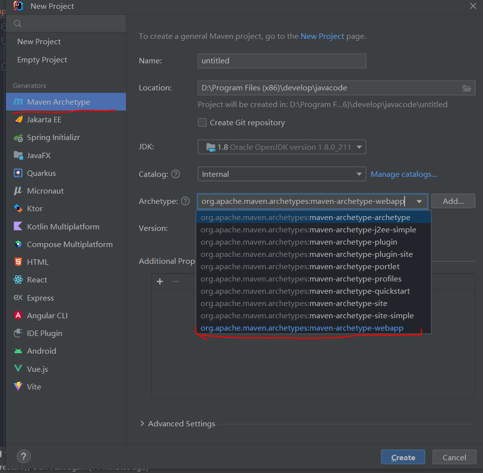

# 初次使用springMVC
## 创建mavenWEB项目：

## 添加依赖
```xml
    <!--要保证spring的依赖版本一致，不然会出现版本冲突-->
    <dependency>
      <groupId>org.projectlombok</groupId>
      <artifactId>lombok</artifactId>
      <version>1.18.22</version>
    </dependency>

    <!-- https://mvnrepository.com/artifact/javax.servlet/javax.servlet-api -->
    <dependency>
      <groupId>javax.servlet</groupId>
      <artifactId>javax.servlet-api</artifactId>
      <version>4.0.1</version>
      <scope>provided</scope>
    </dependency>

    <!-- https://mvnrepository.com/artifact/javax.servlet.jsp/jsp-api -->
    <dependency>
      <groupId>javax.servlet.jsp</groupId>
      <artifactId>jsp-api</artifactId>
      <version>2.2</version>
      <scope>provided</scope>
    </dependency>

    <!-- 日志包，方便看sql语句 -->
    <dependency>
      <groupId>org.slf4j</groupId>
      <artifactId>slf4j-log4j12</artifactId>
      <version>1.6.1</version>
    </dependency>
    
    <!--进行junit单元测试 -->
    <dependency>
      <groupId>junit</groupId>
      <artifactId>junit</artifactId>
      <version>4.11</version>
      <scope>test</scope>
    </dependency>

    <!--依赖于commons-logging日志管理 -->
    <dependency>
      <groupId>commons-logging</groupId>
      <artifactId>commons-logging</artifactId>
      <version>1.2</version>
    </dependency>

    <!-- 进行日志记录 -->
    <dependency>
      <groupId>ch.qos.logback</groupId>
      <artifactId>logback-classic</artifactId>
      <version>1.2.3</version>
    </dependency>

    <!--提供了框架的基本组成部分,包括IOC 和 DI-->
    <dependency>
      <groupId>org.springframework</groupId>
      <artifactId>spring-core</artifactId>
      <version>4.1.6.RELEASE</version>
    </dependency>

    <!-- 提供了BeanFactory-->
    <dependency>
      <groupId>org.springframework</groupId>
      <artifactId>spring-beans</artifactId>
      <version>4.1.6.RELEASE</version>
    </dependency>

    <!--上下文配置对象，提供一个框架式的对象访问方式-->
    <dependency>
      <groupId>org.springframework</groupId>
      <artifactId>spring-context</artifactId>
      <version>4.1.6.RELEASE</version>
    </dependency>

    <!--提供了强大的表达式语言-->
    <dependency>
      <groupId>org.springframework</groupId>
      <artifactId>spring-expression</artifactId>
      <version>4.1.6.RELEASE</version>
    </dependency>

    <!-- https://mvnrepository.com/artifact/org.springframework/spring-orm -->
    <dependency>
      <groupId>org.springframework</groupId>
      <artifactId>spring-orm</artifactId>
      <version>4.1.6.RELEASE</version>
    </dependency>

    <!--主要是多了以下的依赖进行MVC，springMVC的jar包-->
    <dependency>
      <groupId>org.springframework</groupId>
      <artifactId>spring-web</artifactId>
      <version>4.1.6.RELEASE</version>
    </dependency>

    <dependency>
      <groupId>org.springframework</groupId>
      <artifactId>spring-webmvc</artifactId>
      <version>4.1.6.RELEASE</version>
    </dependency>

    <!-- jstl表达式 -->
    <dependency>
      <groupId>jstl</groupId>
      <artifactId>jstl</artifactId>
      <version>1.2</version>
    </dependency>

    <dependency>
      <groupId>taglibs</groupId>
      <artifactId>standard</artifactId>
      <version>1.1.2</version>
    </dependency>
```
## 配置springMVC.xml文件,
```xml
<?xml version="1.0" encoding="UTF-8"?>
<beans xmlns="http://www.springframework.org/schema/beans"
       xmlns:context="http://www.springframework.org/schema/context"
       xmlns:mvc="http://www.springframework.org/schema/mvc"
       xmlns:xsi="http://www.w3.org/2001/XMLSchema-instance"
       xsi:schemaLocation="http://www.springframework.org/schema/beans
       http://www.springframework.org/schema/beans/spring-beans.xsd
	   http://www.springframework.org/schema/mvc
        http://www.springframework.org/schema/mvc/spring-mvc.xsd
       http://www.springframework.org/schema/context
	   http://www.springframework.org/schema/context/spring-context-4.3.xsd">

    <!--配置映射器和适配器：选择默认-->
    <!-- 设置注解扫描路径 -->
    <context:component-scan base-package="com.jr.controller"/>
    <context:component-scan base-package="com.jr.entity"/>
    <context:component-scan base-package="com.jr.config"/>
    <!-- 默认加载注解处理器映射器和处理器适配器及很多的参数绑定 -->
    <mvc:annotation-driven/>
</beans>
```
## 配置web.xml
```xml
<?xml version="1.0" encoding="UTF-8"?>

<web-app xmlns="https://jakarta.ee/xml/ns/jakartaee"
         xmlns:xsi="http://www.w3.org/2001/XMLSchema-instance"
         xsi:schemaLocation="https://jakarta.ee/xml/ns/jakartaee
                      https://jakarta.ee/xml/ns/jakartaee/web-app_5_0.xsd"
         version="5.0"
         metadata-complete="false">
  <display-name>Archetype Created Web Application</display-name>

  <servlet>
    <servlet-name>springmvc</servlet-name>
    <servlet-class>org.springframework.web.servlet.DispatcherServlet</servlet-class>
<!--    init-param 告诉ServletSpringMVC配置文件在哪里 -->
    <init-param>
      <param-name>contextConfigLocation</param-name>
      <param-value>classpath:springmvc-servlet.xml</param-value>
    </init-param>
    <!-- 自启动-在启动tomcat时立即加载对应的Servlet -->
    <load-on-startup>1</load-on-startup>
  </servlet>

  <servlet-mapping>
    <servlet-name>springmvc</servlet-name>
    <!--
    /*：所有请求都进前端控制器，包括jsp也需要前往映射器
    /：的意思是：除了JSP放行,其他全按照名称去找@RequestMapping() -->
    <url-pattern>/</url-pattern>
  </servlet-mapping>
</web-app>
```
配置配置过滤器：用来设置字符编码，防止在servlet中接受的前端数据乱码！
```xml
<!-- 配置过滤器：用来设置字符编码，防止乱码！ -->
  <filter>
    <filter-name>charset</filter-name>
    <filter-class>org.springframework.web.filter.CharacterEncodingFilter</filter-class>
    <init-param>
      <param-name>encoding</param-name>
      <param-value>utf-8</param-value>
    </init-param>
    <init-param>
      <param-name>forceEncoding</param-name>
      <param-value>true</param-value>
    </init-param>
  </filter>
  <filter-mapping>
    <filter-name>charset</filter-name>
    <url-pattern>/*</url-pattern>
  </filter-mapping>
```
## 创建实体类，不需要使用@component
## 创建servlet类
>使用@Controller注解标注，用@RequestMapping ("login")表示方法对应的前端请求路径，返回值采用ModelAndView，包含返回数据以及路径，但只能应对传统的表单请求，无法处理ajax请求的json数据格式。
```java
package com.jr.controller;

import org.springframework.stereotype.Controller;
import org.springframework.web.bind.annotation.RequestMapping;
import org.springframework.web.servlet.ModelAndView;
import javax.servlet.http.HttpServletRequest;
import java.io.UnsupportedEncodingException;

@Controller
public class TestController {
    @RequestMapping ("login")
    public ModelAndView test01(String uname,String pwd) {
        /*作用域为request，一次请求内*/
        ModelAndView mv=new ModelAndView();
        if (uname.equals("张三") && pwd.equals("123")){
            mv.addObject("info",uname+"登录成功");
            /*进行的是请求转发*/
            mv.setViewName("ok.jsp");
        }else {
            mv.setViewName("index.jsp");
        }
        return mv;
    }
}
```
```java
package com.jr.controller;
import com.jr.entity.Emp;
import lombok.extern.slf4j.Slf4j;
import org.springframework.context.ApplicationContext;
import org.springframework.stereotype.Controller;
import org.springframework.web.bind.annotation.RequestMapping;
import org.springframework.web.bind.annotation.ResponseBody;
import org.springframework.web.servlet.ModelAndView;
import javax.annotation.Resource;
import java.util.ArrayList;
import java.util.List;

@Slf4j
@Controller
public class Test01Controller {
    /*这里从spring容器中自动注入ApplicationContext对象，这个对象是在程序加载时就在容器中自动配置完的，是由配置文件中配置完成的*/
    @Resource
    private ApplicationContext context;

    @RequestMapping ("zcb")
    public ModelAndView test02(String choose) {
        /*作用域为request，一次请求内*/
        System.out.println(choose);
        ModelAndView mv=new ModelAndView();
        List<Emp> emps = new ArrayList<Emp>();
        /*这里为了能创建多个emp对象，将emp的bean改为多例模式prototype*/
        Emp emp = context.getBean("emp", Emp.class);
        log.info(emp.toString());
        emp.setEname("ss");
        emp.setEmpno(1);
        emp.setDeptno(10);
        emps.add(emp);
        Emp emp1 = context.getBean("emp", Emp.class);
        emp1.setEname("bb");
        emp1.setEmpno(2);
        emp1.setDeptno(20);
        emps.add(emp1);

        if (choose.equals("2")){
            mv.addObject("emps",emps);
            mv.setViewName("hellow.jsp");
        }
        return mv;
    }
}
```
创建获取bean的配置类，以后都用这种配置方式进行bean的获取
```java
package com.jr.config;
import com.jr.entity.Emp;
import org.springframework.context.annotation.Bean;
import org.springframework.context.annotation.Configuration;
import org.springframework.context.annotation.Scope;

/*@Configuration 注解用于告诉Spring容器，这个类包含了配置信息，并且Spring应该在启动时加载和解析它。*/
@Configuration
public class SpringBeanConfig {
    /*@Bean 注解定义Bean，这些Bean将被Spring容器管理。@Bean 注解告诉Spring容器如何创建和配置这些Bean。就是将下面方法返回的对象注册为一个bean
     * 
     * 当您在配置类中使用 @Bean 注解定义一个方法时，Spring容器会识别这个方法，并将其视为一个Bean的定义。当应用程序需要使用这个Bean时（例如，在其他Bean中引用它，或在应用程序中通过注入方式使用它），Spring容器将自动调用带有 @Bean 注解的方法，以创建Bean的实例。*/
    @Bean(name = "emp")
    /*将bean获取对象的模式改为多例prototype*/
    @Scope("prototype")
    public Emp createEmp() {
        return new Emp();
    }
}
```
