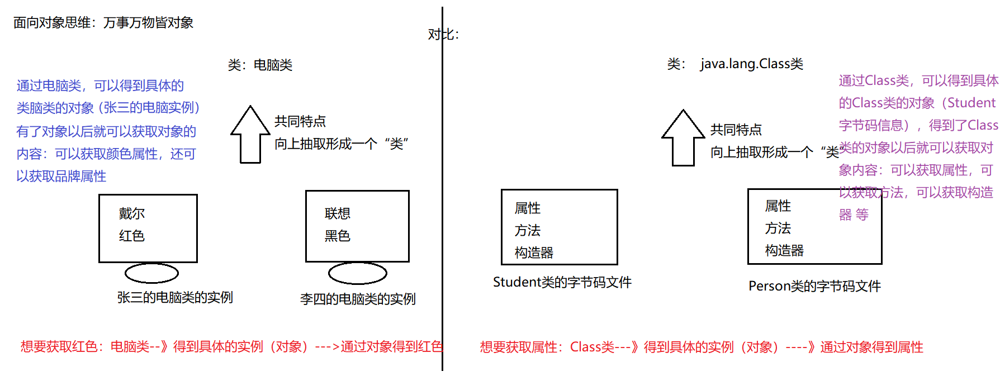

## 十四节 反射
### 1.概念
多态确实可以提高代码的扩展性，但是：扩展性没有达到最好。
怎么没有达到最好：if的分支，还是需要手动的删除或者添加。

JAVA反射机制是在运行状态中，对于任意一个类，都能够知道这个类的所有属性和方法；对于任意一个对象，
都能够调用它的任意方法和属性；这种动态获取信息以及动态调用对象方法的功能称为java语言的反射机制。

在编译后产生字节码文件的时候，类加载器子系统通过二进制字节流，负责从文件系统加载class文件。
在执行程序（java.exe）时候，将字节码文件读入JVM中--->这个过程叫做类的加载。然后在内存中对应创建一个java.lang.Class对象-->这个对象会被放入字节码信息中,这个Class对象,就对应加载那个字节码信息,这个对象将被作为程序访问方法区中的这个类的各种数据的外部接口。
所以：我们可以通过这个对象看到类的结构，这个对象就好像是一面镜子，透过镜子看到类的各种信息，我们形象的称之为反射
这种“看透”class的能力（the ability of the program to examine itself）被称为introspection（内省、内观、反省）。Reflection和introspection是常被并提的两个术语。

说明：在运行期间，如果我们要产生某个类的对象，Java虚拟机(JVM)会检查该类型的Class对象是否已被加载。
如果没有被加载，JVM会根据类的名称找到.class文件并加载它。一旦某个类型的Class对象已被加载到内存，就可以用它来产生该类型的所有对象。

补充:
动态语言vs静态语言<br>
- 1、动态语言<br>
是一类在运行时可以改变其结构的语言:例如新的函数、对象、甚至代码可以
被引进，已有的函数可以被删除或是其他结构上的变化。通俗点说就是在运
行时代码可以根据某些条件改变自身结构。
主要动态语言: Object-C、 C#、JavaScript、 PHP、 Python、 Erlang 。
- 2、静态语言<br>
与动态语言相对应的，运行时结构不可变的语言就是静态语言。如Java、C、 C++。

所以Java不是动态语言，但Java可以称之为“准动态语言”。即Java有一定的动
态性，我们可以利用反射机制、字节码操作获得类似动态语言的特性。
Java的动态性让编程的时候更加灵活! 



### 2.获取字节码信息的四种形式
```java
package com.zhaoss.test02;
public class Test {
    public static void main(String[] args) throws ClassNotFoundException {
        //案例：以Person的字节码信息为案例
        //方式1：通过getClass()方法获取
        Person p = new Person();
        Class c1 = p.getClass();
        System.out.println(c1);
        //方式2：通过内置class属性：
        Class c2 = Person.class;
        System.out.println(c2);
        System.out.println(c1==c2);
        //注意：方式1和方式2  不常用
        //方式3：--》用的最多：调用Class类提供的静态方法forName
        Class c3 = Class.forName("com.zhaoss.test02.Person");
        //方式4：利用类的加载器(了解技能点)
        ClassLoader loader = Test.class.getClassLoader();
        Class c4 = loader.loadClass("com.zhaoss.test02.Person");
    }
}
```

### 3.Class类的具体实例
Class类的具体的实例：<br>
（1）类：外部类，内部类
（2）接口
（3）注解
（4）数组
（5）基本数据类型
（6）void

### 4.反射的各种方法
`想要使用反射出的私有方法需要 setAccessible(true); 设置访问权限；`
- 获取构造器和创建对象
```java
package com.zhaoss.test03;
import java.lang.reflect.Constructor;
import java.lang.reflect.InvocationTargetException;
public class Test01 {
    public static void main(String[] args) throws NoSuchMethodException, IllegalAccessException, InvocationTargetException, InstantiationException {
        //获取字节码信息：
        Class cls = Student.class;
        //通过字节码信息可以获取构造器：
        //getConstructors只能获取当前运行时类的被public修饰的构造器
        Constructor[] c1 = cls.getConstructors();
        for(Constructor c:c1){
            System.out.println(c);
        }
        System.out.println("-------------------");
        //getDeclaredConstructors:获取运行时类的全部修饰符的构造器
        Constructor[] c2 = cls.getDeclaredConstructors();
        for(Constructor c:c2){
            System.out.println(c);
        }
        System.out.println("-------------------");
        //获取指定的构造器：
        //得到空构造器
        Constructor con1 = cls.getConstructor();
        System.out.println(con1);
        //得到两个参数的有参构造器：
        Constructor con2 = cls.getConstructor(double.class, double.class);
        System.out.println(con2);
        //得到一个参数的有参构造器：并且是private修饰的
        Constructor con3 = cls.getDeclaredConstructor(int.class);
        System.out.println(con3);
        //有了构造器以后我就可以创建对象：
        Object o1 = con1.newInstance();
        System.out.println(o1);
        Object o2 = con2.newInstance(180.5, 170.6);
        System.out.println(o2);
        /*使用反射的私有构造器需要将访问权限修改*/
        con3.setAccessible(true);
        Student o3 = (Student) con3.newInstance(180);
        System.out.println(o3);
    }
}
```
- 获取属性和对属性赋值    
```java
package Test02;

import java.lang.reflect.Field;
import java.lang.reflect.Modifier;

public class TestGetField {
    public static void main(String[] args) throws NoSuchFieldException, IllegalAccessException, InstantiationException {
        //获取运行时类的字节码信息：
        Class cls = Student.class;
        //获取属性：
        //getFields：获取运行时类和父类中被public修饰的属性
        Field[] fields = cls.getFields();
        for(Field f:fields){
            System.out.println(f);
        }
        System.out.println("---------------------");
        //getDeclaredFields：获取运行时类中的所有属性
        Field[] declaredFields = cls.getDeclaredFields();
        for(Field f:declaredFields){
            System.out.println(f);
        }
        System.out.println("---------------------");
        //获取指定的属性：
        Field score = cls.getField("score");
        System.out.println(score);
        Field sno = cls.getDeclaredField("sno");
        System.out.println(sno);
        /*获取父类的公开属性*/
        Field s = cls.getField("name");
        System.out.println(s);
        /*获取父类的私有属性，先cls.getSuperclass()获取父类的class对象*/
        Field age = cls.getSuperclass().getDeclaredField("age");
        System.out.println(age);
        System.out.println("---------------------");
        //属性的具体结构：
        //获取修饰符,返回值为一个整型
        /*int modifiers = sno.getModifiers();
        System.out.println(modifiers);
        System.out.println(Modifier.toString(modifiers));*/
        /*如果修饰符不止一个，返回值为修饰符对应值之和*/
        System.out.println((sno.getModifiers()));
        /*用Modifier.toString()方法将值转换为修饰符名*/
        System.out.println(Modifier.toString(sno.getModifiers()));
        //获取属性的数据类型：
        Class clazz = sno.getType();
        System.out.println(clazz.getName());
        //获取属性的名字：
        String name = sno.getName();
        System.out.println(name);
        System.out.println("-------------------------------");
        //给属性赋值：(给属性设置值，必须要有对象)
        Field sco = cls.getField("score");
        Object obj = cls.newInstance();
        sco.set(obj,"98");//给obj这个对象的score属性设置具体的值，这个值为98
        System.out.println(obj);
        /*即使是反射的父类私有属性，也可以通过暴力反射进行调用设置*/
        age.setAccessible(true);
        age.set(obj,18);
        System.out.println(obj);
    }
}
```
- 获取方法和调用方法
```java
package Test02;

import java.lang.annotation.Annotation;
import java.lang.reflect.InvocationTargetException;
import java.lang.reflect.Method;
import java.lang.reflect.Modifier;

public class TestGetMethod {
    public static void main(String[] args) throws NoSuchMethodException, IllegalAccessException, InstantiationException, InvocationTargetException {
        //获取字节码信息：
        Class cls = Student.class;
        //获取方法：
        //getMethods:获取运行时类的方法还有所有父类中的方法（被public修饰）
        Method[] methods = cls.getMethods();
        for(Method m:methods){
            System.out.println(m);
        }
        System.out.println("-----------------------");
        //getDeclaredMethods:获取运行时类中的所有方法：
        Method[] declaredMethods = cls.getDeclaredMethods();
        for(Method m:declaredMethods){
            System.out.println(m);
        }
        System.out.println("-----------------------");
        //获取指定的方法：
        Method showInfo1 = cls.getMethod("showInfo");
        System.out.println(showInfo1);
        Method showInfo2 = cls.getMethod("showInfo", int.class, int.class);
        System.out.println(showInfo2);
        Method work = cls.getDeclaredMethod("work",int.class);
        System.out.println(work);
        System.out.println("-----------------------");
        //获取方法的具体结构：
        /*
        @注解
        修饰符 返回值类型  方法名(参数列表) throws XXXXX{}
         */
        //名字：
        System.out.println(work.getName());
        //修饰符：
        int modifiers = work.getModifiers();
        System.out.println(Modifier.toString(modifiers));
        //返回值：
        System.out.println(work.getReturnType());
        //参数列表：
        Class[] parameterTypes = work.getParameterTypes();
        for(Class c:parameterTypes){
            System.out.println(c);
        }
        //获取注解：
        Method myMethod = cls.getMethod("myMethod");
        Annotation[] annotations = myMethod.getAnnotations();
        for(Annotation a:annotations){
            System.out.println(a);
        }
        //获取异常：
        Class[] exceptionTypes = myMethod.getExceptionTypes();
        for(Class c:exceptionTypes){
            System.out.println(c);
        }
        //调用方法：
        Object o = cls.newInstance();
        myMethod.invoke(o);//调用o对象的mymethod方法
        System.out.println(showInfo2.invoke(o,12,45));
        System.out.println("----------------------");
        /*反射私有方法不能直接使用，但可以设置访问权限，暴力破解*/
        work.setAccessible(true);
        work.invoke(o,12);
    }
}
```
- 获取类的接口\父类，所在包，注解
```java
package Test02;

import java.lang.annotation.Annotation;

public class TestGetOther {
    public static void main(String[] args) {
        //获取字节码信息：
        Class cls = Student.class;
        //获取运行时类的接口：
        Class[] interfaces = cls.getInterfaces();
        for(Class c:interfaces){
            System.out.println(c);
        }
        //得到父类的接口：
        //先得到父类的字节码信息：
        Class superclass = cls.getSuperclass();
        //得到接口：
        Class[] interfaces1 = superclass.getInterfaces();
        for(Class c:interfaces1){
            System.out.println(c);
        }
        //获取运行时类所在的包：
        Package aPackage = cls.getPackage();
        System.out.println(aPackage);
        System.out.println(aPackage.getName());
        //获取运行类的注解：
        Annotation[] annotations = cls.getAnnotations();
        for(Annotation a:annotations){
            System.out.println(a);
        }
    }
}
```
- 破解集合泛型
```java
package Test02;

import java.lang.reflect.InvocationTargetException;
import java.lang.reflect.Method;
import java.util.ArrayList;

public class TestCrackGenerics {
    public static void main(String[] args) throws NoSuchMethodException, InvocationTargetException, IllegalAccessException, ClassNotFoundException {
        /*集合的泛型在程序运行时是不生效的*/
        ArrayList<Integer> list = new ArrayList<>();
        Class<?> cls = ArrayList.class;
        Method add = cls.getMethod("add",Object.class);
        add.invoke(list,"哈哈");
        System.out.println(list);
    }
}
```


