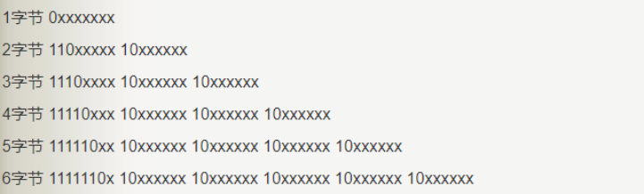

## 第二节
### 1.变量
#### 什么是变量？
在计算机领域任何信息都可以称为量

生活中
- 常量：恒古不变的信息，例如：一年有12个月
- 变量：信息内容可以发生改变的，例如：年龄

程序中
- 常量通常指的是一个固定的值。
  常量分为两种：字面值常量、符号常量(字符常量）。

字面值常量是指看到这个常量之后，就知道其值为多少。例如：整型常量：1、2、3，字符常量’a’、’b’，逻辑常量true、false，字符串常量”helloWorld”等。

符号常量（字符常量 final int PI = 1）是用符号进行表示，看到常量之后，能够知道其表示什么意思，但是不能知道其值为多少。例如 PI、E。

在Java语言中，主要是利用关键字final来修饰PI、E等常量。 常量一旦被初始化后不能再更改其值。一个变量被final修饰，这个变量就变成了一个常量，这个常量的值就不可变了,约定俗成的规定：字符常量的名字全部大写
- 变量：
  变量本质上就是代表一个”可操作的存储空间”，空间位置是确定的，但是里面放置什么值不确定。我们可通过变量名来访问“对应的存储空间”，从而操纵这个“存储空间”存储的值。Java是一种强类型语言，每个变量都必须声明其数据类型。变量的数据类型决定了变量占据存储空间的大小。 比如，int a=3; 表示a变量的空间大小为4个字节。变量作为程序中最基本的存储单元，其要素包括变量名，变量类型和作用域。变量在使用前必须对其声明, 只有在变量声明以后，才能为其分配相应长度的存储空间。

#### 为什么要使用变量？

随着行业的发展，java程序会越来越复杂，程序越来越多的要考虑 扩展性。
如果我们还是坚持使用字面常量 每次更改信息 都要先找到源码----更改源码----重新编译----重新运行。 使用变量可以避免这些问题。
#### 使用变量的步骤：
- 声明变量：变量类型 变量名；int x;（内存中会立即开辟一个int类型大小的存储空间,空间名字叫x）
  如果定义了一个变量但没有赋值的话，那这个变量相当于没有（因为会被垃圾回收机制回收空间）。
  - 变量作用域：从声明开始到离其最近的并包裹它的大括号结束，作用域内不能重复声明统一个变量名
- 变量赋值：变量名 = 值 x = 10;（在x存储空间里存入10这个量）
  - 声明同时赋值：变量类型 变量名 = 值 int x = 10;
- 使用变量：直接使用变量名
  - System.out.print("x的值为"+x);
  - x = x + 10
#### 变量类型
- 基本数据类型（共8个）：
  - `整数类型：`byte（1字节 127）short（2字节 32767）int（4字节 21亿）long（8字节）【java程序中整数默认用int存储，超出int存储位数的数据要改为long数据类型，并在数据结尾加L】
  - `浮点类型：`单精度浮点float（4字节）；双精度浮点double（8字节）【java程序中小数默认用double存储】
  - `字符类型：`char（基本占2字节；ASCII码表中的字符占1字节；Unicode码表包含基本所有字体符号，占2以上个字符，最多6字符）【只能是一个长度的信息，即一个字符】
    - java中用单引号（''）表示字符常量
    - char h = 40644（黄）(强制转换，对照Unicode码转换成字符)
  - `布尔类型：`boolean（）【只有true和false两个值，在内存中占1位bit，一字节是8bit】
- 引用数据类型：
  - 类（class）例如：String
  - 接口（interface）
  - 数组
### 2.标识符
- 【1】标识符：读音  biao zhi（四声） fu
- 【2】什么是标识符？
  包，类，变量，方法.....等等,只要是起名字的地方,那个名字就是标识符
- 【3】标识符定义规则：
  - 1. 三个可以（组成部分）：数字，字母，美元符号$ 注意：字母概念比较宽泛，指的是英文字母，汉字，日语，俄语......
       但是我们一般起名字尽量使用英文字母
  - 2.两个不可以：不可以以数字开头，不可以使用java中的关键字
  - 3.见名知意：增加可读性
  - 4.大小写敏感： int a; int A;
  - 5.遵照驼峰命名：
    类名：首字母大写，其余遵循驼峰命名
    方法名，变量名：首字母小写，其余遵循驼峰命名
    包名：全部小写，不遵循驼峰命名
  - 6.长度无限制，但是不建议太长
### 3.赋值：
- String name = "值";
- char c = '值';char c = 100;(强制转换)
- 其他变量类型 直接赋值
### 4.Scanner 工具类---程序输入：
- 创建Scanner对象：`Scanner input = new Scanner(System.in);`
- 提示信息：`System.out.print("请输入文字：");`
- 获取并存储输入信息：`String name = input.next();`
```java
package com.jiruan;
import java.util.Scanner;
/**
 * 借助Scanner实现接受用户输入姓名，年龄，成绩
 * 然后将接收的信息输出
 */
public class test01 {
    public static void main(String[] args) {

        Scanner input = new Scanner(System.in);
        System.out.print("请输入你的姓名：");
        String name = input.next();
        System.out.print("请输入你的年龄：");
        int year = input.nextInt();
        System.out.print("请输入你的性别：");
        String sex = input.next();
        System.out.print("请输入你的成绩：");
        double grade = input.nextDouble();
        System.out.println("姓名："+name+"\n年龄："+year+"\n性别："+sex+"\n成绩："+grade);
    }
}
```
### 5.基本数据类型的转换
- 1.boolean类型不参与类型转换
- 2.byte、short、char都是最小类型，三者之间不进行转换
- 3.类型排序（byte short char）< int< long< float< double
- 4.大类型转小类型：要进行强制类型转换。例：`double d = 34.25;int a = (int)d;`
- 5.小类型转大类型：自动进行转换。例：`int a = '张';`
- 6.一般整数默认为int类型，但当整数数值超出int的赋值范围，需要显示表示long类型。例：`long = 123456789123L;`
- 7.一般小数默认为double类型，想用float类型进行存储，同样需要显示表示。例:`float = (float)23.56;或 float = 23.56F;`
### 6.介绍字符编码
- JAVA是Unicode编码方式。国际通用字符集，融合了目前人类使用的所有字符。为每个字符分配唯一的字符码。
- UTF-8存储格式：一个字符最小可由一个字节存储（像ASCII码），最多可由六个字节存储。



