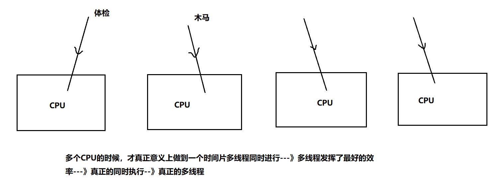

## 第十二节 多线程
### 1.理论：程序，进程，线程
- ➢程序(program)：是为完成特定任务、用某种语言编写的一组指令的集合,是一段静态的代码。
（程序是静态的）
- ➢进程(process)：是程序的一次执行过程。正在运行的一个程序，`进程作为资源分配的单位`，
在内存中会为每个进程分配不同的内存区域。 （进程是动态的）是一个动的过程 ，进程的生命
周期:有它自身的产生、存在和消亡的过程
- ➢线程(thread)，`进程可进一步细化为线程`， 是一个程序内部的一条执行路径。
若一个进程同一时间并行执行多个线程，就是支持多线程的。


- 单核CPU与多核CPU的任务执行：
  - 伪多线程

  - 多线程

- 并行和并发：<br>
  并行：多个CPU同时执行多个任务<br>
  并发：一个CPU“同时”执行多个任务（采用时间片切换）<br>
### 2.创建线程的三种方式
#### 1.继承Thread类
在学习多线程一章之前，以前的代码是单线程的吗？不是，以前也是有三个线程同时执行的。

- 1.线程创建：
线程类
```java
package com.msb.test01;
/**
 * @author : msb-zhaoss
 * 线程类叫：TestThread，不是说你名字中带线程单词你就具备多线程能力了（争抢资源能力）
 * 现在想要具备能力，继承一个类：Thread，具备了争抢资源的能力
 */
public class TestThread extends Thread{
    /*还可以采用构造器设置线程名字*/
    public TestThread(String name){
      super(name);//调用父类的有参构造器
    }
    /*
    一会线程对象就要开始争抢资源了，这个线程要执行的任务到底是啥？这个任务你要放在方法中
    但是这个方法不能是随便写的一个方法，必须是重写Thread类中的run方法
    然后线程的任务/逻辑写在run方法中
     */
    @Override
    public void run() {
        //输出1-10
        for (int i = 1; i <= 10 ; i++) {
            System.out.println(i);
        }
    }
}
```
测试方法
```java
package com.msb.test01;
/**
 * @author : msb-zhaoss
 * 测试类
 */
public class Test {
    //这是main方法，程序的入口
    public static void main(String[] args) {
        //给main方法这个主线程设置名字：
        //Thread.currentThread()作用获取当前正在执行的线程
        Thread.currentThread().setName("主线程");
        //主线程中也要输出十个数：
        for (int i = 1; i <= 10 ; i++) {
            System.out.println(Thread.currentThread().getName()+"main1-----"+i);
        }
        //制造其他线程，要跟主线程争抢资源：
        //具体的线程对象：子线程
        /*采用构造器设置名字*/
        TestThread tt = new TestThread("子线程");
        /*采用setName设置子线程名字*/
        //tt.setName("子线程");
        
        /*tt.run();//调用run方法，想要执行线程中的任务 -->这个run方法
         不能直接调用，直接调用就会被当做一个普通方法*/
        //想要tt子线程真正起作用比如要启动线程：使用start方法启动线程
        //start()是Thread类中的方法
        tt.start();
        //主线程中也要输出十个数：
        for (int i = 1; i <= 10 ; i++) {
            System.out.println(Thread.currentThread().getName()+"main2-----"+i);
        }
    }
}
```
- 多窗口（线程）抢票模拟
```java
package ThreadTest;
/**
 * 模拟多个窗口进行车票抢购
 * 采用创建线程的方式抢夺10张票
 * 共享资源以静态属性设置
 * */
public class BuyTicketThread extends Thread{
    public BuyTicketThread(String name) {
        super(name);
    }
    /*设置共享票数，一个类的多个对象要共享属性必须设置静态*/
    static int ticketNum = 10;

    @Override
    public void run() {
        /*每个窗口有100人来*/
        for (int i = 0; i <100 ; i++) {
            if(ticketNum > 0){//对票数进行判断，票数大于零我们才抢票，
                System.out.println("我在"+this.getName()+"买到了从北京到哈尔滨的第" + ticketNum-- + "张车票");
            }else {
                break;
            }
        }
    }
}
```
```java
package ThreadTest;

public class BuyTicketTest {
    public static void main(String[] args) {
        /*创建多线程，多窗口
         * 如果未设置线程名，程序会给线程设置默认名，Thread-x；
         * */
        BuyTicketThread t1 = new BuyTicketThread("窗口1");
        /*线程开始*/
        t1.start();
        BuyTicketThread t2 = new BuyTicketThread("窗口2");
        t2.start();
        BuyTicketThread t3 = new BuyTicketThread("窗口3");
        t3.start();
    }
}
```
#### 2.实现Runnable接口
- 1.代码
```java
package com.msb.test03;
/**
 * @author : msb-zhaoss
 * TestThread实现了这个接口，才会变成一个线程类
 */
public class TestThread implements Runnable{
    @Override
    public void run() {
        //输出1-10数字：
        for (int i = 1; i <= 10 ; i++) {
            System.out.println(Thread.currentThread().getName()+"----"+i);
        }
    }
}
```
```java
package com.msb.test03;
/**
 * @author : msb-zhaoss
 */
public class Test {
    public static void main(String[] args) {
        /*设置主线程名字*/
        Thread.currentThread().setName("主线程");
        //创建子线程对象,和Thread方法略有不同：
        TestThread tt = new TestThread();
        Thread t = new Thread(tt,"子线程");
        t.start();
        //主线程里面也是打印1-10数字：
        for (int i = 1; i <= 10 ; i++) {
            System.out.println(Thread.currentThread().getName()+"---"+i);
        }
    }
}
```
- 2.多窗口（线程）抢票模拟
```java
package RunnAble;
/**
 * 模拟多个窗口进行车票抢购
 * 采用创建线程的方式抢夺10张票
 * 共享资源以静态属性设置
 * */
public class BuyTicketRunnable implements Runnable{
    /*设置共享票数，不用设置static也能共享，因为多线程对象是由一个Runnable对象转换生成的*/
    int ticketNum = 10;

    @Override
    public void run() {
        /*每个窗口有100人来抢*/
        for (int i = 0; i <100 ; i++) {
            if(ticketNum > 0){//对票数进行判断，票数大于零我们才抢票，
                System.out.println("我在"+Thread.currentThread().getName()+"买到了从北京到哈尔滨的第" + ticketNum-- + "张车票");
            }
        }
    }
}
```
```java
package RunnAble;

public class BuyTicketTest {
    public static void main(String[] args) {
        /*创建一个实现类对象*/
        BuyTicketRunnable btr = new BuyTicketRunnable();
        /*将实现类转为线程类对象*/
        Thread r1 = new Thread(btr,"窗口1");
        r1.start();
        Thread r2 = new Thread(btr,"窗口2");
        r2.start();
        Thread r3 = new Thread(btr,"窗口3");
        r3.start();

    }
}
```
#### 3.实现Callable接口
对比第一种和第二种创建线程的方式发现，无论第一种继承Thread类（占用继承）的方式还是第二种实现
Runnable接口的方式，都需要有一个run方法，
但是这个run方法有不足：（1）没有返回值 ，（2）不能抛出异常<br>
实现Callable接口好处：（1）有返回值  （2）能抛出异常<br>
缺点：线程创建比较麻烦
```java
package CallableTest;

import java.util.Random;
import java.util.concurrent.Callable;
import java.util.concurrent.ExecutionException;
import java.util.concurrent.FutureTask;

public class TestRandomNum implements Callable<Integer> {
  /*
  1.实现Callable接口，可以不带泛型，如果不带泛型，那么call方式的返回值就是Object类型
  2.如果带泛型，那么call的返回值就是泛型对应的类型
  3.从call方法看到：方法有返回值，可以跑出异常
   */
  @Override
  public Integer call() throws Exception {
    for (int i = 1; i <= 100 ; i++) {
      System.out.println(Thread.currentThread().getName()+"-----"+i);
    }
    return new Random().nextInt(10);//返回10以内的随机数
  }
}
class Test{
  //这是main方法，程序的入口
  public static void main(String[] args) throws ExecutionException, InterruptedException {
    Thread.currentThread().setName("主线程");
    /*创建Callable实现类对象*/
    TestRandomNum trn = new TestRandomNum();
    /*转换Runnable实现类对象*/
    FutureTask ft = new FutureTask(trn);
    /*转换Thread线程类对象*/
    Thread t = new Thread(ft,"线程一");

    FutureTask ft1 = new FutureTask(trn);
    Thread t1 = new Thread(ft1,"线程二");
    t.start();
    for (int i = 1; i <= 100 ; i++) {
      System.out.println(Thread.currentThread().getName()+"main2-----"+i);
    }
    //获取线程得到的返回值：
    Object obj = ft.get();
    System.out.println(obj);
  }
}
```
### 3.线程的生命周期(重点)

- 1.线程的状态：<br>
线程从创建到死亡是会经历多个状态的流转的。它们分别是：NEW、RUNNABLE、BLOCKED、
WAITING、TIMED_WAITING、TERMINATED。<br>
新生状态：被创建出来后.<br>
就绪状态和运行状态：start后，程序在抢夺资源时会在就绪状态和运行状态之间切换。<br>
死亡状态：自动结束或被迫终止.<br>
阻塞状态：遭遇阻塞事件，待阻塞事件结束，重回就绪状态.<br>


### 4.线程常见方法
- 1.基础方法：
  - （1）`start()`:启动当前线程，表面上调用start方法，实际在调用线程里面的run方法
  - （2）`run()`:线程类 继承 Thread类 或者 实现Runnable接口的时候，都要重新实现这个run方法，run方法里面是线程要执行的内容
  - （3）`currentThread`:Thread类中一个静态方法：获取当前正在执行的线程
  - （4）`setName`:设置线程名字
  - （5）`getName`:读取线程名字
- 2.设置优先级`setPriority`：
  - 【1】同优先级别的线程，采取的策略就是先到先服务，使用时间片策略
  - 【2】如果优先级别高，被CPU调度的概率就高
  - 【3】级别：1-10   默认的级别为5
  
  
  代码：
```java
package com.msb.test06;
/**
 * @author : msb-zhaoss
 */
public class TestThread01 extends Thread {
    @Override
    public void run() {
        for (int i = 1; i <= 10; i++) {
            System.out.println(i);
        }
    }
}
class TestThread02 extends Thread{
    @Override
    public void run() {
        for (int i = 20; i <= 30 ; i++) {
            System.out.println(i);
        }
    }
}
class Test{
    //这是main方法，程序的入口
    public static void main(String[] args) {
        //创建两个子线程，让这两个子线程争抢资源：
        TestThread01 t1 = new TestThread01();
        /*设置优先级*/
        t1.setPriority(10);//优先级别高
        t1.start();
        TestThread02 t2 = new TestThread02();
        t2.setPriority(1);//优先级别低
        t2.start();
    }
}

```
- 3.`join`方法：
  当一个线程调用了join方法，这个线程就会先被执行，它执行结束以后才可以去执行其余的线程。
  注意：必须先start，再join才有效。
代码：
```java
package com.msb.test07;
/**
 * @author : msb-zhaoss
 */
public class TestThread extends Thread {
    public TestThread(String name){
        super(name);
    }
    @Override
    public void run() {
        for (int i = 1; i <= 10 ; i++) {
            System.out.println(this.getName()+"----"+i);
        }
    }
}
class Test{
    //这是main方法，程序的入口
    public static void main(String[] args) throws InterruptedException {
        for (int i = 1; i <= 100 ; i++) {
            System.out.println("main-----"+i);
            if(i == 6){
                //创建子线程：
                TestThread tt = new TestThread("子线程");
                tt.start();
                tt.join();//“半路杀出个程咬金”
            }
        }
    }
}
```
- 4.`Thread.sleep` : 人为的制造阻塞事件<br>
  - 休眠3秒：
   ```java
   public class Test01 {
       //这是main方法，程序的入口
       public static void main(String[] args) {
           try {
               /*单位为毫秒*/
               Thread.sleep(3000);
           } catch (InterruptedException e) {
               e.printStackTrace();
           }
           System.out.println("00000000000000");
       }
   }
   ```
  - 秒表功能：
```java
package com.msb.test08;
import javafx.scene.input.DataFormat;
import java.text.DateFormat;
import java.text.SimpleDateFormat;
import java.util.Date;
/**
 * @author : msb-zhaoss
 */
public class Test02 {
    //这是main方法，程序的入口
    public static void main(String[] args) {
        //2.定义一个时间格式：
        DateFormat df = new SimpleDateFormat("HH:mm:ss");
        while(true){
            //1.获取当前时间：
            Date d = new Date();
            //3.按照上面定义的格式将Date类型转为指定格式的字符串：
            System.out.println(df.format(d));
            try {
                /*每次休眠1秒*/
                Thread.sleep(1000);
            } catch (InterruptedException e) {
                e.printStackTrace();
            }
        }
    }
}
```
- 5.设置伴随线程`setDaemon`<br>
将子线程设置为主线程的伴随线程，主线程停止的时候，子线程也不要继续执行了
```java
package com.msb.test09;
/**
 * @author : msb-zhaoss
 */
public class TestThread extends Thread {
    @Override
    public void run() {
        for (int i = 1; i <= 1000 ; i++) {
            System.out.println("子线程----"+i);
        }
    }
}
class Test{
    //这是main方法，程序的入口
    public static void main(String[] args) {
        //创建并启动子线程：
        TestThread tt = new TestThread();
        tt.setDaemon(true);//设置伴随线程  注意：先设置，再启动
        tt.start();
        //主线程中还要输出1-10的数字：
        for (int i = 1; i <= 10 ; i++) {
            System.out.println("main---"+i);
        }
    }
}
```

- 6.stop
```java
package com.msb.test09;
/**
 * @author : msb-zhaoss
 */
public class Demo {
    //这是main方法，程序的入口
    public static void main(String[] args) {
        for (int i = 1; i <= 100 ; i++) {
            if(i == 6){
                Thread.currentThread().stop();//过期方法，不建议使用
            }
            System.out.println(i);
        }
    }
}

```
### 5.线程安全问题


- 1.同步代码块：<br>
同步监视器总结：<br>
  总结1：认识同步监视器（锁）   -----  synchronized(同步监视器){ }<br>
  1)必须是引用数据类型，不能是基本数据类型<br>
  2)也可以创建一个专门的同步监视器，没有任何业务含义<br>
  3)一般使用共享资源做同步监视器即可   <br>
  4)在同步代码块中不能改变同步监视器对象的引用 <br>
```java
package ThreadSafety;
/**
 * 模拟多个窗口进行车票抢购
 * 采用创建线程的方式抢夺10张票
 * 共享资源以静态属性设置
 * */
public class BuyTicketThread extends Thread{
    public BuyTicketThread(String name) {
        super(name);
    }
    /*设置共享票数*/
    static int ticketNum = 10;
    @Override
    public void run() {
        /*每个窗口有100人来抢*/
        for (int i = 0; i <100 ; i++) {
            synchronized (BuyTicketThread.class){
            if(ticketNum > 0) {//对票数进行判断，票数大于零我们才抢票，
                ticketNum--;
                System.out.println("我在" + this.getName() + "买到了从北京到哈尔滨的第" + (ticketNum+1) + "张车票");
            }else {
                break;
            }
            }
        }
    }
}
```
接口
```java
package RunnAble;
/**
 * 模拟多个窗口进行车票抢购
 * 采用创建线程的方式抢夺10张票
 * 共享资源以静态属性设置
 * */
public class BuyTicketRunnable implements Runnable{
  /*设置共享票数*/
  static int ticketNum = 1000;

  @Override
  public void run() {
    /*每个窗口有100人来抢*/
    for (int i = 0; i <100 ; i++) {
      synchronized (this) {
        if (ticketNum > 0) {//对票数进行判断，票数大于零我们才抢票，
          System.out.println("我在" + Thread.currentThread().getName() + "买到了从北京到哈尔滨的第" + ticketNum-- + "张车票");
        }
      }
    }
  }
}
```
- 2.同步方法：
接口：
```java
public class BuyTicketThread implements Runnable {
    int ticketNum = 10;
    @Override
    public void run() {
        //此处有1000行代码
        for (int i = 1; i <= 100 ; i++) {
            buyTicket();
        }
        //此处有1000行代码
    }
    public synchronized void buyTicket(){//锁住的是this
        if(ticketNum > 0){
            System.out.println("我在"+Thread.currentThread().getName()+"买到了北京到哈尔滨的第" + ticketNum-- + "张车票");
        }
    }
}
```
继承
```java
public class BuyTicketThread extends Thread {
    public BuyTicketThread(String name){
        super(name);
    }
    //一共10张票：
    static int ticketNum = 10;//多个对象共享10张票
    //每个窗口都是一个线程对象：每个对象执行的代码放入run方法中
    @Override
    public void run() {
        //每个窗口后面有100个人在抢票：
        for (int i = 1; i <= 100 ; i++) {
            buyTicket();
        }
    }
    public static synchronized void buyTicket(){//锁住的  同步监视器： BuyTicketThread.class
        if(ticketNum > 0){//对票数进行判断，票数大于零我们才抢票
            System.out.println("我在"+Thread.currentThread().getName()+"买到了从北京到哈尔滨的第" + ticketNum-- + "张车票");
        }
    }
}
```
- 3.lock锁<br>
DK1.5后新增新一代的线程同步方式:Lock锁
与采用synchronized相比，lock可提供多种锁方案，更灵活
synchronized是Java中的关键字，这个关键字的识别是靠JVM来识别完成的呀。是虚拟机级别的。
但是Lock锁是API级别的，提供了相应的接口和对应的实现类，这个方式更灵活，表现出来的性能优于之前的方式。
```java
package ThreadSafety;

import java.util.concurrent.locks.Lock;
import java.util.concurrent.locks.ReentrantLock;
/**
 * 模拟多个窗口进行车票抢购
 * 采用创建线程的方式抢夺10张票
 * 共享资源以静态属性设置
 */
public class BuyTicketThread extends Thread {
    final String a = "abc";

    public BuyTicketThread(String name) {
        super(name);
    }

    /*设置共享票数*/
    static int ticketNum = 10;
    Lock lock = new ReentrantLock();

    @Override
    public void run() {
        /*每个窗口有100人来强*/
        for (int i = 0; i < 100; i++) {
            lock.lock();
            if (ticketNum > 0) {//对票数进行判断，票数大于零我们才抢票，
                System.out.println("我在" + Thread.currentThread().getName() + "买到了从北京到哈尔滨的第" + ticketNum-- + "张车票");
            }
            lock.unlock();

        }
    }
}
```
- 4.使用线程同步的缺点<br>
  - 【1】对比：<br>
  线程安全，效率低<br>
  线程不安全，效率高<br>
  - 【2】可能造成死锁：<br>
不同的线程分别占用对方需要的同步资源不放弃，都在等待对方放弃自己需要的同步资源，就形成了线程的死锁
出现死锁后，不会出现异常，不会出现提示，只是所有的线程都处于阻塞状态，无法继续。
```java
public class TestDeadLock implements Runnable {
    public int flag = 1;
    static Object o1 = new Object(),o2 = new Object();
        
        
    public void run(){
        System.out.println("flag=" + flag);
        // 当flag==1锁住o1
        if (flag == 1) {
            synchronized (o1) {
                try {
                    Thread.sleep(500);
                } catch (Exception e) {
                    e.printStackTrace();
                }
                // 只要锁住o2就完成
                synchronized (o2) {
                    System.out.println("2");
                }
            }
        }
        // 如果flag==0锁住o2
        if (flag == 0) {
            synchronized (o2) {
                try {
                    Thread.sleep(500);
                } catch (Exception e) {
                    e.printStackTrace();
                }
                // 只要锁住o1就完成
                synchronized (o1) {
                    System.out.println("3");
                }
            }
        }
    }
        
        
    public static void main(String[] args) {
        // 实例2个线程类
        TestDeadLock td1 = new TestDeadLock();
        TestDeadLock td2 = new TestDeadLock();
        td1.flag = 1;
        td2.flag = 0;
        // 开启2个线程
        Thread t1 = new Thread(td1);
        Thread t2 = new Thread(td2);
        t1.start();
        t2.start();
    }
}
```
`解决方法： 减少同步资源的定义，避免嵌套同步`


