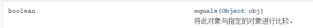

## 第九节 常用类
### 1.Object类
所有java类的父类。在java.lang包下
 - Object类只有一个无参构造器
 - equals（）比较两个对象内存地址。
 - hashCode（）经过哈希算法，返回一个哈希码。
 - toString（）以字符串的形式打印对象。在输出语句中会默认调用toString方法。
### 2.包装类
- 【1】什么是包装类：
  以前定义变量，经常使用基本数据类型，
  对于基本数据类型来说，它就是一个数，加点属性，加点方法，加点构造器，
  `将基本数据类型对应进行了一个封装`，产生了一个新的类，---》包装类。
  int,byte.....--->基本数据类型
  `包装类--->引用数据类型`


- 【3】已经有基本数据类型了，为什么要封装为包装类？<br>
  - （1）java语言 面向对象的语言，最擅长的操作各种各样的类。基本数据类型不符合面向对象原理<br>
  - （2）以前学习装数据的---》数组，int[]  String[]  double[]   Student[]
     以后学习的装数据的---》`集合，有一个特点，只能装引用数据类型的数据`
- 【4】integer
  - 【1】直接使用，无需导包：
  - 【2】类的继承关系：

  - 【3】实现接口：


Comparable<integer> 比较器，集合时进行排序使用 <vr>
Serializable 支持序列化和反序列化
  - 【4】这个类被final修饰，那么这个类不能有子类，不能被继承：

  - 【5】包装类是对基本数据类型的封装： 对int类型封装产生了Integer

  - 【6】属性：
  ```
  //属性：
  System.out.println(Integer.MAX_VALUE);                2147483647
  System.out.println(Integer.MIN_VALUE);                -2147483648
  //“物极必反”原理：
  System.out.println(Integer.MAX_VALUE+1);            -2147483648
  System.out.println(Integer.MIN_VALUE-1);             2147483647
  ```
  - 【7】构造器（发现没有空参构造器）
    - （1）int类型作为构造器的参数：`Integer i1 = new Integer(12);`
    
    - （2）String类型作为构造器的参数：Integer i2 = new Integer("12");<br>
      Integer i3 = new Integer("abcdef");
    
    
      传入的字符串如果转型不了，会向上抛出一个运行异常（无需我们自己捕获）。
  - 【8】包装类特有的机制：自动装箱  自动拆箱：
  ```
  //自动装箱：int--->Integer
        Integer i = 12;
        System.out.println(i);
        //自动拆箱：Integer--->int
        Integer i2 = new Integer(12);
        int num = i2;
        System.out.println(num);
  ```
  

Integer valueOf(int i)：返回一个表示指定的 int 值的 Integer 实例。

intValue()方法用于返回此Integer对象表示的值，该值转换为int类型(通过强制转换)。

intValue()方法是一个非静态方法，只能通过类对象访问，如果尝试使用类名称访问该方法，则会收到错误消息。

从整数转换为int时，intValue()方法不会引发异常。
valueOf方法的底层：


如果自动装箱值在-128~127之间，那么比较的就是具体的数值，否则，比较的就是对象的地址
```
package com.jiruan;
public class Test {
    public static void main(String[] args) {
        Integer integer = 127;
        Integer integer2 = 127;
        System.out.println(integer2 == integer);//true
        System.out.println(integer2.equals(integer));//true
        Integer integer3 = 128;
        Integer integer4 = 128;
        System.out.println(integer3 == integer4);//false
        System.out.println(integer4.equals(integer3));//true
    }
}
```
- 9.常用方法





### 3.Math类
- 【1】直接使用，无需导包：

- 【2】final修饰类，这个类不能被继承：

- 【3】构造器私有化，不能创建Math类的对象：

- 【4】Math内部的所有的属性，方法都被static修饰：类名.直接调用，无需创建对象：

- 【5】常用方法：一般做一些普通的常规运算，特别精细的运算无法实现。
```java
package com.msb.test03;
/**
 * @Auther: msb-zhaoss
 */
public class Test01 {
    //这是一个main方法，是程序的入口：
    public static void main(String[] args) {
        //常用属性：
        System.out.println(Math.PI);
        //常用方法：
        System.out.println("随机数："+Math.random()*10+15);//[15.0,25.0)
        System.out.println("绝对值："+Math.abs(-80));
        System.out.println("向上取值："+Math.ceil(9.1));
        System.out.println("向下取值："+Math.floor(9.9));
        System.out.println("四舍五入："+Math.round(3.5));
        System.out.println("取大的那个值："+Math.max(3, 6));
        System.out.println("取小的那个值："+Math.min(3, 6));
    }
}
```
- 【6】静态导入：`import static java.lang.Math.*`;
### 4.Random类
- 1.java.util包，需要导包
- 2.实现接口：Serializable
- 3.利用带参数的构造器创建对象：使用单个long种子创建一个新的随机数生成器。
一个种子对应一个随机数类
```
Random r1 = new Random(System.currentTimeMillis());
        int i = r1.nextInt();
        System.out.println(i);
```
- 4.利用空参构造器创建对象： 
```
Random r2 = new Random();//表面是在调用无参数构造器，实际底层还是调用了带参构造器
System.out.println(r2.nextInt(10));//在 0（包括）和指定值（不包括）之间均匀分布的 int 值。
System.out.println(r2.nextDouble()*10);//在 0.0 和 10.0 之间均匀分布的 double 值。
```
### 5.字符串类
#### 1.String类
- 1.直接使用，无需导包：

- 2.继承Object类。
- 3.实现接口：Serializable, Comparable<String>, CharSequence
- 4.字符串是不可变的

- 5.这个String类不可以被继承，不能有子类：

- 6.String底层是一个char类型的数组,地址不可变，重新赋值会切换地址。

- 7.常用方法
  - 1.【1】构造器：底层就是给对象底层的value数组进行赋值操作。
   ```
  //通过构造器来创建对象：
        String s1 = new String();
        String s2 = new String("abc");
        String s3 = new String(new char[]{'a','b','c'});
   ```
  - 2.方法
  ```
  String s4 = "a bc";
  System.out.println("字符串的长度为："+s4.length());  //4
  String s5 = new String("abc");
  //字符串有地址但是没有元素时判断为空
  System.out.println("字符串是否为空："+s5.isEmpty());  //false
  String str2 =new String();
  String str3 =new String("");
  System.out.println(str2.isEmpty());   //true
  System.out.println(str3.isEmpty());   //true
  System.out.println("获取字符串的下标对应的字符为："+s5.charAt(1));//b
        //字符串的截取：
        String s10 = "abcdefhijk";
        System.out.println(s10.substring(3));  //defhijk
        System.out.println(s10.substring(3, 6));//[3,6)   //def
        //字符串的合并/拼接操作(匿名变量,不影响原先字符串的值)：
        System.out.println(s10.concat("pppp"));   //abcdefhijkpppp
        //字符串中的字符的替换：
        String s11 = "abcdeahija";
        System.out.println(s11.replace('a', 'u')); //ubcdeuhiju
        //按照指定的字符串进行分裂为数组的形式：
        String s12 = "a-bf-c-d-e-f";
        String[] strs = s12.split("-");   
        System.out.println(Arrays.toString(strs));//[a, bf, c, d, e, f]
        //转大小写的方法：
        String s14 = "ABC";
        String s13 = "abc";
        System.out.println(s13.toUpperCase());   //ABC
        System.out.println(s13.toUpperCase().toLowerCase());//abc
        //忽略大小写比较
        System.out.println(s13.equalsIgnoreCase(s14));
        //去除首尾空格：
        String s14 = "    a  b  c    ";
        System.out.println(s14.trim());   //a  b  c
        //toString()
        String s15 = "abc";
        System.out.println(s15.toString());   //abc
        //转换为String类型：
        System.out.println(String.valueOf(false));   //false
        //查询字符串下标
        String s20 = "abcdefhigfhcdefdjk";
        //最先出现的第一个位置
        System.out.println(s20.indexof("cde"));// 2
        //最后出现的第一个位置
        System.out.println(s20.lastindexof("cde"));  //11
  ```
  - 3.equals
  
  - 4.String类实现了Comparable，里面有一个抽象方法叫compareTo，所以String中一定要对这个方法进行重写
  
  - 4.字符串拼接：
  ```
    public class Test02 {
    //这是一个main方法，是程序的入口：
    public static void main(String[] args) {
    String s1 = "a"+"b"+"c";
    String s2 = "ab"+"c";
    String s3 = "a"+"bc";
    String s4 = "abc";
    String s5 = "abc"+"";
    }
    }
  ```
  上面的字符串，会进行编译器优化，直接合并成为完整的字符串,然后在常量池中，常量池的特点
是第一次如果没有这个字符串，就放进去，如果有这个字符串，就直接从常量池中取.

>注意：【String字符串相加 只要相加过程中出现引用类型都会采用创建StringBuilder的方
式拼接字符串；】
#### 2.StringBuilder类
- 1.字符串的分类：
  - （1）不可变字符串：String
  - （2）可变字符串：StringBuilder，StringBuffer
- 2.继承 :extends AbstractStringBuilder。<br>
接口：implements java.io.Serializable, CharSequence。<br>
StringBuilder的底层AbstractStringBuilder是Char[]类型数组.

构造器
```
public StringBuilder() {
super(16);
}
```
空构造器初始长度为16.
- 3.常用方法

构造器


```java
package StringTest;

public class TestBuilder {
    public static void main(String[] args) {
        StringBuilder builder = new StringBuilder();
        builder = new StringBuilder("123");
        //拼接
        builder.append("asdf");
        System.out.println(builder);   //123asdf
        //删除
        builder.delete(2,5);
        System.out.println(builder);   //12df
        builder.deleteCharAt(0);
        System.out.println(builder);   //2df
        //插入
        System.out.println(builder.insert(3,"sackh"));   //2dfsackh
        //替换
        System.out.println(builder.replace(3,4,"我是谁")); //2df我是谁ackh
        //逆序
        System.out.println(builder.reverse()); //hkca谁是我fd2
        //查找
        System.out.println(builder.charAt(4));  //谁
        //设置
        builder.setCharAt(3,'!');
        System.out.println(builder);  //hkc!谁是我fd2
    }
}
```
#### 2.StringBuffer类
- String、StringBuffer、StringBuilder区别与联系

1. String类是不可变类，即一旦一个String对象被创建后，包含在这个对象中的字符序列是不可改变的，直至这个对象销毁。

2. StringBuffer类则代表一个字符序列可变的字符串，可以通过append、insert、reverse、
setChartAt、setLength等方法改变其内容。一旦生成了最终的字符串，调用toString方法将其转变为String

3. JDK1.5新增了一个StringBuilder类，与StringBuffer相似，构造方法和方法基本相同。
不同是StringBuffer是线程安全的，而StringBuilder是线程不安全的，所以性能略高。
通常情况下，创建一个内容可变的字符串，应该优先考虑使用StringBuilder

StringBuilder:JDK1.5开始,效率高,线程不安全<br>
StringBuffer:JDK1.0开始,效率低,线程安全<br>

### 6.日期类
#### 1.第一阶段 Date（util）

```java
package com.msb.test02;
import java.util.Date;
/**
 * @Auther: msb-zhaoss
 */
public class Test {
    //这是一个main方法，是程序的入口：
    public static void main(String[] args) {
        //java.util.Date:
        Date d = new Date();//系统当前时间
        System.out.println(d);//Wed Aug 02 15:53:31 CST 2023
        System.out.println(d.toString());//Wed Aug 02 15:53:31 CST 2023
      //2 Aug 2023 07:53:31 GMT  
      System.out.println(d.toGMTString());//过期方法，过时方法，废弃方法。
      //2023-8-2 15:53:31
      System.out.println(d.toLocaleString());
      //距离1900年差的年份
        System.out.println(d.getYear());//123
        System.out.println(d.getMonth());//7
        //返回自 1970 年 1 月 1 日 00:00:00 GMT 以来此 Date 对象表示的毫秒数。
        System.out.println(d.getTime());//1690962811058
      //推荐使用下面的静态方法
        System.out.println(System.currentTimeMillis());//1690962811095
        /*
        （1）疑问：以后获取时间差用：getTime()还是currentTimeMillis()
        答案：currentTimeMillis()--》因为这个方法是静态的，可以类名.方法名直接调用
        （2）public static native long currentTimeMillis();
        本地方法
        为什么没有方法体？因为这个方法的具体实现不是通过java写的。
        （3）这个方法的作用：
        一般会去衡量一些算法所用的时间
         */
      Date date1 = new Date(123,9,1);//2023-10-1
    }
}
```
#### 2.第一阶段Date（sql）
- 1.java.util.Date和java.sql.Date的区别
  - 1.java.util.Date是java.sql.Date的父类
  - 2.java.util.Date可以代表年月日时分秒，java.sql.Date只能代表年月日
  - 3.java.util.Date有参和无参构造器，java.sql.Date只有有参构造器（毫秒）
  - 4.`util.Date 转 sql.Date`
    - 1.方式1：向下转型<br>
    java.util.Date `date` = new java.sql.Date(System.currentTimeMillis());<br>
    java.sql.Date date1 = (java.util.Date) date;
    - 2.方式2：用构造器<br>
    java.sql.Date `date2` = new java.sql.Date(date.getTime());
  - 5.`sql.Date 转 util.Date`(自动类型转换)<br>
    java.util.Date `date3` = date2;
  - 6.`String 转 sql.Date`<br>
    java.sql.Date `date4` =  java.sql.Date.valueOf("2023-8-8");
#### 3.第一阶段SimpleDateFormat
【1】String---》java.util.Date 类型转换：<br>
分解：<br>
（1）String--->java.sql.Date<br>
（2）java.sql.Date--->java.util.Date<br>
SimpleDateFormat可以将String直接转成util.Date
```java
package TimeTest;
import java.text.DateFormat;
import java.text.ParseException;
import java.text.SimpleDateFormat;
import java.util.Date;
public class SimpleDateFormatTest {
    public static void main(String[] args) throws ParseException {
        DateFormat dataFormat = new SimpleDateFormat();//默认格式yyyy-MM-dd
        //时间转字符串,将String转为util.Date
        System.out.println(dataFormat.format(new Date()));//23-8-8 下午3:47
        DateFormat dataFormat1 = new SimpleDateFormat("yyyy-MM-dd");
        //字符串转时间 
        System.out.println(dataFormat1.parse("2023-08-08"));//Tue Aug 08 00:00:00 CST 2023
        SimpleDateFormat simpleDateFormat = new SimpleDateFormat("yyyy@MM@dd");//yyyy@MM@dd
        System.out.println(simpleDateFormat.parse("2023@08@08"));
    }
}
```

#### 4.第二阶段 日历类 Calendar
```java
package com.msb.test02;
import java.util.Calendar;
import java.util.GregorianCalendar;
/**
 * @Auther: msb-zhaoss
 */
public class Test06 {
    //这是一个main方法，是程序的入口：
    public static void main(String[] args) {
        //Calendar是一个抽象类，不可以直接创建对象
        //GregorianCalendar()子类 extends Calendar（父类是一个抽象类）
        Calendar cal = new GregorianCalendar();
        Calendar cal2 = Calendar.getInstance();
        //上面都是创建对象的方法
        System.out.println(cal);
        //常用的方法：
        // get方法，传入参数：Calendar中定义的常量
        System.out.println(cal.get(Calendar.YEAR));
        System.out.println(cal.get(Calendar.MONTH));//实际月份-1
        System.out.println(cal.get(Calendar.DATE));
        System.out.println(cal.get(Calendar.DAY_OF_WEEK));
        System.out.println(cal.getActualMaximum(Calendar.DATE));//获取当月日期的最大天数
        System.out.println(cal.getActualMinimum(Calendar.DATE));//获取当月日期的最小天数
        // set方法：可以改变Calendar中的内容
        cal.set(Calendar.YEAR,1990);
        cal.set(Calendar.MONTH,3);
        cal.set(Calendar.DATE,16);
        System.out.println(cal);
        //String--->Calendar:
        //分解：
        //String--->java.sql.Date:
        java.sql.Date date = java.sql.Date.valueOf("2020-4-5");
        //java.sql.Date-->Calendar:
        //指定时间
        cal.setTime(date);
        System.out.println(cal);
        //获取当前日历时间，
        cal.setTime();
        //设置时间
      cal.set(2023,7,1);//实际月份等于输入月份+1
      System.out.println(cal.get(Calendar.DAY_OF_WEEK));//3
    }
}
```
#### 5.第三阶段 LocalDate/LocalTime/LocalDateTime
- 第一阶段和第二阶段的缺陷
  - 1.可变性 : 像日期和时间这样的类应该是不可变的。
  - 2.偏移性 : Date中的年份是从1900开始的，而月份都从0开始。
  - 3.格式化 : 格式化只对Date有用，Calendar则不行。
```java
package com.msb.test02;
import java.time.LocalDate;
import java.time.LocalDateTime;
import java.time.LocalTime;
/**
 * @Auther: msb-zhaoss
 */
public class Test09 {
    //这是一个main方法，是程序的入口：
    public static void main(String[] args) {
        //1.完成实例化：
        //方法1：now()--获取当前的日期，时间，日期+时间
        LocalDate localDate = LocalDate.now();
        System.out.println(localDate);
        LocalTime localTime = LocalTime.now();
        System.out.println(localTime);
        LocalDateTime localDateTime = LocalDateTime.now();
        System.out.println(localDateTime);
        //方法2：of()--设置指定的日期，时间，日期+时间
        LocalDate of = LocalDate.of(2010, 5, 6);//年月日
        System.out.println(of);
        LocalTime of1 = LocalTime.of(12, 35, 56);//时分秒
        System.out.println(of1);
        LocalDateTime of2 = LocalDateTime.of(1890, 12, 23, 13, 24, 15);//年月日时分秒
        System.out.println(of2);
        //LocalDate,LocalTime用的不如LocalDateTime多
        //下面讲解用LocalDateTime：
        //一些列常用的get***
        System.out.println(localDateTime.getYear());//2020
        System.out.println(localDateTime.getMonth());//JUNE
        System.out.println(localDateTime.getMonthValue());//6
        System.out.println(localDateTime.getDayOfMonth());//14
        System.out.println(localDateTime.getDayOfWeek());//SUNDAY
        System.out.println(localDateTime.getHour());//22
        System.out.println(localDateTime.getMinute());//22
        System.out.println(localDateTime.getSecond());//6
        //不是set方法，叫with
        //体会：不可变性
        LocalDateTime localDateTime2 = localDateTime.withMonth(7);
        System.out.println(localDateTime);// 2023-08-03T13:45:18.607
        System.out.println(localDateTime2);//  2023-07-03T13:45:18.607
        //提供了加减的操作：
        //加：
        LocalDateTime localDateTime1 = localDateTime.plusMonths(4);
        System.out.println(localDateTime);  //2023-08-03T13:45:18.607
        System.out.println(localDateTime1);// 2023-12-03T13:45:18.607
        //减：
        LocalDateTime localDateTime3 = localDateTime.minusMonths(5);
        System.out.println(localDateTime); // 2023-08-03T13:45:18.607
        System.out.println(localDateTime3);  //2023-03-03T13:45:18.607
    }
}
```

#### 第三阶段 DateTimeFormatter
```java
package com.msb.test02;
import java.time.LocalDateTime;
import java.time.format.DateTimeFormatter;
import java.time.format.FormatStyle;
import java.time.temporal.TemporalAccessor;
/**
 * @Auther: msb-zhaoss
 */
public class Test10 {
    //这是一个main方法，是程序的入口：
    public static void main(String[] args) {
        //格式化类：DateTimeFormatter
        //方式一:预定义的标准格式。如: ISO_LOCAL_DATE_TIME; 
        // ISO_LOCAL_DATE;     IS0_LOCAL_TIME
        DateTimeFormatter df1 = DateTimeFormatter.ISO_LOCAL_DATE_TIME;
        //df1就可以帮我们完成LocalDateTime和String之间的相互转换：
        //LocalDateTime-->String:
        LocalDateTime now = LocalDateTime.now();
        String str = df1.format(now);
        System.out.println(str);//2020-06-15T15:02:51.29
        //String--->LocalDateTime
        TemporalAccessor parse = df1.parse("2020-06-15T15:02:51.29");
        System.out.println(parse); // {},ISO resolved to 2020-06-15T15:02:51.290
        //方式二:本地化相关的格式。如: oflocalizedDateTime()
        //参数：FormatStyle.LONG / FormatStyle.MEDIUM / FormatStyle.SHORT
        //FormatStyle.LONG :2020年6月15日 下午03时17分13秒
        //FormatStyle.MEDIUM: 2020-6-15 15:17:42
        //FormatStyle.SHORT:20-6-15 下午3:18
        DateTimeFormatter df2 = DateTimeFormatter.ofLocalizedDateTime(FormatStyle.SHORT);
        //LocalDateTime-->String:
        LocalDateTime now1 = LocalDateTime.now();
        String str2 = df2.format(now1);
        System.out.println(str2);//23-8-3 下午2:48
        //String--->LocalDateTime
        TemporalAccessor parse1 = df2.parse("20-6-15 下午3:18");
        System.out.println(parse1); //{},ISO resolved to 2020-06-15T15:18
        //方式三: 自定义的格式。如: ofPattern( "yyyy-MM-dd hh:mm:ss") ---》重点，以后常用
        DateTimeFormatter df3 = DateTimeFormatter.ofPattern("yyyy-MM-dd hh:mm:ss");
        //LocalDateTime-->String:
        LocalDateTime now2 = LocalDateTime.now();
        String format = df3.format(now2);//2023-08-03 02:48:41
        System.out.println(format);//2020-06-15 03:22:03
        //String--->LocalDateTime
        TemporalAccessor parse2 = df3.parse("2020-06-15 03:22:03");
        System.out.println(parse2);//{MinuteOfHour=22, MilliOfSecond=0, HourOfAmPm=3, MicroOfSecond=0, SecondOfMinute=3, NanoOfSecond=0},ISO resolved to 2020-06-15
    }
}
```


