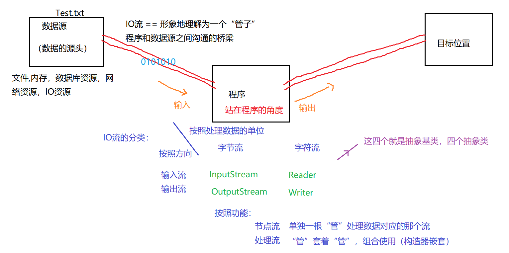
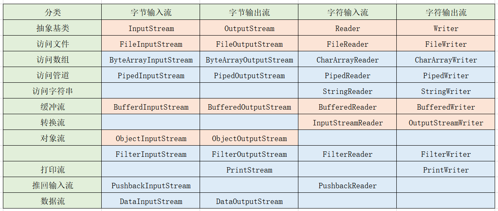
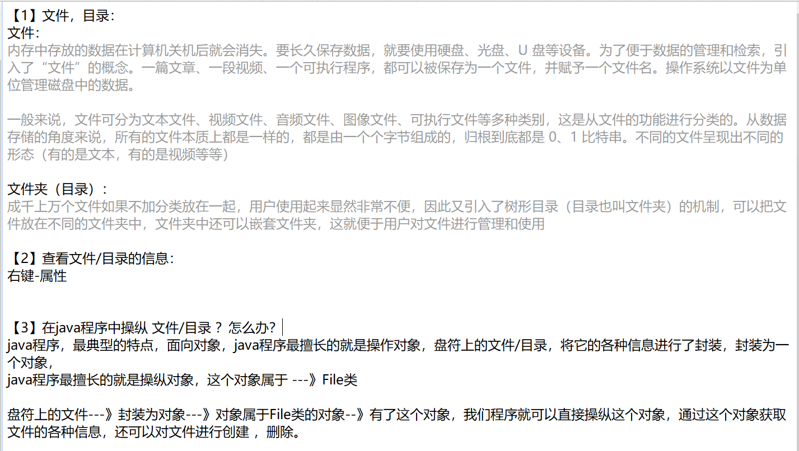
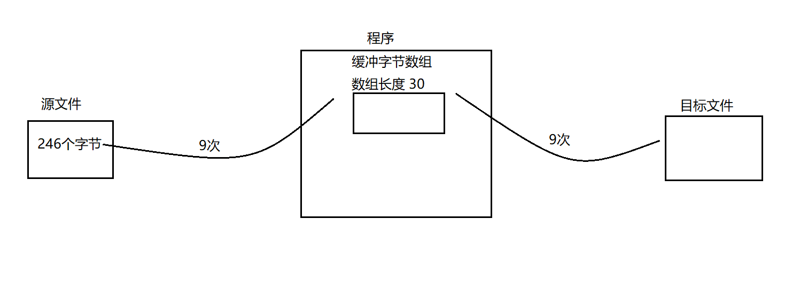
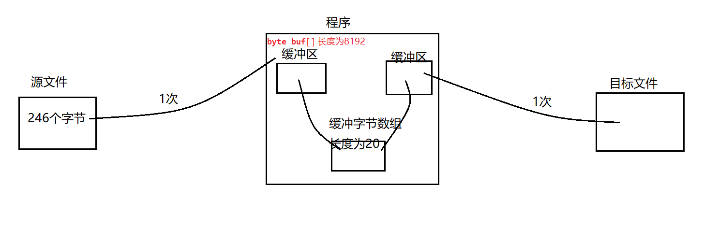
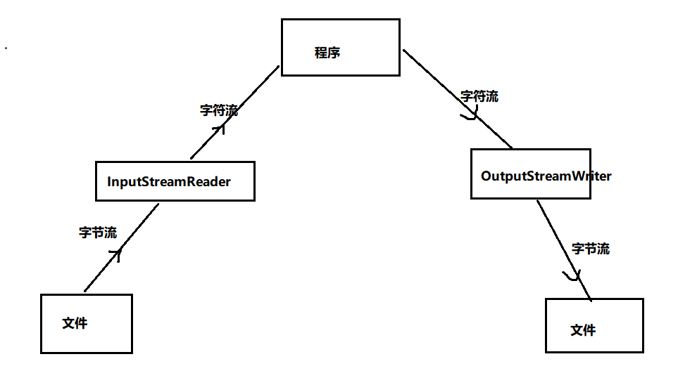
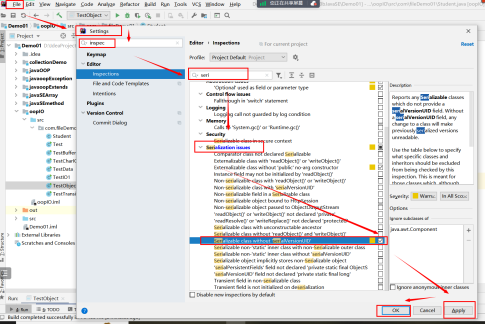
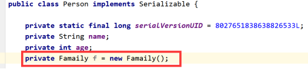
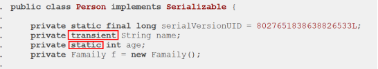
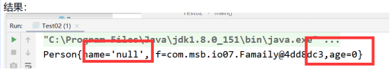

## 第十一节 IO流
- （1）I/O ：Input/Output的缩写，用于处理设备之间的数据的传输。<br>
作用：将临时的缓存信息存储到物理文件里做永久保存。
形象理解：IO流 当做一根 “管”（从内存----->物理文件）：

  - 1.input输入：从外部物理文件往内存。
  - 2.output输出：从内存往外部物理文件。
- （2）IO流的体系结构：

  - 根据流的方向分别为`输入流`和`输出流`。
  - 根据流运载信息的多少，分为`字节流`和`字符流`。
  - 根据流的功能分为`节点流（直接连接数据源）`和`处理流（连接另外一个流）`。
- （3）File类

  - 1.文件操作方法
  ```java
  package com.msb.file;
  import java.io.File;
  import java.io.IOException;
  /**
  * @author : msb-zhaoss
  */
  public class Test01 {
  //这是一个main方法，是程序的入口：
  public static void main(String[] args) throws IOException {
  //将文件封装为一个File类的对象：
  File f = new File("d:\\test.txt");
  File f1 = new File("d:\\test.txt");
  File f2 = new File("d:/test.txt");
  //File.separator属性帮我们获取当前操作系统的路径拼接符号
  //在windows，dos下，系统默认用“\”作为路径分隔符 ，在unix，url中，使用“/”作为路径分隔符。
  File f3 = new File("d:"+File.separator+"test.txt");//建议使用这种
  //常用方法：
  System.out.println("文件是否可读："+f.canRead());
  System.out.println("文件是否可写："+f.canWrite());
  System.out.println("文件的名字："+f.getName());
  System.out.println("上级目录："+f.getParent());
  System.out.println("是否是一个目录："+f.isDirectory());
  System.out.println("是否是一个文件："+f.isFile());
  System.out.println("是否隐藏："+f.isHidden());
  System.out.println("文件的大小："+f.length());
  System.out.println("是否存在："+f.exists());
  /*if(f.exists()){//如果文件存在，将文件删除操作
  f.delete();
  }else{//如果不存在，就创建这个文件
  f.createNewFile();
  }*/
  System.out.println(f == f1);//比较两个对象的地址
  System.out.println(f.equals(f1));//比较两个对象对应的文件的路径
  //跟路径相关的：
  System.out.println("绝对路径："+f.getAbsolutePath());
  System.out.println("相对路径："+f.getPath());
  System.out.println("toString:"+f.toString());
  System.out.println("----------------------");
  File f5 = new File("demo.txt");//使用单文件名创建文件时，默认路径是IDEA的该项目文件下
  if(!f5.exists()){
  f5.createNewFile();
  }
  //绝对路径指的就是：真实的一个精准的，完整的路径
  System.out.println("绝对路径："+f5.getAbsolutePath());
  //相对路径：有一个参照物，相对这个参照物的路径。
  //在main方法中，相对位置指的就是：D:\IDEA_workspace\TestJavaSE
  //在junit的测试方法中，相对路径指的就是模块位置
  System.out.println("相对路径："+f5.getPath());
  //toString的效果永远是  相对路径
  System.out.println("toString:"+f5.toString());
  File f6 = new File("a/b/c/demo.txt");
  if(!f5.exists()){
  f5.createNewFile();
  }
  System.out.println("绝对路径："+f6.getAbsolutePath());
  System.out.println("相对路径："+f6.getPath());
  }
  }
  ```
  - 2.目录操作方法：
  ```java
  package com.msb.file;
  import java.io.File;
  /**
  * @author : msb-zhaoss
  */
  public class Test02 {
  //这是一个main方法，是程序的入口：
  public static void main(String[] args) {
  //将目录封装为File类的对象：
  File f = new File("D:\\IDEA_workspace");
  System.out.println("文件是否可读："+f.canRead());
  System.out.println("文件是否可写："+f.canWrite());
  System.out.println("文件的名字："+f.getName());
  System.out.println("上级目录："+f.getParent());
  System.out.println("是否是一个目录："+f.isDirectory());
  System.out.println("是否是一个文件："+f.isFile());
  System.out.println("是否隐藏："+f.isHidden());
  System.out.println("文件的大小："+f.length());
  System.out.println("是否存在："+f.exists());
  System.out.println("绝对路径："+f.getAbsolutePath());
  System.out.println("相对路径："+f.getPath());
  System.out.println("toString:"+f.toString());
  //跟目录相关的方法：
  File f2 = new File("D:\\a\\b\\c");
  //创建目录：
  //f2.mkdir();//创建单层目录
  //f2.mkdirs();//创建多层目录
  //删除：如果是删除目录的话，只会删除一层，并且前提：这层目录是空的，里面没有内容，如果内容就不会被删除
  f2.delete();
  //查看：
  String[] list = f.list();//文件夹下目录/文件对应的名字的数组
  for(String s:list){
  System.out.println(s);
  }
  System.out.println("=========================");
  File[] files = f.listFiles();//获取所有文件对象的一个数组，作用更加广泛
  for(File file:files){
  System.out.println(file.getName()+","+file.getAbsolutePath());
  }
  }
  }
  ```
- (4)IO流
【read读取的机制为在存储数组原有元素的基础上，将可读取的数据重新存储进数组中。实行的是每次
覆盖一个元素，直到存满一个数组长度，或没有元素可以存储为止，若没有元素可存储，剩余数组空间
将会保留上一次添加的元素】
  - 1.字节流<br>-
    `读取：FileInputStream`
  ```java
   package com.msb.io02;
  import java.io.File;
  import java.io.FileInputStream;
  import java.io.IOException;
  /**
  * @author : msb-zhaoss
  */
  public class Test03 {
  //这是一个main方法，是程序的入口：
  public static void main(String[] args) throws IOException {
  //功能：利用字节流将文件中内容读到程序中来：
  //1.有一个源文件：
  File f = new File("D:\\LOL.jpg");
  //2.将一个字节流这个管怼到 源文件上：
  FileInputStream fis = new FileInputStream(f);
  //3.开始读取动作
  //利用缓冲数组：（快递员的小车）
  byte[] b = new byte[1024*6];
  int len = fis.read(b);//len指的就是读取的数组中的有效长度
  while(len!=-1){
  //System.out.println(len);
  for(int i = 0;i<len;i++){
  System.out.println(b[i]);
  }
  len = fis.read(b);
  }
  //4.关闭流：
  fis.close();
  }
  }
  ```
`输出：FileOutputStream`
```java
package com.msb.io02;
import java.io.File;
import java.io.FileInputStream;
import java.io.FileOutputStream;
import java.io.IOException;
/**
 * @author : msb-zhaoss
 */
public class Test05 {
    //这是一个main方法，是程序的入口：
    public static void main(String[] args) throws IOException {
        //功能：完成图片的复制：
        //1.有一个源图片
        File f1 = new File("d:\\LOL.jpg");
        //2.有一个目标图片：
        File f2 = new File("d:\\LOL2.jpg");
        //3.有一个输入的管道 怼 到 源文件：
        FileInputStream fis = new FileInputStream(f1);
        //4.有一个输出的管道 怼到  目标文件上：
        FileOutputStream fos = new FileOutputStream(f2);
        //5.开始复制：（边读边写）
        //利用缓冲数组：
        //1024byte是1kb
        byte[] b = new byte[1024*8];
        //数组内的有效长度,将读取的数据存储再数组b中，有可能存不满b
        int len = fis.read(b);
        //len为-1证明数组有效长度为0
        while(len!=-1){
            //读取有效长度的字节
            fos.write(b,0,len);
            len = fis.read(b);
        }
        //6.关闭流：(倒着关闭流，先用后关)
        fos.close();
        fis.close();
    }
}

```
  - 2.缓冲字节流：<br>


使用缓冲字节数组读取和写入次数还是很多



想要完成上面的效果，单纯的靠FileInputStream,FileOutputStream是不可以完成的，这个时候就需要功能的加强，
这个加强就需要引入新的流（在FileInputStream,FileOutputStream外面再套一层流）
：`BufferedInputStream ,BufferedOutputStream.` ----->处理流

```java
package com.msb.io02;
import java.io.*;
/**
 * @author : msb-zhaoss
 */
public class Test06 {
    //这是一个main方法，是程序的入口：
    public static void main(String[] args) throws IOException {
        //1.有一个源图片
        File f1 = new File("d:\\LOL.jpg");
        //2.有一个目标图片：
        File f2 = new File("d:\\LOL2.jpg");
        //3.有一个输入的管道 怼 到 源文件：
        FileInputStream fis = new FileInputStream(f1);
        //4.有一个输出的管道 怼到  目标文件上：
        FileOutputStream fos = new FileOutputStream(f2);
        //5.功能加强，在FileInputStream外面套一个管：BufferedInputStream:
        BufferedInputStream bis = new BufferedInputStream(fis);
        //6.功能加强，在FileOutputStream外面套一个管：BufferedOutputStream:
        BufferedOutputStream bos = new BufferedOutputStream(fos);
        //7.开始动作 ：
        byte[] b = new byte[1024*6];
        int len = bis.read(b);
        while(len!=-1){
            bos.write(b,0,len);
           /* bos.flush(); 底层已经帮我们做了刷新缓冲区的操作，不用我们手动完成：底层调用flushBuffer()*/
            len = bis.read(b);
        }
        //8.关闭流：
        //倒着关：
        //如果处理流包裹着节点流的话，那么其实只要关闭高级流（处理流），那么里面的字节流也会随之被关闭。
        bos.close();
        bis.close();
        /*fos.close();
        fis.close();*/
    }
}
```
- 3.字符流
  `FileReader----FileWriter`
```java
package com.msb.io01;
import java.io.*;
/**
 * @author : msb-zhaoss
 */
public class Test04 {
    //这是一个main方法，是程序的入口：
    public static void main(String[] args) throws IOException {
        //1.有一个源文件
        File f1 = new File("d:\\Test.txt");
        //2.有一个目标文件：
        File f2 = new File("d:\\Demo.txt");
        //3.搞一个输入的管 怼到源文件上：
        FileReader fr = new FileReader(f1);
        //4.搞一个输出的管，怼到目标文件上：
        FileWriter fw = new FileWriter(f2);
        //5.开始动作：
        //方式1：一个字符一个字符的复制：
        /*int n = fr.read();
        while(n!=-1){
            fw.write(n);
            n = fr.read();
        }*/
        //方式2：利用缓冲字符数组：
        /*char[] ch = new char[5];
        int len = fr.read(ch);
        while(len!=-1){
            fw.write(ch,0,len);//将缓冲数组中有效长度写出
            len = fr.read(ch);
        }*/
        //方式3：利用缓冲字符数组，将数组转为String写出。
        char[] ch = new char[5];
        int len = fr.read(ch);
        while(len!=-1){
            String s = new String(ch,0,len);
            fw.write(s);
            len = fr.read(ch);
        }
        //6.关闭流：(关闭流的时候，倒着关闭，后用先关)
        fw.close();
        fr.close();
    }
}
```
- 4.缓冲字符流<br>
  `BufferedReader---BufferedWriter`
```java
package com.msb.io02;
import java.io.*;
/**
 * @author : msb-zhaoss
 */
public class Test07 {
    //这是一个main方法，是程序的入口：
    public static void main(String[] args) throws IOException {
        //1.有一个源文件：
        File f1 = new File("d:\\Test.txt");
        //2.有一个目标文件：
        File f2 = new File("d:\\Demo.txt");
        //3.需要一个管 怼到 源文件：
        FileReader fr = new FileReader(f1);
        //4.需要一根管怼到目标文件：
        FileWriter fw = new FileWriter(f2);
        //5.套一根管在输入字符流外面：
        BufferedReader br = new BufferedReader(fr);
        //6.套一根管在输出字符流外面：
        BufferedWriter bw = new BufferedWriter(fw);
        //7.开始动作：
        //方式1：读取一个字符，输出一个字符：
        /*int n = br.read();
        while(n!=-1){
            bw.write(n);
            n = br.read();
        }*/
        //方式2:利用缓冲数组：
        /*char[] ch = new char[30];
        int len = br.read(ch);
        while(len!=-1){
            bw.write(ch,0,len);
            len = br.read(ch);
        }*/
        //方式3：读取String：
        String str = br.readLine();//每次读取文本文件中一行，返回字符串
        while(str!=null){
            bw.write(str);
            //在文本文件中应该再写出一个换行：
            bw.newLine();//在写入中新起一行
            str = br.readLine();
        }
        //8.关闭流
        bw.close();
        br.close();
    }
}
```
- 5.转换流<br>
【1】转换流：作用：将字节流和字符流进行转换。<br>
【2】转换流  属于 字节流还是字符流？属于字符流<br>
`InputStreamReader`：字节输入流 ---》字符的输入流<br>
`OutputStreamWriter`： 字符输出流 --》字节的输出流<br>
```java
package IOTest;
import java.io.*;
public class InputStreamTest {
    public static void main(String[] args) throws IOException {
        /*添加源文件*/
        File in = new File("d:\\Program Files (x86)\\develop\\Test.txt");
        /*添加目标文件*/
        File out = new File("C:\\Users\\16608\\Desktop\\123.txt");
        /*输入字节流*/
        FileInputStream fis = new FileInputStream(in);
        /*字节流转字符流*/
        InputStreamReader isr = new InputStreamReader(fis);
        /*读取字符缓冲流*/
        BufferedReader br = new BufferedReader(isr);

        /*输出字节流*/
        FileOutputStream fos = new FileOutputStream(out);
        /*字符流转字节流*/
        OutputStreamWriter osw = new OutputStreamWriter(fos);
        /*写入字节缓冲流，因为转换流本质为字符流*/
        BufferedWriter bw = new BufferedWriter(osw);

        /*流程执行*/
        char[] chars = new char[5];
        int len = br.read(chars);
        while (len!=-1){
            bw.write(chars,0,len);
            len = br.read(chars);
        }

        /*关闭*/
        bw.close();
        br.close();
    }
}
```

- 6.数据流<br>
【1】数据流：用来操作基本数据类型和字符串的<br>
`DataInputStream`:将文件中存储的基本数据类型和字符串写入内存的变量中。<br>
`DataOutputStream`: 将内存中的基本数据类型和字符串的变量写出文件中。<br>
【读取数据类型顺序必须和写出到文件的数据类型顺序匹配】
```java
package IOTest;
import java.io.*;
public class DataTest {
    public static void main(String[] args) throws IOException {

        File in = new File("d:\\Program Files (x86)\\develop\\Test2.txt");
        /*输入字节流*/
        FileInputStream fis = new FileInputStream(in);
        /*读取数据流*/
        DataInputStream dis = new DataInputStream(fis);
        /*读取数据，必须按照写出信息类型顺序读取*/
        System.out.println(dis.readUTF());
        System.out.println(dis.readBoolean());
        System.out.println(dis.readChar());
        /*关闭*/
        dis.close();
    }
    static public void out() throws IOException {
        /*添加数据源对象*/
        File out = new File("d:\\Program Files (x86)\\develop\\Test2.txt");
        /*输出字节流*/
        FileOutputStream fos = new FileOutputStream(out);
        /*写出数据流*/
        DataOutputStream dos = new DataOutputStream(fos);
        /*写出确定类型数据到文件*/
        dos.writeUTF("定制");
        dos.writeBoolean(true);
        dos.writeChar('男');
        /*关闭*/
        dos.close();
    }
}
```
- 7.对象流`ObjectInputStream，ObjectOutputStream`<br>
  用于存储和读取基本数据类型数据或对象的处理流。
  它的强大之处就是可以把Java中的对象写入到数据源中，也能把对象从数据源中还原回来。
  - 序列化和反序列化：<br>
ObjectOutputStream类：把内存中的Java对象转换成平台无关的二进制数据，从而允许把这种二进制数据持久地保
存在磁盘上，或通过网络将这种二进制数据传输到另一个网络节点。----》序列化<br>
ObjectInputStream类：当其它程序获取了这种二进制数据，就可以恢复成原来的Java对象。----》反序列化<br>


1.一个类想要被序列化和反序列化，需要实现标记接口`Serializable`<br>
2.为了防止修改类源码，导致序列化后的对象前后版本不一致，需要添加序列化ID.

idea平台设置序列化ID操作步骤:




- `static，transient`修饰的属性 不可以被序列化。用来将敏感信息进行保密，因为根本没被写入
所以读取时会显示初始值。



学生类
```java
package IOTest;

import java.io.Serializable;

//实现序列化接口
public class Student implements Serializable {
  private static final long serialVersionUID = 6265100707977090601L;
  private int id;
  private int age;
  private String name;

  public int getId() {
    return id;
  }

  public void setId(int id) {
    this.id = id;
  }

  public int getAge() {
    return age;
  }

  public void setAge(int age) {
    this.age = age;
  }

  public String getName() {
    return name;
  }

  public void setName(String name) {
    this.name = name;
  }

  public Student() {
  }

  public Student(int id, int age, String name) {
    this.id = id;
    this.age = age;
    this.name = name;
  }

  @Override
  public String toString() {
    return "Student{" +
            "id=" + id +
            ", age=" + age +
            ", name='" + name + '\'' +
            '}';
  }
}

```
对象流
```java
package IOTest;
import java.io.*;
public class ObjectInputTest {
    public static void main(String[] args) throws IOException, ClassNotFoundException {
        /*添加数据源对象*/
        File in = new File("d:\\Program Files (x86)\\develop\\ObjectTest.txt");
        /*输入字节流*/
        FileInputStream fis = new FileInputStream(in);
        /*还原对象流*/
        ObjectInputStream ois = new ObjectInputStream(fis);
        /*还原*/
        Student obj = (Student)ois.readObject();
        System.out.println(obj);
        ois.close();
    } 
    public static void outObject() throws IOException {
        /*添加写入文件对象*/
        File out = new File("d:\\Program Files (x86)\\develop\\ObjectTest.txt");
        /*输出字节流*/
        FileOutputStream fos = new FileOutputStream(out);
        /*写入对象流*/
        ObjectOutputStream oos = new ObjectOutputStream(fos);

        /*写入*/
        Student s = new Student(1,23,"三");
        oos.writeObject(s);
        /*关闭*/
        oos.close();
    }
}
```
【当还原对象流使用ois.readObject();读取到空时，会抛出一个EOFException。】
