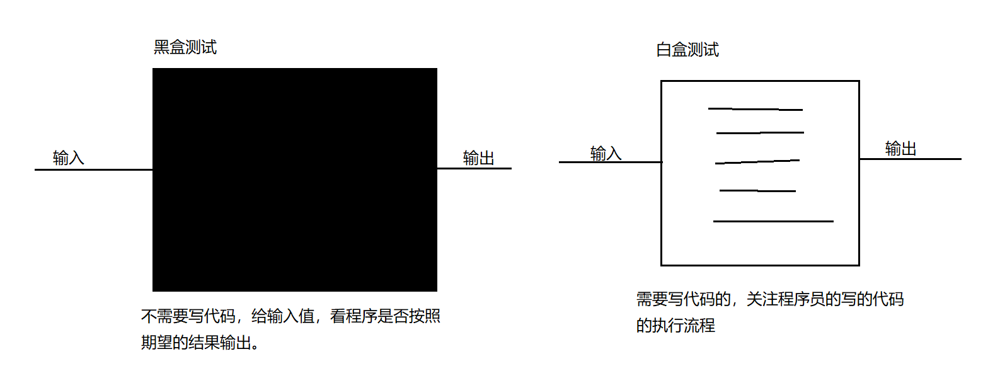
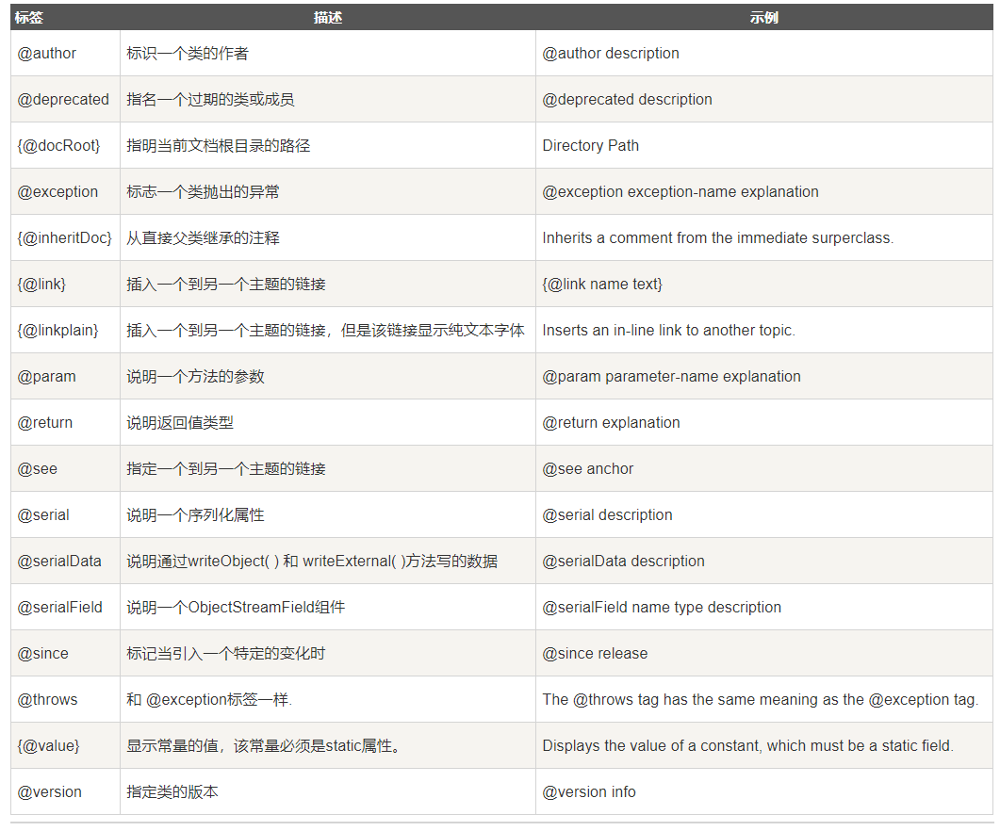
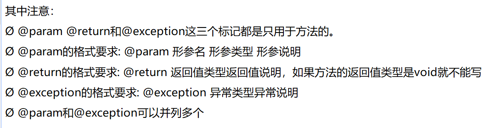
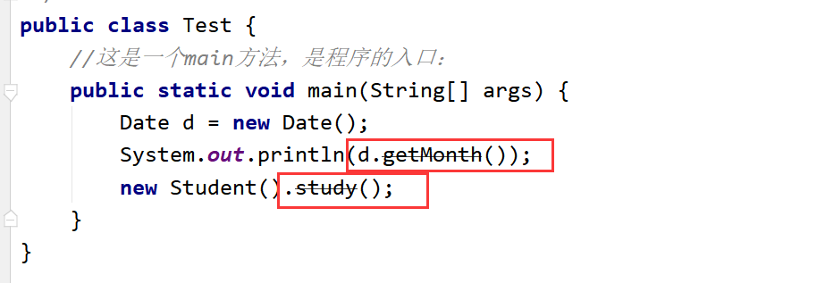
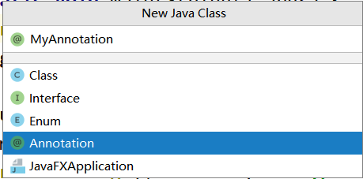
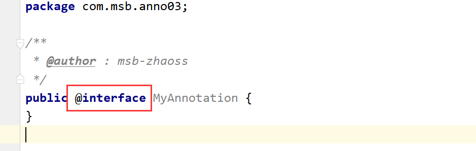
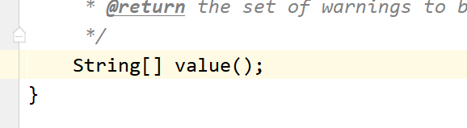
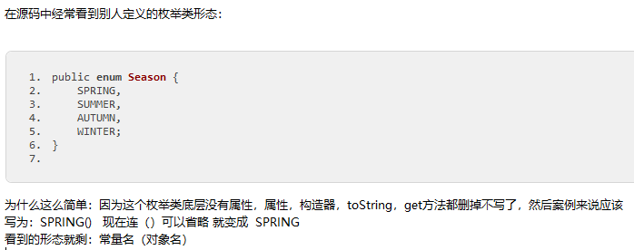

## junit

【1】软件测试的目的：
软件测试的目的是在规定的条件下对程序进行操作,以发现程序错误,衡量软件质量,并对其是否能满足设计要求进行评估的过程。
【2】测试分类：<br>
（1）黑盒测试：
软件的黑盒测试意味着测试要在软件的接口处进行。这种方法是把测试对象看做一个黑盒子,
测试人员完全不考虑程序内部的逻辑结构和内部特性,只依据程序的需求规格说明书,检查程
序的功能是否符合它的功能说明。因此黑盒测试又叫功能测试。

（2）白盒测试：---》Junit属于白盒测试。
软件的白盒测试是对软件的过程性细节做细致的检查。这种方法是把测试对象看做一个打开
的盒子,它允许测试人员利用程序内部的逻辑结构及有关信息,设计或选择测试用例,对程序
的所有逻辑路径进行测试,通过在不同点检查程序状态,确定实际状态是否与预期的状态一致。
因此白盒测试又称为结构测试。



@Before:
某一个方法中，加入了@Before注解以后，那么这个方法中的功能会在测试方法执行前先执行
一般会在@Beforer修饰的那个方法中加入：加入一些申请资源的代码：申请数据库资源，申请IO资源，申请网络资源。。。

@After:
某一个方法中，加入了@After注解以后，那么这个方法中的功能会在测试方法执行后先执行
一般会在@After修饰的那个方法中加入：加入释放资源的代码：释放数据库资源，释放IO资源，
释放网络资源。。。

## 注解

- 【1】历史：
  JDK5.0 新增 --- 注解（Annotation）,也叫元数据
- 【2】什么是注解？
  注解其实就是代码里的特殊标记，这些标记可以在编译,类加载,运行时被读取,并执行相应的
  处理。通过使用注解,程序员可以在不改变原有逻辑的情况下，在源文件中嵌入一些补充信息。
  代码分析工具、开发工具和部署工具可以通过这些补充信息进行验证或者进行部署。

使用注解时要在其前面增加@符号,并把该注解当成一个修饰符使用。用于修饰它支持的程序元素。

- 【3】注解的重要性：
  Annotation 可以像修饰符一样被使用，可用于修饰包，类，构造器,方法，成员变量,参数，
  局部变量的声明，这些信息被保存在Annotation的"name=value"对中。在JavaSE中，注
  解的使用目的比较简单，例如标记过时的功能，忽略警告等。在JavaEE/ArIdroid中注解占
  据了更重要的角色，例如用来配置应用程序的任何切面，代替JavaEE旧版中所遗留的繁冗代码
  和XML配置等。未来的开发模式都是基于注解的，JPA(java的持久化API)是基于注解的，
  Spring2.5以. E都是基于注解的，Hibernate3.x以后也是基于注解的，现在的Struts2
  有一部分也是基于注解的了，注解是一种趋势，一定程度上可以说 ：框架=注解+反射+设计模式。

- junit注解
  `@Test`
  `@Before`
  `@After`
- 文档相关注解

说明注释允许你在程序中嵌入关于程序的信息。你可以使用 javadoc 工具软件来生成信息，并输出到HTML文件中。
说明注释，使你更加方便的记录你的程序信息。
文档注解我们一般使用在文档注释中，配合javadoc工具<br>
javadoc 工具软件识别以下标签：




- JDK内置的注解
    - `@Override`:限定重写父类方法，该注解只能用于方法
    - `@Deprecated`:用于表示所修饰的元素(类,方法，构造器，属性等)已过时。通常是因为
      所修饰的结构危险或存在更好的选择

  

    - `@SuppressWarnings`:抑制编译器警告
  ```
        public class Test02 {
    //这是一个main方法，是程序的入口：
    public static void main(String[] args) {
        @SuppressWarnings("unused")
        int age = 10;
        
        int num = 10;
        System.out.println(num);
        @SuppressWarnings({"unused","rwatypes"})
        ArrayList al = new ArrayList();
    }
  ```
  
- 实现替代配置文件功能
- 如何自定义注解：




跟接口没有关系

- 注解的内部：



看上去是无参数方法，实际上理解为一个成员变量，一个属性
无参数方法名字--》成员变量的名字
无参数方法的返回值--》成员变量的类型
这个参数叫 配置参数

无参数方法的类型：基本数据类型（八种），String，枚举，注解类型，还可以是以上类型对应的数组。

PS：注意：如果只有一个成员变量的话，名字尽量叫value。
- 使用注解
  - （1）使用注解的话，如果你定义了配置参数，就必须给配置参数进行赋值操作：
  ```
    @MyAnnotation(value={"abc","def","hij"})
    public class Person {
    }
  ```
  - （2）如果只有一个参数，并且这个参数的名字为value的话，那么value=可以省略不写。
  ```
   @MyAnnotation({"abc","def","hij"})
    public class Person {
    }
  ```
  - （3）如果你给配置参数设置默认的值了，那么使用的时候可以无需传值：
  ```
  public @interface MyAnnotation2 {
    String value() default "abc";
   }
  ```
  
- 元注解是用于修饰其它注解的注解。

  JDK5.0提供了四种元注解：`Retention, Target, Documented, Inherited`
  @Retention:用于修饰注解，用于指定修饰的那个注解的生命周期，@Rentention包含一个RetentionPolicy枚举类型的成员变量,使用@Rentention时必须为该value成员变量指定值:

➢RetentionPolicy.SOURCE:在源文件中有效(即源文件保留),编译器直接丢弃这种策略
的注释，在.class文件中不会保留注解信息

Target用于修饰注解的注解，用于指定被修饰的注解能用于修饰哪些程序元素。@Target也
包含一个名为value的成员变量。
@Target({TYPE,CONSTRUCTOR,METHOD})

Documented用于指定被该元注解修饰的注解类将被javadoc工具提取成文档。默认情况下，
javadoc是 不包括注解的，但是加上了这个注解生成的文档中就会带着注解了

## 枚举

在java中，类的对象是有限个，确定的。这个类我们可以定义为枚举类。

JDK1.5以后使用enum关键字创建枚举类：
```java
package com.msb.enum02;
/**
 * @author : msb-zhaoss
 * 定义枚举类：季节
 */
@SuppressWarnings("all")
public enum Season {
    //提供枚举类的有限的  确定的对象：--->enum枚举类要求对象（常量）必须放在最开始位置
    //多个对象之间用，进行连接，最后一个对象后面用;结束
    SPRING("春天","春暖花开"),
    SUMMER("夏天","烈日炎炎"),
    AUTUMN("秋天","硕果累累"),
    WINTER("冬天","冰天雪地");
    //属性：
    private final String seasonName ;//季节名字
    private final String seasonDesc ;//季节描述
    //利用构造器对属性进行赋值操作：
    //构造器私有化，外界不能调用这个构造器，只能Season内部自己调用
    private Season(String seasonName, String seasonDesc){
        this.seasonName = seasonName;
        this.seasonDesc = seasonDesc;
    }
    //额外因素：
    public String getSeasonName() {
        return seasonName;
    }
    public String getSeasonDesc() {
        return seasonDesc;
    }
    //toString();
    @Override
    public String toString() {
        return "Season{" +
                "seasonName='" + seasonName + '\'' +
                ", seasonDesc='" + seasonDesc + '\'' +
                '}';
    }
}
```
使用：
```java
public class TestSeason {
    //这是一个main方法，是程序的入口：
    public static void main(String[] args) {
        Season winter = Season.WINTER;
        System.out.println(winter);
        //enum关键字对应的枚举类的上层父类是 ：java.lang.Enum
        //但是我们自定义的枚举类的上层父类：Object
        System.out.println(Season.class.getSuperclass().getName());//java.lang.Enum
    }
}
```


- 实际应用
```java
package com.msb.enum05;
/**
 * @author : msb-zhaoss
 */
public class Person {
    //属性：
    private int age;
    private String name;
    private Gender sex;
    public int getAge() {
        return age;
    }
    public void setAge(int age) {
        this.age = age;
    }
    public String getName() {
        return name;
    }
    public void setName(String name) {
        this.name = name;
    }
    public Gender getSex() {
        return sex;
    }
    public void setSex(Gender sex) {
        this.sex = sex;
    }
    @Override
    public String toString() {
        return "Person{" +
                "age=" + age +
                ", name='" + name + '\'' +
                ", sex='" + sex + '\'' +
                '}';
    }
}

public enum Gender {
  男,
  女;
}
```

```java
public class Test {
    //这是一个main方法，是程序的入口：
    public static void main(String[] args) {
        Person p = new Person();
        p.setAge(19);
        p.setName("lili");
        Scanner input = new Scanner(System.in);
        System.out.println("请输入性别：");
        String sex = input.next();
        Gender gender = Gender.valueOf(sex);
        p.setSex(gender);//传入枚举类Gender的对象：-->在入口处对参数进行了限制
        System.out.println(p);
    }
}
```

## 泛型

泛型实际就是 一个<>引起来的 参数类型，这个参数类型  具体在使用的时候才会确定具体的类型。
使用了泛型以后，可以确定集合中存放数据的类型，在编译时期就可以检查出来。运行时不存在泛型
泛型的类型：都是引用数据类型，不能是基本数据类型。
泛型只存在编译器，运行期不存在
```java
package TestNote;
/*【1】什么是泛型（Generic）：
        泛型就相当于标签
        形式：<>
集合容器类在设计阶段/声明阶段不能确定这个容器到底实际存的是什么类型的对象，所以在JDK1.5之前只能把元素类型设计为Object，
        JDK1.5之 后使用泛型来解决。因为这个时候除了元素的类型不确定，其他的部分是确定的，例如关于这个元素如何保存，
        如何管理等是确定的，因此此时把元素的类型设计成一个参数，这个类型参数叫做泛型。
        Collection<E>, List<E>， ArrayList<E> 这个<E>就是类型参数，即泛型。*/

/*泛型可以定义多个参数值，因为在实例化指定泛型后，一个泛型就确定为指定类型，多个泛型可以在多个地方使用*/
public class GenericTest<E,F> {
    int age;
    String name;
    /*调用泛型时从参数列表找就可以了*/
    E sex;
    F place;
    public GenericTest() {
    }
    public GenericTest(int age, String name, E sex,F place) {
        this.age = age;
        this.name = name;
        this.sex = sex;
        this.place = place;
    }

    public void a(E n) {
    }

    public void b(E[] m) {
    }
    public void s(F v){

    }

    /*
    如果继承时父类指定了泛型，那么子类的对应泛型方法也确定了
    class SubGenericTest extends GenericTest<String>{
    }
    class Demo{
        //这是main方法，程序的入口
        public static void main(String[] args) {
            //指定父类泛型，那么子类就不需要再指定泛型了，可以直接使用
            SubGenericTest sgt = new SubGenericTest();
            sgt.a("你好");
        }
    }*/

    /*
    如果继承时未指定泛型，那子类也会成为一个泛型类，实例化子类对象时可以自己指定泛型
    class SubGenericTest2<E> extends GenericTest<E>{
    }*/

    public static class Test {
        //这是main方法，程序的入口
        public static void main(String[] args) {
            //GenericTest进行实例化：
            //(1)实例化的时候不指定泛型：如果实例化的时候不明确的指定类的泛型，那么认为此泛型为Object类型
            GenericTest gt1 = new GenericTest();
            gt1.a("abc");
            gt1.a(17);
            gt1.a(9.8);
            gt1.b(new String[]{"a", "b", "c"});
            //（2）实例化的时候指定泛型：---》推荐方式
            /*指定泛型就必须把泛型列表里的所有泛型都指定出来*/
            GenericTest<String,Integer> gt2 = new GenericTest<>();
            gt2.sex = "男";
            gt2.a("abc");
            gt2.b(new String[]{"a", "b", "c"});
            gt2.place = 5;
            GenericTest<Integer,Byte> gt3 = new GenericTest<>();
            gt3.sex= 123;
            gt3.place = -128;
            GenericTest<Boolean,Double> gt4 = new GenericTest<>(18,"133",true,30.5);

        }
    }
}
```

泛型方法
```java
package com.msb.test04;
/**
 * @author : msb-zhaoss
 * 1.什么是泛型方法：
 * 不是带泛型的方法就是泛型方法
 * 泛型方法有要求：这个方法的泛型的参数类型要和当前的类的泛型无关
 * 换个角度：
 * 泛型方法对应的那个泛型参数类型 和  当前所在的这个类 是否是泛型类，泛型是啥  无关
 * 2.泛型方法定义的时候，前面要加上<T>
 *     原因：如果不加的话，会把T当做一种数据类型，然而代码中没有T类型那么就会报错
 * 3.T的类型是在调用方法的时候确定的
 * 4.泛型方法可否是静态方法？可以是静态方法
 */
public class TestGeneric<E> {
    //不是泛型方法 （不能是静态方法）
    public static void a(E e){
    }
    //是泛型方法
    public static <T>  void b(T t){
    }
}
class Demo{
    //这是main方法，程序的入口
    public static void main(String[] args) {
        TestGeneric<String> tg = new TestGeneric<>();
        tg.a("abc");
        tg.b("abc");
        tg.b(19);
        tg.b(true);
    }
}
```
通配符
```
public class Demo {
    //这是main方法，程序的入口
    public static void main(String[] args) {
        List<Object> list1 = new ArrayList<>();
        List<String> list2 = new ArrayList<>();
        List<Integer> list3 = new ArrayList<>();
        List<?> list = null;
        list = list1;
        list = list2;
        list = list3;
    }
}
```
A 和 B是子类父类的关系，G<A>和G<B>不存在子类父类关系，是并列的
加入通配符？后，G<?>就变成了 G<A>和G<B>的父类
```java
package com.msb.test07;
import java.util.ArrayList;
import java.util.List;
/**
 * @author : msb-zhaoss
 */
public class Test {
    //这是main方法，程序的入口
    public static void main(String[] args) {
        //a,b,c三个集合是并列的关系：
        List<Object> a = new ArrayList<>();
        List<Person> b = new ArrayList<>();
        List<Student> c = new ArrayList<>();
        /*开始使用泛型受限：泛型的上限
        List<? extends Person>:
        就相当于：
        List<? extends Person>是List<Person>的父类，是List<Person的子类>的父类
         */
        List<? extends Person> list1 = null;
        list1 = b;
        list1 = c;
        /*开始使用泛型受限：泛型的下限
        List<? super Person>
        就相当于：
        List<? super Person>是List<Person>的父类，是List<Person的父类>的父类
         */
        List<? super Person> list2 = null;
        list2 = a;
        list2 = b;
    }
}
```


