# JavaScript
## 1.引入JavaScript
一切数据都由客户端浏览器，将请求发送到服务器端去做校验。

### 特点：
- 1.JavaScript是运行在浏览器端的。`阻断式解释执行的前端脚本语言`
- 2.弱类型语言：声明变量的时候不需要指定变量类型。
- 3.主要作用是做前端的数据校验，用户交互。
- 4.基于对象：
- 5.事件驱动：在网页中执行了某种操作的动作，被称为"事件"(Event)，比如按下鼠标、
移动窗口、选择菜单等都可以视为事件。当事件发生后，可能会引起相应的事件响应。
- 6.安全性：JavaScript不能访问本地的硬盘，不能将数据存入到服务器上，不能对
网络文档进行修改和删除，只能通过浏览器实现信息浏览或动态交互。
- 7.跨平台性：JavaScript依赖于浏览器本身，与操作平台无关， 只要计算机安装了支持
JavaScript的浏览器（装有JavaScript解释器），JavaScript程序就可以正确执行。
缺点 ：各种浏览器支持JavaScript的程度是不一样的，支持和不完全支持JavaScript的 
浏览器在浏览同一个带有JavaScript脚本的网页时，效果会有一定的差距，有时甚至会显示
不出来。
- 8.动态语言：程序在运行期间仍然可以动态改变程序结构。
### JavaScript三部分

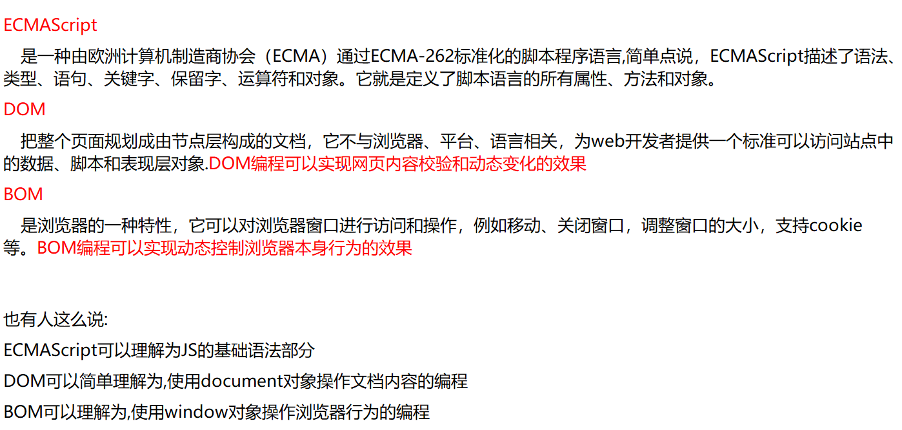

## 2.JavaScript入门
- 1.Script的位置：
学习期间写在head中，开发过程放在body下方。
- 2.想要script代码受控，需要把script代码放在方法中，在body中相应事件调用script中的
方法。
- 3.一个事件可以调用多个方法，一个方法可以被多个事件调用。
- 4.script标签一但用于引入外部JS文件,就不能在中间定义内嵌式代码，一个页面上可以用
多个script标签，一个标签只能应用引入和定义其中一种方法。

## 3.ECMAScript语法
### 1.输出
`弹框输出alert`：alert("我来阻断");

`页面打印document.write`：document.write(i+"*"+j+"="+i*j+"&nbsp;&nbsp");

`确认弹框confirm`：confirm("确定吗");

`控制台打印console：`
console.log();
console.warn();
console.error();
console.info(); 

### 2.`弹框输入prompt`：let name = prompt("你的名字是：");用一个变量来接收。

### 3.变量：声明，赋值，使用。
  - 1.常量：const age = 20;声明同时赋值。
  - 2.方法中局部变量：let age;age = 20;
  - 3.成员变量：var age = 25; 
  【声明变量时，关键字不能省略，如果一个变量什么关键字也没写，使用一次后，自动变为成员变量】
  - 4.变量类型：
    - 1.`数值型`：number整数和浮点数统称为数值。例如85或3.1415926等。
    - 2.`字符串型`：String由0个,1个或多个字符组成的序列。在JavaScript中，用双引
    号或单引号括起来表示，如"您好"、'学习JavaScript' 等。
    - 3.`逻辑（布尔）型`：boolean用true或false来表示。
    - 4.`空（null）值`：表示没有值，用于定义空的或不存在的引用。要注意，空值不等同
    于空字符串""或0。
    - 5.`未定义（undefined）值`：它也是一个保留字。表示变量虽然已经声明，但却没有
    赋值。
    - 6.除了以上五种普通的数据类型（包括三个基本：number，string，boolean，
    两个特殊：null，undefined）之外，JavaScript还支持复合数据类型Object，
    复合数据类型包括`对象和数组`两种。 
    
    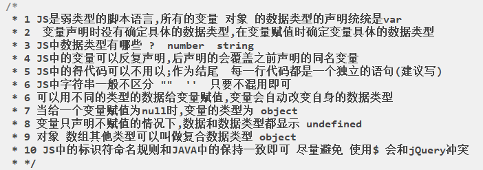

普通变量类型转换方法：<br>
Number():将boolean转成1或0（true（1），false（0）），可以将数字格式的字符串转
成number。

parseInt()/parseFloat():可以将字符串转化成number，从头开始尽力将能转换的部分
进行转换。

### 4.流程控制：
基本与java相同。
### 5.运算符
JS中运算符号大部分和java中的运算符一样

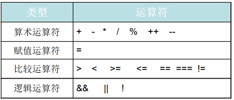

- 1.如果出现2/0【JS中如果出现除零,那么结果是 infinity,而不是报错】


- 2.【JS取余数运算对于浮点数仍然有效,如果和0取余数,结果是NaN(not a number)】


- 3.+号

+同时也是连接运算符,看两端的变量类型,如果都是number那么就是算数中的加法 如果有
字符串,那么就是连接符号,如果是布尔类型和number相加,那么会将true转化为1 将false
转化为0。
```html
<script>
        /*
         * +号中 如果一段是字符串,就变成了文字拼接
         * 数字和 boolean类型相加  true会转变成1  false会转变成0  再做数学运算
         * */
        var i=1;
        alert(i+1);
        alert(1+"1");
        alert(1+true);
</script>
```
- 4.== 等值符

先比较类型,如果类型一致,再比较内容,如果类型不一致,会强制转换为number（使用Number()）
再比较内容
```html
<script>
        /*
         * == 等值符
         * 先比较类型,如果类型一致,则比较值是否相同
         * 如果类型不一致,会将数据尝试转换number 再比较内容
         * */
        var a =1;
        var b="1";
        var c=true;
        var d="true";
        alert(a==b)// t
        alert(a==c)// t
        alert(a==d)// f
        alert(b==c)// t
        alert(b==d)// f
        alert(c==d)// f
</script>
```
- 5.=== 等同符

数据类型不同 直接返回false如果类型相同 才会比较内容。
```html
<script>
        /*
         * === 等同符
         * 如果数据类型不同,直接返回false  如果类型相同,才会继续比较内容
         * 
         * */
        var a =1;
        var b="1";
        var c=true;
        var d="true";
        alert(a===b)//f
        alert(a===c)//f
        alert(a===d)//f
        alert(b===c)//f
        alert(b===d)//f
        alert(c===d)//f
        alert("asdf"==="asdf")//t
</script>
```
【一个=就是单纯的赋值符号】
### 6.方法（函数）
- 1.什么是JS的函数:

类似于java中的方法,JS中也可以定义一些函数,java中的方法签名包含访问修饰符,返回值
类型,方法名,参数列表,异常列表,但是JS中定义函数的语法相对简单很多,主要以function
作为函数关键字,具备函数名和参数列表,但是没有访问修饰符也没有返回值类型关键字和异常
列表。
- 2.函数定义的三种方式：<br>
修饰符：function;   命名规则同java
```html
<!DOCTYPE html>
<html>
<head>
    <meta charset="UTF-8">
    <title></title>
    <script>
        /*
         * 第一种语法格式 常见
         * function 函数名(参数列表){js代码}
         * 
         * 
         * 第二种语法
         * var 函数名=function(参数列表){JS代码}
         * 
         * 第三种语法 不常用 了解
         * var 函数名=new Function('js代码')
         * 
         * */
        /*声明式*/
        function fun1() {
            alert("你好");
        }

        /*赋值式*/
        var fun2 = function () {
            alert("你很好")
        }
        /*new对象*/
        var fun3 = new Function('alert("你非常好");');

        // 调用方法
        fun1();
        fun2();
        fun3();
    </script>
</head>
<body>
</body>
</html>
```
- 3.函数的参数和返回值：<br>
【javaScript只有一个全局作用区(window)，同名的方法或函数会将之前的覆盖掉，所以不存在重载】
```html
<!DOCTYPE html>
<html>
<head>
    <meta charset="UTF-8">
    <title></title>
    <script>
        /*
         *
         * 1传入的实参可以和形参个数不一致 
         * 2如果函数中有返回值,那么直接用return关键字返回即可
         * */
        function fun1(a, b, c) {
            alert("a:" + a);
            alert("b:" + b);
            alert("c:" + c);
        }

        //fun1(10,"hello js",false);
        // 少传参数 OK
        //fun1(1,2);
        // 多传参数 OK 多出来的参数相当于没传
        //fun1(10,"hello js",false,new Date());
        function fun2(a, b) {
            var c = a * b;
            return c;
        }

        //var x =fun2(10,20);
        //alert(x)
        // 方法本身作为参数(了解)
        function funa(i, j) {
            return i + j;
        }

        function funb(a) {
            return a(10, 20);
        }

        var sum = funb(funa)
        alert(sum)
    </script>
</head>
<body>
</body>
</html>
```
【调用函数时如果没有带(),返回值为整个函数的结构】
【script标签是一个一个标签整体预加载的，如果一个标签内调用方法在声明方法之前，该
方法也是会生效的，前提是创建方法使用的是声明式。】

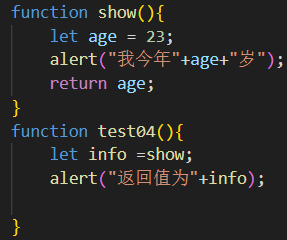
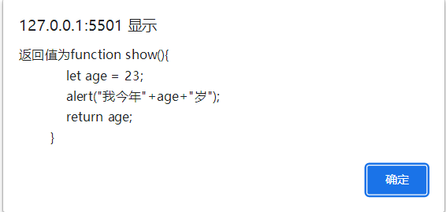
### 7.常用对象
- 1.Object对象
```html
<script type="text/javascript">
    function test02() {
        /* 介绍对象Object */
        // let obj = new Object();进行简写
        /* obj.empno = 7521;
        obj.ename = "张三"; 进行简写*/
        /* json格式属性要加"" */
        let obj = {"empno": "7521", "ename": "张三"};
        alert(obj);
        obj.show = function () {
            alert(obj.empno + ";" + obj.ename);
        }
        obj.show();
    }
</script>
```
- 2.JSON格式<br>
json的全称为：JavaScript Object Notation，是一种轻量级的数据交互格式。
它基于 ECMAScript (欧洲计算机协会制定的js规范)的一个子集，采用完全独立于编
程语言的文本格式来存储和表示数据。<br>
在JSON格式中赋值通过"属性名"："属性值"的形式赋值，固定要带""。
```html
<script type="text/javascript">
    function test03() {
        /* 创建json格式集合 */
        let arr = [{"stuname": "张三", "stuage": "23", "stusex": "男"},
            {"stuname": "瑶瑶", "stuage": "22", "stusex": "女"},
            {"stuname": "王五", "stuage": "21", "stusex": "男"}];
        alert("瑶瑶的性别是" + arr[1].stusex);
        /* 创建json格式对象 */
        let obj = {"stuname": "张三", "stuage": "23", "stusex": "男"};
        alert(obj.stuage);
    }
</script>
```
- 3.eval()方法
```html
<script type="text/javascript">
    function test04() {
// alert(obj.eval());将传入的字符串转成可运行的JavaScript代码
// 对象内的属性要用''
        let str = "{'stuname':'张三','stuage':'23','stusex':'男'}";
        alert(str);
        eval("var name =" + str);
        alert(name.stuname);
// 生成集合字符串时，不能换行
        let str1 = "[{'stuname':'张三','stuage':'23','stusex':'男'},{'stuname':'瑶瑶','stuage':'22','stusex':'女'},{'stuname':'王五','stuage':'21','stusex':'男'}]";
        eval("var arr1 =" + str1);
        alert("瑶瑶的性别是" + arr1[1].stusex);
    }
</script>
```
### 8.封装
也就是指使用function函数，自定义构造函数创建构造方法。里面可以包含初始属性
和方法。
this特指创建的这个对象，一系列属性就像使用构造器一样，可以在创建对象时进行赋值
也可以给创建出的对象赋新的属性和属性值。
```html
 <script type="text/javascript">
        /* 创建学生类 */
        function Student(stuno,sname,age,sex){
            this.stuno = stuno;
            this.sname = sname;
            this.age = age;
            this.sex = sex;
            // 方法
            this.show = function(){
                alert(this.sname+"的学生编号："+this.stuno);
            }
            this.study = function(){
                alert(this.sname+"正在背题");
            }
        }
        function main(){
            let stu01 = new Student(921,"美美",23,"女");
            let stu02 = new Student(925,"小明",23,"男");
            stu01.phone = "154622484"
            stu01.study();
            stu02.show();
        }
    </script>
```

### 9.继承
当我们用构造方法创建一个类时,在内存会预先调用构造方法创建一个对象,这对象我们称之
为原型对象,构造方法对象中有一个prototype属性指向该对象,原型对象中有一个
constructor属性指向构造方法.获得一个类的原型对象可以通过类名.prototype的方式
获得。
```html
<script type="text/javascript">
        function Person(name,age,sex){
            this.name = name;
            this.age = age;
            this.sex = sex;
            // 方法
            this.info = function(){
                alert("名字是："+this.name+"年龄是："+this.age+"性别是："+this.sex);
            }
        }
        function Student(stuno){
            this.stuno = stuno;
            this.study = function(){
                alert("学习中");
            }
        }
        function main(){
            alert(Person);
            // 原型继承
            Student.prototype = new Person("张三",20,"男");
            let stu01 = new Student("s001");
            stu01.info();
            stu01.study();
            stu01.name = "寒"
            stu01.info();
        }
</script>
```
### 10.事件和事件对象
- 1.什么是事件：<br>
可以被浏览器侦测到的人或者浏览器本身的行为,人对浏览器或者浏览器对网页做了什么事,
JS可以根据不同行为.绑定一些不同的响应代码处理,让浏览器和人的行为之间有一个交互。
- 2.事件的绑定和触发：<br>
给页面上的元素先绑定事件，然后通过行为去触发。
- 3.常用事件类型
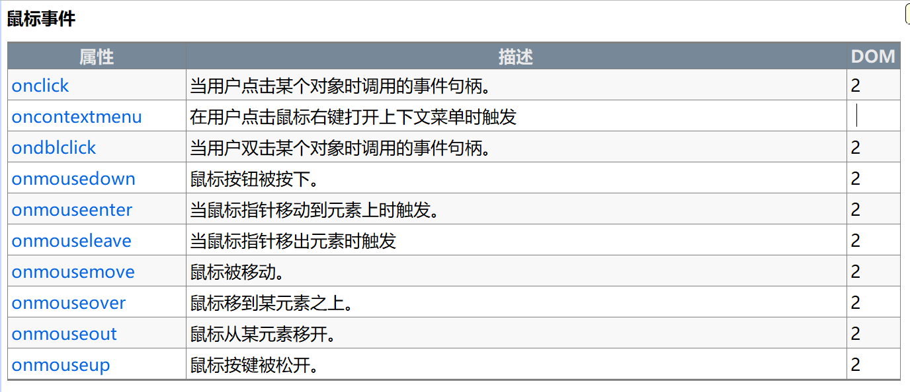

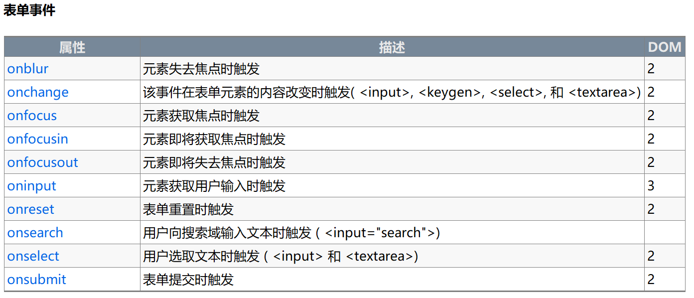

加载事件：onload<br>
在body标签调用，在进行body区加载时就执行的方法。

事件的阻止机制：
```html
<script type="text/javascript">
    function test10(){
        // 获取文本框的输入值
        let val = document.myform.wd.value;
        if(val == "习近平"){
            //将按钮属性设置为不可用
            sub.disabled ="disabled"
            return false;
        }else{
            return true;
        }
    }
</script>
<body>
<form action="https://www.baidu.com/s" method="get" name="myform">
    <input type="text" name="wd">
    <input type="submit" value="百度一下" id="sub" onclick="return test10();">
</form>
</body>
```
```html
<!DOCTYPE html>
<html lang="en">
<head>
    <meta charset="UTF-8">
    <meta name="viewport" content="width=device-width, initial-scale=1.0">
    <title>Document</title>
    <style>
        *{
            margin: 0px;
            padding: 0px;
        }
        #d1{
            text-align: center;
            border: red dashed 3px;
            height: 200px;
            width: 300px;
            margin-left: 100px;
            position: relative;
        }
        #d2{
            text-align: center;
            border: red dashed 3px;
            height: 200px;
            width: 300px;
            margin-left: 600px;
            margin-top: 0;
        }
        span{
            margin-left: 650px;
            margin-top: 100px;
        }
    </style>
    <script type="text/javascript">
        function test01(event){
            let x = event.x;
            let y = event.y;
            // alert(x+";"+y);
            document.getElementById("spanid").innerHTML=x+";"+y;
        }
        function test02(){
            document.getElementById("spanid").innerHTML="";
        }
        function test03(){
            document.getElementsByTagName("div")[0].style.backgroundColor = "yellow";
        }
        function test04(){
            document.getElementsByTagName("div")[0].style.backgroundColor = "";
        }

        function test05(){
            document.getElementById("text01").value = "";
        }
        // 提示信息还原
        function test06(){
            let str = document.getElementById("text01").value.length;
            if(str == 0){
                document.getElementById("text01").value = "请输入";
            }
        }
        function test07(){
            let color = document.getElementById("text01").value;
            alert(color);
            document.getElementsByTagName("body")[0].style.backgroundColor = color;
            
        }
    </script>
</head>
<body>
    <div id = "d1" onmousemove = "test01(event);" onmouseout="test02();" onmouseenter = "test03();" onmouseleave = "test04();">
    </div>
    <span id = "spanid">
    </span>
    <div id = "d2">
        <input type="text" id="text01" value="请输入" onfocus="test05();" onblur="test06();" onchange="test07();">
    </div>
</body>
</html>
```
## Bom
### 1.什么是BOM<br>
- BOM是Browser Object Model的简写，即浏览器对象模型。
- BOM有一系列对象组成，是访问、控制、修改浏览器的属性的方法。
- BOM没有统一的标准(每种客户端都可以自定标准)。
- BOM的顶层是window对象。
### 2.常用方法
- 1.打开和关闭方法
```html
<!DOCTYPE html>
<html lang="en">
<head>
    <meta charset="UTF-8">
    <meta name="viewport" content="width=device-width, initial-scale=1.0">
    <title>Document</title>
    <style>
        div{
            text-align: center;
        }
    </style>
    <script type="text/javascript">
        function test01(){
            let num = window.prompt("1+1=2?");
            alert("回答："+num);
            let val = confirm("确定删除吗？")
            if(val){
                alert("数据删除");
                return true;
            }else{
                alert("已取消");
                return false;
            }
        }
        //打开方法直接传入url或uri
        function test02(){
            window.open("subpage.html");
        }
        function show(){
            alert("我是父页面show()方法");
        }
        var year = 2023;
    </script>
</head>
<body>
<div>
    <input type="button" value="打开子页面" onclick="test02();">
    <input type="button" value="test01()" onclick="test01();">
    <a href="#" onclick="return test01();">删除</a>
</div>
</body>
</html>
```
```html
<!DOCTYPE html>
<html lang="en">
<head>
    <meta charset="UTF-8">
    <meta name="viewport" content="width=device-width, initial-scale=1.0">
    <title>Document</title>
    <script type="text/javascript">
        function testsubpage(){
            //opener能指打开这个子页面的父页面，可以调用父页面的属性和方法
            alert("父页面："+window.opener.year);
            window.opener.test03();
        }
        function windowclose(){
            // 点击关闭后10秒后关闭页面
            window.setTimeout(
                    function(){
                        window.close();
                    }
                    ,2000);
            //调用外部方法 
            // window.setTimeout(方法名,2000);
        }
    </script>
</head>
<body>
<h1>子页面</h1>
<input type="button" value="testsubpage()" onclick="testsubpage();">
<input type="button" value="关闭页面" onclick="windowclose();">
</body>
</html>
```
- 2.定时器
```html
<script type="text/javascript">
    function windowclose(){
        // 点击关闭后10秒后关闭页面
        window.setTimeout(
                function(){
                    window.close();
                }
                ,2000);
        //调用外部方法 
        // window.setTimeout(方法名,2000);
    }
</script>
```
```html
<script type="text/javascript">
    function windowclose(){
        // 每隔一秒钟提一下要关闭
        interval01 = window.setInterval(intervalClose,1000);
    }
    var num = 10;
    function intervalClose(){
        if(num != 0){
            num--;
            document.getElementById("h1").innerHTML="还剩"+num+"秒关闭页面";
        }else{
            window.close();
        }
    }
    //停止关闭计时
    function stopClose(){
        window.clearInterval(interval01);
    }
</script>
```
两种定时器：
```html
<!DOCTYPE html>
<html lang="en">
<head>
    <meta charset="UTF-8">
    <meta name="viewport" content="width=device-width, initial-scale=1.0">
    <title>Document</title>
    <style>
        div{
            text-align: center;
        }
    </style>
    <script type="text/javascript">
        // 用于存放多个定时器
         var intervalIDS =new Array();
         // 循环计时01
         function startInterval1(){
            var intervalID1 = window.setInterval(
                function(){
                    var today =new Date();
                    var hours=today.getHours();
                    var minutes=today.getMinutes();
                    var seconds =today.getSeconds();
                    var str = hours+"点"+minutes+"分"+seconds+"秒";
                    /* var ta =document.getElementById("timeArea");
                    ta.value =str; */
                    document.getElementById("timeArea1").value = str;
                },
                1000
            );
            // 将定时器放入数组中
            intervalIDS.push(intervalID1);
        }
        // 循环计时02
        function startInterval2(){
            var intervalID2 = window.setInterval(
                function(){
                    var today =new Date();
                    var hours=today.getHours();
                    var minutes=today.getMinutes();
                    var seconds =today.getSeconds();
                    var str = hours+"点"+minutes+"分"+seconds+"秒";
                    /* var ta =document.getElementById("timeArea");
                    ta.value =str; */
                    document.getElementById("timeArea2").value = str;
                },
                1000
            );
            // 将定时器放入数组中
            intervalIDS.push(intervalID2);
        }
        // 清除定时器
        function stopInterval(){
            while(intervalIDS.length >0){
                // 关闭数组变量中的定时器,使用shift()方法关闭数组中所有定时器
                    window.clearInterval(intervalIDS.shift());
            }
        }
        // 单点计时器
        var timeoutIDS =new Array();
        function startTimeout(){
            var timeoutID = window.setTimeout(
                function(){
                    var today = new Date();
                    var hours = today.getHours();
                    var minutes = today.getMinutes();
                    var seconds = today.getSeconds();
                    var str = hours+"点"+minutes+"分"+seconds+"秒";
                    console.log(str)
                },
                1000
            );
            timeoutIDS.push(timeoutID);
        }
        function stopTimeout(){
            while(timeoutIDS.length >0){
                window.clearTimeout(timeoutIDS.shift());
            }
        }
    </script>
</head>
<body>
    <div>
        <input type="text" id="timeArea1" /> <br />
        <input type="text" id="timeArea2" /> <br />
        <input type="button" value="开始循环计时1" onclick="startInterval1()" />
        <input type="button" value="开始循环计时2" onclick="startInterval2()" />
        <input type="button" value="结束循环计时" onclick="stopInterval()" />
        <br>
        <br>
        <br>
        <input type="button" value="开始单点定时器" onclick="startTimeout();">
        <input type="button" value="结束单点定时器" onclick="stopTimeout()" />
    </div>
</body>
</html>
```
### 3.常用属性
- 1.显示器信息（screen）：

## Dom（文档对象模型）
- 什么是DOM编程

简单来说:DOM编程就是使用document对象的API完成对网页HTML文档进行动态修改,以实现网页数据和样式动态变化效果的编程.
- 什么是document

document对象代表整个html文档，可用来访问页面中的所有元素，是最复杂的一个dom对象，可以说是学习好dom编程的关键所在。
- document对象如何获取

document对象是window对象的一个成员属性，通过window.document来访问，当然也可以直接使用document,根据HTML代码结构特点,document对象本身是一种树形结构的文档对象。

### 1.直接获取标签对象：
```html
<!DOCTYPE html>
<html>
<head>
    <meta charset="UTF-8">
    <title></title>
    <script>
        function fun1() {
            // 获得document对象
            var element1 = document.getElementById("d1");
            console.log(element1);

            element1.innerText = "这是我的div";
        }

        function fun2(className) {
            var elements = document.getElementsByClassName(className);
            console.log(elements)
            for (var i = 0; i < elements.length; i++) {
                console.log(elements[i])
            }
        }

        function fun3() {
            var elements = document.getElementsByTagName("input");
            console.log(elements);
            for (var i = 0; i < elements.length; i++) {
                console.log(elements[i])
            }
        }

        function fun4() {
            var elements = document.getElementsByName("hobby");
            console.log(elements);
            for (var i = 0; i < elements.length; i++) {
                console.log(elements[i])
            }
        }
    </script>
</head>
<body>
<div id='d1' class="a">这是第一个div</div>
<div id='d2' class="a">这是第二个div</div>
<div id='d3' class="a">这是第三个div</div>
<input id='i1' class="a" name='name1'/>
<div id='d4' class="b" name='name1'>这是第四个div</div>
<div id='d5' class="b">这是第五个div</div>
爱好:
<input type="checkbox" name="hobby" value="1"/>篮球
<input type="checkbox" name="hobby" value="2"/>足球
<input type="checkbox" name="hobby" value="3"/>羽毛球

<hr/>
<input type="button" value="id值获取" onclick='fun1()'/>
<input type="button" value="class属性值获取" onclick='fun2("b")'/>
<input type="button" value="标签名获取" onclick='fun3()'/>
<input type="button" value="name属性值获取" onclick='fun4()'/>
</body>
</html>
```
```html
<!DOCTYPE html>
<html lang="en">
<head>
    <meta charset="UTF-8">
    <meta name="viewport" content="width=device-width, initial-scale=1.0">
    <title>Document</title>
    <style>
        div{
            text-align: center;
            font-size: 25px;
        }
    </style>
    <script type="text/javascript">
        function test01(){
            //通过id值获取标签对象
            let obj = document.getElementById("aid");
            obj.href = "http://www.baidu.com";
        }
        function test02(){
            //通过name值获取标签对象
            let objs = document.getElementsByName("sname");
            objs[0].innerText = "换名字了";
        }
        function test03(){
            //通过标签名获取标签对象
            let objs = document.getElementsByTagName("a");
            objs[0].innerHTML= "<i style= 'color : red;'> 老师名字</i>";
        }
        function test04(){
            //通过标签名获取标签对象
            let objs = document.getElementsByClassName("acla");
            objs[0].style.backgroundColor = "cyan";
        }
    </script>
</head>
<body>
    <div>
        <a href="#" id ="aid" onclick="test01();"> 百度</a>
        <a href="#" name = "sname" onclick="test02();"> 百度</a>
        <a href="#" name = "" onclick="test03();">  切换链接1文本</a>
        <a href="#" class="acla" onclick="test04();">定制10班</a>
    </div>
</body>
</html>
```
### 2.操作属性

自带属性直接用.调用，自定义属性需要使用getAttribute()方法
```html
<!DOCTYPE html>
<html lang="en">
<head>
    <meta charset="UTF-8">
    <meta name="viewport" content="width=device-width, initial-scale=1.0">
    <title>Document</title>
    <style>
        div{
            text-align: center;
            font-size: 25px;
        }
    </style>
    <script type="text/javascript">
        function removeDisabled(){
            let ck = document.getElementById("chkid").checked; //boolean
            let obj = document.getElementsByTagName("input")[1];
            if (ck) {
                // alert("已勾选");
                obj.disabled = false;
            }else{
                // alert("未勾选");
                obj.disabled = true;
            }
        }

        function test05(){
            //通过标签名获取标签对象
            let obj = document.getElementsByTagName("input")[2];
            //获取自定义属性用getAttribute
            alert("自定义属性1是"+obj.getAttribute("abc"));
            //设置自定义属性用getAttribute
            obj.setAttribute("dddd","xxxxx");
            alert("自定义属性2是"+obj.getAttribute("dddd"));
            alert("自带属性："+obj.type+";"+obj.value+";"+obj.name+";"+obj.id);
        }
    </script>
</head>
<body>
<div>
    <input type="checkbox" name="" id="chkid" onclick="removeDisabled();"/>请勾选，再提交
    <input type="button" value="提交" disabled = "disabled">
    <input type="submit" id="subid" name="subname" value="百度一下" abc = "dz10ban" onclick="test05();" />
</div>
</body>
</html>
```

### 3.操作文本
innerHtml 操作双标签中间的HTML

innerText  操作双标签中间的 Text

value      操作表单标签值
```html
<!DOCTYPE html>
<html>
        <head>
                <meta charset="UTF-8">
                <title></title>
                <style>
                        div{
                                border: 1px solid red;
                                width: 200px;
                                height: 200px;
                        }
                </style>
                <script>
                        function fun1(){
                                var element1=document.getElementById("d1");
                                
                                /*
                                 * innerText  不包含HTML结构
                                 * innerHTML  包含HTML结构
                                 * */
                                
                                console.log("innerText>>>"+element1.innerText);
                                console.log("innerHTML>>>"+element1.innerHTML);
                                
                                
                                var element2=document.getElementById("i1");
                                console.log(element2.value)
                        }
                        function fun2(){
                                var element1=document.getElementById("d1");
                                //element1.innerText="<h1>一刻也不能分割</h1>"
                                element1.innerHTML="<h1>一刻也不能分割</h1>"
                                
                                var element2=document.getElementById("i1");
                                element2.value="无论我走到哪里";
                                
                        }
                </script>
        </head>
        <body>
                <div id='d1'>
                        a
                        <span>文字</span>
                        b
                </div>
                
                <input type="text" value="我和我的祖国" id='i1' />
                
                <input type="button" value="获取内容"  onclick="fun1()"/>
                <input type="button" value="修改内容"  onclick="fun2()"/>
        </body>
</html>
```
```html
<!DOCTYPE html>
<html lang="en">
<head>
    <meta charset="UTF-8">
    <meta name="viewport" content="width=device-width, initial-scale=1.0">
    <title>Document</title>
    <style>
        div{
            text-align: center;
            font-size: 25px;
        }
    </style>
    <script type="text/javascript">
        function test01(){
            //通过id值获取标签对象
            let obj = document.getElementById("aid");
            obj.href = "http://www.baidu.com";

        }

        function test02(){
            //通过name值获取标签对象
            let objs = document.getElementsByName("sname");
            objs[0].innerText = "换名字了";

        }
        function test03(){
            //通过标签名获取标签对象
            let objs = document.getElementsByTagName("a");
            objs[0].innerHTML= "<i style= 'color : red;'> 老师名字</i>";
        }
        
        function test04(){
            //通过标签名获取标签对象
            let objs = document.getElementsByClassName("acla");
            objs[0].style.backgroundColor = "cyan";
        }

    </script>
</head>
<body>
    <div>
        <a href="#" id ="aid" onclick="test01();"> 百度</a>
        <a href="#" name = "sname" onclick="test02();"> 百度</a>
        <a href="#" name = "" onclick="test03();">  切换链接1文本</a>
        <a href="#" class="acla" onclick="test04();">定制10班</a>
    </div>
</body>
</html>
```
### 4.操作样式

可通过style.css样式名和通过设置class属性两种方式实现

```html
<!DOCTYPE html>
<html>
<head>
    <meta charset="UTF-8">
    <title></title>
    <style>
        #div1 {
            width: 100px;
            height: 100px;
            border: 1px solid red;

        }

        .a {
            background-color: lightblue;
            color: blue;
            font-size: 40px;
        }
    </style>
    <script>
        function fun1() {
            // 节点.style.样式名=样式值
            var element = document.getElementById("div1");
            element.style.width = "200px";
            element.style.height = "200px";
            element.style.border = "10px solid green";
            // css样式在更多的时候是以class选择器的形式作用到元素上
            // 可以通过修改class属性,影响div的样式
            element.setAttribute("class", "a")
        }
    </script>
</head>
<body>
<div id="div1">
    你好呀
</div>
<hr/>
<input type="button" value="测试" onclick="fun1()"/>
</body>
</html>
```
```html
<!DOCTYPE html>
<html lang="en">
<head>
    <meta charset="UTF-8">
    <meta name="viewport" content="width=device-width, initial-scale=1.0">
    <title>Document</title>
    <style>
        *{
            margin: 0px;
            padding: 0px;
        }
        div{
            text-align: center;
            font-size: 25px;
        }
    </style>
</head>
<body onload="hidden();">
    <div onclick="changeStyle();">
        今天是2023-8-31号,星期四;\
    </div>
    <script type="text/javascript">
        function changeStyle(){
            let obj = document.getElementsByTagName("div")[2];
            obj.style.backgroundColor = "blue";
            obj.style.color = "red";
            obj.style.fontSize = "50px";
            obj.style.height = "200px";
            obj.style.width = "200px";
            obj.style.border = "dashed black 3px";
        }
    </script>
<!--    实上在这里设置了div4的初始样式就不需要在body处初始化了。-->
    <div id="div4"  style="overflow: hidden; height: 50px;">
        <p style="height: 50px;" onclick="showAnswer();">今天是星期几？</p>
        <p style="height: 50px; ">今天是2023-8-31号星期四</p>
    </div>
    <script type="text/javascript">
        function hidden(){
            let obj = document.getElementById("div4");
            obj.style.height = "51px";
            obj.style.overflow = "hidden";
        }
        function showAnswer(){
            let obj = document.getElementById("div4");
            obj.style.height = "auto";
        }
    </script>
</body>
</html>
```
### 5.增加删除标签
```html
<!DOCTYPE html>
<html lang="en">
<head>
    <meta charset="UTF-8">
    <meta name="viewport" content="width=device-width, initial-scale=1.0">
    <title>Document</title>
    <style>
        *{
            margin: 0px;
            padding: 0px;
        }
        div{
            text-align: center;
            font-size: 25px;
        }
    </style>
    <script type="text/javascript">
        var sum = 0;
    	function test01(){
    		//0.获得div标签对象
    		let divobj = document.getElementById("gwc");
    		//1.创建文本框标签对象
    		let txt = document.createElement("input");
    		txt.value=parseInt(Math.random()*20);
    		//2.创建对应的删除按钮
    		let delobj = document.createElement("input");
    		delobj.type = "button";
    		delobj.value = "删除";
    		delobj.onclick = function(){
    			// confirm("你要确定删除吗");
    			divobj.removeChild(txt);
	    		divobj.removeChild(delobj);
	    		divobj.removeChild(brobj);
                
                sum = sum - parseInt(txt.value);
                document.getElementById("price").innerText="总价"+sum+"元";
    		}
    		sum = sum + parseInt(txt.value);
    		document.getElementById("price").innerText="总价"+sum+"元";
    		//3.创建换行标签对象
    		let brobj = document.createElement("br");
    		//2.添加子标签到div标签中
    		divobj.appendChild(txt);
    		divobj.appendChild(delobj);
    		divobj.appendChild(brobj);
    	}
    </script>
</head>
<body>
        <h1>欢迎来到小明蛋糕店</h1>
        <b>购物车：</b>
        <input type="button" id="tj01" value="添加购物车" onclick="test01();" />
        <div id="gwc"></div>
		<span id="price">总价 0元</span>
</body>
</html>
```
### 6.介绍表单
#### 1.获得表单对象；
```html
function test01(){
//1.获得form标签对象
let obj = document.getElementsByTagName("form")[0];
alert(obj.action+";"+obj.method);
//方式2
let obj2 = document.myform;
alert(obj2.innerHTML);
}
```
#### 2.更改表单属性
```html
<!DOCTYPE html>
<html lang="en">
<head>
    <meta charset="UTF-8">
    <meta name="viewport" content="width=device-width, initial-scale=1.0">
    <title>Document</title>
    <style>
        *{
            margin: 0px;
            padding: 0px;
        }
        div{
            text-align: center;
            font-size: 25px;
        }
    </style>

    <script type="text/javascript">
        function test01(){
            //1.获得form标签对象
            let obj = document.getElementsByTagName("form")[0];
            alert(obj.action+";"+obj.method);
            //方式2
            let obj2 = document.myform;
            alert(obj2.innerHTML);
        }
        function test02(){
            let formobj = document.myform;
            let val = document.getElementsByName("wd")[0];
            val.name = "q";
            formobj.action = "https://www.so.com/s?";
        }
    </script>
</head>
<body>
<div>
    <input type="button" value="test01()" onclick="test01();">
    <form action="https://www.baidu.com/s" method="get" name="myform">
        <input type="text" name="wd" id="wd" value="" />
        <input type="submit" id="" name=""  value="百度一下" onclick="test02();"/>
    </form>
</div>
</body>
</html>bj.action = "https://www.so.com/s?";
}
```
#### 3.操作表单的方法
```html
<!DOCTYPE html>
<html lang="en">
<head>
    <meta charset="UTF-8">
    <meta name="viewport" content="width=device-width, initial-scale=1.0">
    <title>Document</title>
    <style>
        *{
            margin: 0px;
            padding: 0px;
        }
        div{
            text-align: center;
            font-size: 25px;
        }
    </style>
    <script type="text/javascript">
        function test01(){
            //获得用户输入的关键字
            let val = document.getElementById("txtid").value;
            //为两个表单赋值
            document.mybaidu.wd.value = val;
            document.my360.q.value = val;
            //数据提交
            document.mybaidu.submit();
            document.my360.submit();
        }
        function test02(){
            let val = document.myform.wd.value;
            if (val.length == 0) {
                alert("请填写完表单内容！");
                return false;
            }else{
                return true;
            }
        }
    </script>
</head>
<body>
<div>
    <!-- onsubmit表单提交事件 -->
    <form action="https://www.baidu.com/s" method="get" name="myform" onsubmit="return test02();">
        <input type="text" name="wd">
        <input type="submit" name="" value="百度一下">
    </form>
</div>
<div>
    <br>
    <input type="text" id="txtid" value="" />
    <input type="button" id="" value="百度360一起查" onclick="test01();" />
</div>
<form name="mybaidu" action="https://www.baidu.com/s" method="get" target="_blank">
    <input type="hidden" name="wd">
</form>
<form name="my360" action="https://www.so.com/s" method="get" target="360">
    <input type="hidden" name="q">
</form>
<!--创建显示框架-->
<iframe
        style="height: 500px; width: 100%;"
        name="360">
</iframe>
</body>
</html>
```
### 7.介绍表单元素
```html
<!DOCTYPE html>
<html lang="en">
<head>
    <meta charset="UTF-8">
    <meta name="viewport" content="width=device-width, initial-scale=1.0">
    <title>Document</title>
    <style>
        *{
            margin: 0px;
            padding: 0px;
        }
        div{
            text-align: center;
            font-size: 25px;
        }
    </style>
    <script type="text/javascript">
		function test01(){
            //获取方法document.表单name.标签name
            let obj=document.myform.wd;
            //通用属性
            alert(obj.id+";"+obj.type+";"+obj.name);
            //获得当前子标签所在的表单对象
            obj.form.submit();
		}
    </script>
</head>
<body>
    <form name="myform" action="https://www.baidu.com/s" method="get">
        <!-- readonly只读没法编辑，但value值可以提交 -->
        <!-- disabled只读无法编辑，但value值不可提交 -->
    	<input type="text" id="" name="wd" value="" />
        <input type="button" id="" value="test01()" onclick="test01();" />
    </form>

</body>
</html>
```
```html
<!DOCTYPE html>
<html lang="en">
<head>
    <meta charset="UTF-8">
    <meta name="viewport" content="width=device-width, initial-scale=1.0">
    <title>Document</title>
    <style>
        *{
            margin: 0px;
            padding: 0px;
        }
        div{
            text-align: center;
            font-size: 25px;
        }
    </style>
    <script type="text/javascript">
		function test01(){
            //获取方法
            let obj=document.myform.wd;
            //通用属性
            alert(obj.id+";"+obj.type+";"+obj.name);
            //获得当前子标签所在的表单对象
            obj.form.submit();
		}
        function test02(){
            let objwd = document.myform.wd;
            let objlen = objwd.value.length;
            if (objlen == 0) {
                //defaultValue初始默认值
                objwd.value = objwd.defaultValue;
            }
		}
        function test03(){
            document.myform.wd.value = "";
		}
        function check(a){
            let objs = document.myform.citys;
            for (let i = 0; i < objs.length; i++) {
                if (a == 1) {
                    objs[i].checked = true;
                }else if (a == 2) {
                    objs[i].checked = false;
                }else if (a == 3) {
                    objs[i].checked = !(objs[i].checked);
                }
            }
		}
        function check2(){
            let objs = document.myform.citys;
            let obj = document.myform.allck;
            for (let i = 0; i < objs.length; i++) {
                if (obj.checked) {
                    objs[i].checked = true;
                }else{
                    objs[i].checked = false;
                }
            }
		}
        function test05(){
            /* select标签 document.myform.selcolor
                potion标签 document.myform.selcolor.options
            */
            let obj = document.myform.selcolor;
            let col = obj.value;
            document.getElementById("byid").style.backgroundColor = col;
            document.getElementById("byid").style.backgroundImage ="url("+col+")";
            let opts = obj.options;
            /* //获得所有option选项
            for (let i = 0; i < opts.length; i++) {
                alert(opts[i].value+"'"+opts[i].text);
            } */
            /* //获得选中的option选项第一种
            for (let i = 0; i < opts.length; i++) {
                if (opts[i].selected) {
                    alert(opts[i].value+"'"+opts[i].text);
                }
            } */
            //第二种obj.selectedIndex被选择那项的下标
            alert(opts[obj.selectedIndex].value+";"+opts[obj.selectedIndex].text); 
		}
    </script>
</head>
<body id="byid">
    <div>
    <form name="myform" action="https://www.baidu.com/s" method="get">
        <!-- readonly只读没法编辑，但value值可以提交 -->
        <!-- disabled只读无法编辑，但value值不可提交 -->
    	<input type="text" id="" name="wd" value="请输入关键字" onblur="test02();" onfocus="test03();" />
        <input type="button" id="" value="test01()" onclick="test01();" />
        <br>
        <br>
        <br>
        <!-- 多项选择，全选，全不选和反选 -->
        你最喜欢的城市：
        <br>
        <br>
        <input type="radio" name="checkd" id="" onclick="check(1);" >全选
        <input type="radio" name="checkd" id="" onclick="check(2);">全不选
        <input type="radio" name="checkd" id="" onclick="check(3);">反选
        <br>
        <br>
        <br>
        <!-- 此选项选择后就是全部选择，取消后就是全部取消 -->
        <input type="checkbox" name="allck" id="" value="04" onclick="check2();">全选
        <br>
        <br>
        <input type="checkbox" name="citys" id="" value="01">沈阳
        <input type="checkbox" name="citys" id="" value="02">上海
        <input type="checkbox" name="citys" id="" value="03">北京
        <input type="checkbox" name="citys" id="" value="04">地府
        <input type="checkbox" name="citys" id="" value="04">地狱
        <input type="checkbox" name="citys" id="" value="04">往世
        <br>
        请选择一款颜色
        <select name="selcolor" id="" onchange="test05();">
            <option >--请选择--</option>
            <option value="red">红色</option>
            <option value="yellow">黄色</option>
            <option value="blue">蓝色</option>
            <option value="green">绿色</option>
            <option value="/img/VG6753.png">图片1</option>
            <option value="/img/[碧瑶主页]-VG80902.jpg">图片2</option>
            <option value="/img/酒呑童子.jpg">图片3</option>
        </select>
    </form>
    </div>
</body>
</html>
```
### 8.正则表达式
\d数字 \D字母和汉字 \w数字和字母，汉字 \W特殊符号 \s回车，空格等
正则表达式在允许范围内优先选择范围大的

### 9.jQuery<br>

jQuery是javaScript的一个类库
主要目的是：
  - 1.简化DOM模块！
  - 2.支持独立开发，防止硬编码。
  - 3.用更少的代码做更多的事。

选择器：
```html
<script !src="">
/*基本选择器*/
/*标签*/
$("td").css("background-color","#00FFFF");
/*id*/
$("#td01").css("background-color","red");
/*name为myform的*/
$("[name = 'myform']").css("background-color","red");
/*交集td中id为td01的*/
$("td#td01").css("color","white");
/*属性选择器*/
/*td标签下有id属性的*/
$("td[id]").css("font-size","50px");
/*td标签下没有id属性的*/
$("td:not([id])").css("font-family","fantasy");
/*td中id为td01的*/
$("td[id = 'td01']").css("border","double blueviolet 5px");
/*^以什么开头$以什么结尾*/
$("td[id^=td]").css("border","double blueviolet 5px");
/*基本过滤选择器*/
/*相等*/
$("td:eq(5)").css("background-color","yellowgreen")
$("td").eq(5).css("background-color","yellowgreen")
/*大于*/
$("td:gt(5)").css("background-color","coral")
/*小于*/
$("td:lt(5)").css("background-color","palevioletred")
/*偶数从0开始*/
$("td:even").css("background-color","gold")
/*奇数*/
$("td:odd").css("background-color","black")
</script>
```

#### 获得jQuery对象
```html
<script !src="">
// 通过DOM对象获取
let obj = document.getElementsByTagName("a")[1];
$("obj")
// jQuery对象转DOM对象调用方法
$("obj")[0].innerHTML;
// 通过选择器选择
$("a[0]")
$("a[alt]=111")
$("a[alt]=222") 
//通过html语句获取对象
$(
    "<input type='text' value='"+val+"'/>"
    +"<input type='button' value='删除'/>"
    +"<br/>"
)

// jQuery获取属性的方法
//样式属性
alert($("img").css("height"));

//value属性的获取和赋值
alert($("input").val());
$("input").val(345); 

//获得文本属性
alert($("table").text()); //获取文本内容   
alert($("table").html()); //获取html代码   

//获取其他属性,并修改属性
alert($("td[name]:eq(0)").attr("name"));
alert($("img").attr("src"));
$("img").attr("src","img/酒呑童子.jpg");

// Javascript里有的事件jQuery中全有，就是名称不一样。
</script>
```
### ajax
#### 1.为什么要学ajax
Ajax作用：异步通信，局部刷新。不过多请求数据，减少页面、数据库和服务器的压力。

Ajax好处：
- 页面不需要刷新，用户体验都好;
- “按需请求”，减少冗余请求的数据;
- 响应速度块;
- 把一部分服务器的压力，转交给前端;

Ajax缺点：
- 1.如果一个页面大量使用ajax的话，那么该页面的搜索性能差
- 2.破坏了history历史纪录的机制。

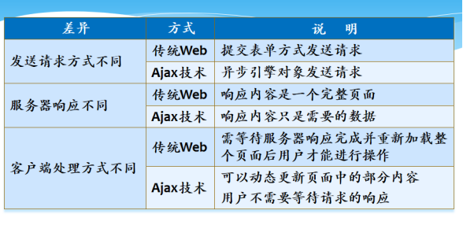
#### 2.什么是ajax（synchronous JavaScript And Xml）
使用JSON替换XML。 

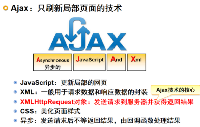

ajax就是一个其他技术的汇总：
- html +css 完成页面的显示。
- DOM 动态获取标签对象或者显示标签内容
- xml/json 服务区端和客户端之间进行数据转换和传递
- javascript 做总和。 

#### 3.ajax工作流程(会考)
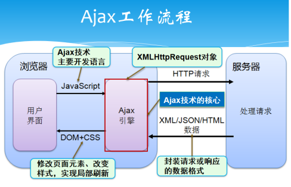

ajax使用步骤：<br>
1、创建异步引擎对象：
>let req = new XMLHttpRequest();

2、设置一个请求：（请求方式，请求路径，参数）
>req.open(method,URL,async)

3、发送请求(具体应为数据参数)
>send(content)

4、接收响应（先判断响应状态）
responseText
responseXml（基本不使用）

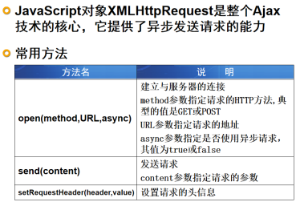
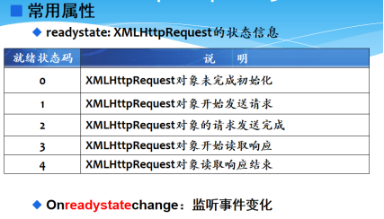


```html
<!DOCTYPE html>
<html lang="en">
<head>
    <meta charset="UTF-8">
    <meta name="viewport" content="width=device-width, initial-scale=1.0">
    <title>Document</title>
    <style type="text/css" >
        div{
            height: 300px;
            width: 32%;
            border: solid red 3px;
            display: inline-block;
            text-align: center;
            overflow: auto;
        }
    </style>
    <script type="text/javascript">
        function getlogin(){
            //1.创建ajax引擎对象
            let req = new XMLHttpRequest();
            //2设置请求信息（提交方式，提交地址，提交参数(不写默认为true采用异步请求)）
            let uname = document.getElementsByName("uname")[0].value;
            let pwd = document.getElementsByName("pwd")[0].value;
            let yzpwd = document.getElementsByName("yzpwd")[0].value;

            req.open("GET","http://iwenwiki.com/api/blueberrypai/login.php"+
                    "?user_id="+uname+"&password="+pwd+"&verification_code="+yzpwd);
            // 3.发送请求null表示请求实体（get没有请求实体，post才有）
            req.send(null);
            // 4.获得响应信息（1.相应信息有无异常错误，采用状态码判断2.判断相应信息获取中阶段，采用状态信息）
            req.onreadystatechange=function(){
                /* 阶段状态信息为4表示读取完毕 */
                /* 状态码为200表示相应正常 */
                if (req.readyState == 4 && req.status == 200) {
                    // 获得服务器响应JSON信息
                    let obj = req.responseText;
                    if (obj.success) {
                        document.getElementsByTagName("span")[0].innerHTML="<b style = 'color : red;'>登录成功</b>";
                    }else{
                        document.getElementsByTagName("span")[0].innerHTML="<b style = 'color : red;'>登录失败</b>";
                    }
                }
            }
        }
        function postlogin(){
            //1.获得引擎对象
            let request = new XMLHttpRequest();
            //2.设置请求信息
            request.open("POST","http://iwenwiki.com/api/blueberrypai/login.php");
            //3.发送请求
            let uname = document.getElementsByName("uname")[1].value;
            let pwd = document.getElementsByName("pwd")[1].value;
            let yzpwd = document.getElementsByName("yzpwd")[1].value;
            //post特有的头信息
            request.setRequestHeader("content-type", "application/x-www-form-urlencoded");
            //post要将请信息放在send中
            request.send("user_id="+uname+"&password="+pwd+"&verification code="+yzpwd);
            //4.获得相应信息
            request.onreadystatechange = function(){
                if (request.readyState == 4 && request.status == 200) {
                    let obj = request.responseText;
                    if (obj.success) {
                        document.getElementsByTagName("span")[1].innerHTML="<b style = 'color : red;'>登录成功</b>";
                    }else{
                        document.getElementsByTagName("span")[1].innerHTML="<b style = 'color : red;'>登录失败</b>";
                    }
                }
            }
        }
        //获取请求
        function getNums(){
            //1.创建封装对象
            let req = new XMLHttpRequest;
            //2.设置请求信息
            req.open("GET","http://iwenwiki.com/api/blueberrypai/getIndexInteresting.php");
            //3.发送请求
            req.send(null);
            //4.获得响应信息
            req.onreadystatechange= function(){
                if (req.readyState == 4 && req.status == 200 ) {
                    let obj = req.responseText;
                    console.log(obj);
                    //将响应信息转换为JSON形式
                    // 只有原生写法需要进行形式转换。
                    let jsonobj = JSON.parse(obj);
                    let arrs = jsonobj.interesting;
                    for (let i = 0; i < arrs.length; i++) {
                        let objp = document.createElement("p");
                        objp.innerText = arrs[i].title+"---"+arrs[i].writer;
                        document.getElementById("div1").appendChild(objp);
                    }
                }
            }
        }
    </script>
    
    <script type="text/javascript" src="../../js/jquery-1.8.3.js"></script>
    <script type="text/javascript">
        $(document).ready(function(){
            //使用$.ajax封装ajax异步请求信息
            $("[value = '获得数据']").click(function(){
                //调用ajax方法添加JSON信息
                $.ajax({
                    "type":"post",
                    "url":"http://iwenwiki.com/api/blueberrypai/getIndexInteresting.php",
                    "contentType":"application/x-www-form-urlencoded",
                    success:function(resptxt){
                        console.log(resptxt);
                        let arrs = resptxt.interesting;
                        for (let i = 0; i < arrs.length; i++) {
                            $("<p>"+arrs[i].title+"--"+arrs[i].writer+"</p>").appendTo("#div2");
                        }
                    }
                });
            });
            //一加载就发送异步请求信息
            //使用.get和.post封装ajax异步请求信息
            $.get("http://iwenwiki.com/api/blueberrypai/getIndexInteresting.php",function(resptxt){
                let arrs = resptxt.interesting;
                for (let i = 0; i < arrs.length; i++) {
                    $("<p>"+arrs[i].title+"--"+arrs[i].writer+"</p>").appendTo("#div3");
                }
            });
            $.post("http://iwenwiki.com/api/blueberrypai/getIndexInteresting.php",function(resptxt){
                let arrs = resptxt.interesting;
                for (let i = 0; i < arrs.length; i++) {
                    $("<p>"+arrs[i].title+"--"+arrs[i].writer+"</p>").appendTo("#div4");
                }
            });
        });
    </script>
</head>
<body>
<div>
    <h1>原生ajax--GET提交获取集合信息</h1>
    <input type="button" value="数据显示" onclick="getNums();">
    <div id="div1">
    </div>
</div>
<div>
    <h1>原生ajax--GET提交获取对象信息</h1>
    用户名：<input type="text" name="uname"><br>
    密码：<input type="password" name="pwd"><br>
    验证码：<input type="text" name="yzpwd"><br>
    <input type="button" value="登录" name="" id="" onclick="getlogin();">
    <span></span>
</div>
<div>
    <h1>原生ajax--POST提交获取对象信息</h1>
    用户名：<input type="text" name="uname"><br>
    密码：<input type="password" name="pwd"><br>
    验证码：<input type="text" name="yzpwd"><br>
    <input type="button" value="登录" name="" id="" onclick="postlogin();">
    <span></span>
</div>
<div>
    <h1>jQuery封装ajax----post提交,获取集合信息</h1>
    <input type="button" value="获得数据">
    <div id="div2"></div>
</div>
<div>
    <h1>jQuery封装ajax----get提交,获取集合信息</h1>
    <div id="div3"></div>
</div>
<div>
    <h1>jQuery封装ajax----postt提交,获取集合信息</h1>
    <div id="div4"></div>
</div>
</body>
</html>
```

- 使用POSt方法采用原生ajax，第一次封装，第二次封装三个方法将响应的集合信息输出到
一个表格中。

```html
<!DOCTYPE html>
<html lang="en">
<head>
    <meta charset="UTF-8">
    <meta name="viewport" content="width=device-width, initial-scale=1.0">
    <style>
        table{
            border: solid red 3px;
            border-collapse: collapse;
            text-align: center;
        }
        table td{
            border: solid red 3px;
        }
        .th1{
            text-align: center;
            font-size: 30px;
        }

    </style>
    <title>Document</title>
    <script type="text/javascript" src="../../js/jquery-1.8.3.js"></script>
    <script type="text/javascript">
        //原生ajax异步请求信息并将响应信息集合输出到一个表格中
        function getInfo1(){
            let request = new XMLHttpRequest;
            request.open("POST","http://iwenwiki.com/api/blueberrypai/getIndexInteresting.php");
            request.setRequestHeader("content-type", "application/x-www-form-urlencoded");
            request.send(null);
            request.onreadystatechange = function(){
                if (request.readyState == 4 && request.status == 200) {
                    let obj = request.responseText;
                    let jsonobj = JSON.parse(obj);
                    let arrays = jsonobj.interesting ;
                    for (let i = 0; i < arrays.length; i++) {
                        document.getElementsByName("tt")[i].innerText = arrays[i].title;
                        document.getElementsByName("w")[i].innerText = arrays[i].writer;
                        document.getElementsByName("t")[i].innerText = arrays[i].time;
                        document.getElementsByName("c")[i].innerText = arrays[i].content;
                        document.getElementsByName("i")[i].innerText = arrays[i].img;
                    }
                }
            }
        }
    </script>
    
    <script type="text/javascript">
        $(document).ready(function(){
            //第一阶段使用jQuery封装ajax异步请求信息并将响应信息集合输出到一个表格中
            $.ajax({
                "type":"POST",
                "url":"http://iwenwiki.com/api/blueberrypai/getIndexInteresting.php",
                "content-type":"application/x-www-form-urlencoded",
                success:function(requestTxt){
                    let arrays = requestTxt.interesting;
                    for (let i = 0; i < arrays.length; i++) {
                        //jQuery挑选索引位于i的标签对象
                        // $("td[name = tt1]:eq("+i+")").text(arrays[i].title);
                        $("td[name = tt1]").eq(i).text(arrays[i].title);
                        $("td[name = w1]").eq(i).text(arrays[i].writer);
                        $("td[name = t1]").eq(i).text(arrays[i].time);
                        $("td[name = c1]").eq(i).text(arrays[i].content);
                        $("td[name = i1]").eq(i).text(arrays[i].img);
                    }
                }
            });
        });
        //第二阶段使用jQuery封装ajax异步请求信息并将响应信息集合输出到一个表格中
        //第二阶段简化就直接在tr标签中循环创建td标签，节省body空间
        $.post("http://iwenwiki.com/api/blueberrypai/getIndexInteresting.php",function(requestTxt){
            let arrays = requestTxt.interesting;
            for (let i = 0; i < arrays.length; i++) {
                $("<td >"+arrays[i].title+"</td>").appendTo($("tr[name = tr"+i+"]"));
                $("<td >"+arrays[i].writer+"</td>").appendTo($("tr[name = tr"+i+"]"));
                $("<td >"+arrays[i].time+"</td>").appendTo($("tr[name = tr"+i+"]"));
                $("<td >"+arrays[i].content+"</td>").appendTo($("tr[name = tr"+i+"]"));
                $("<td >"+arrays[i].img+"</td>").appendTo($("tr[name = tr"+i+"]"));
            }
        });
    </script>

</head>
<body onload="getInfo1();">
<table>
    <th colspan="5" class="th1">原生ajax--POST提交获取集合信息</th>
    <tr>
        <td>title</td>
        <td>writer</td>
        <td>time</td>
        <td>content</td>
        <td>img</td>
    </tr>
    <tr>
        <td name="tt"></td>
        <td name="w"></td>
        <td name="t"></td>
        <td name="c"></td>
        <td name="i"></td>
    </tr>
    <tr>
        <td name="tt"></td>
        <td name="w"></td>
        <td name="t"></td>
        <td name="c"></td>
        <td name="i"></td>
    </tr>
    <tr>
        <td name="tt"></td>
        <td name="w"></td>
        <td name="t"></td>
        <td name="c"></td>
        <td name="i"></td>
    </tr>
    <tr>
        <td name="tt"></td>
        <td name="w"></td>
        <td name="t"></td>
        <td name="c"></td>
        <td name="i"></td>
    </tr>
    <tr>
        <td name="tt"></td>
        <td name="w"></td>
        <td name="t"></td>
        <td name="c"></td>
        <td name="i"></td>
    </tr>
    <tr>
        <td name="tt"></td>
        <td name="w"></td>
        <td name="t"></td>
        <td name="c"></td>
        <td name="i"></td>
    </tr>
    <tr>
        <td name="tt"></td>
        <td name="w"></td>
        <td name="t"></td>
        <td name="c"></td>
        <td name="i"></td>
    </tr>
    <tr>
        <td name="tt"></td>
        <td name="w"></td>
        <td name="t"></td>
        <td name="c"></td>
        <td name="i"></td>
    </tr>
    <tr>
        <td name="tt"></td>
        <td name="w"></td>
        <td name="t"></td>
        <td name="c"></td>
        <td name="i"></td>
    </tr>
    <tr>
        <td name="tt"></td>
        <td name="w"></td>
        <td name="t"></td>
        <td name="c"></td>
        <td name="i"></td>
    </tr>
    <tr>
        <td name="tt"></td>
        <td name="w"></td>
        <td name="t"></td>
        <td name="c"></td>
        <td name="i"></td>
    </tr>
    <tr>
        <td name="tt"></td>
        <td name="w"></td>
        <td name="t"></td>
        <td name="c"></td>
        <td name="i"></td>
    </tr>
    <tr>
        <td name="tt"></td>
        <td name="w"></td>
        <td name="t"></td>
        <td name="c"></td>
        <td name="i"></td>
    </tr>
    <tr>
        <td name="tt"></td>
        <td name="w"></td>
        <td name="t"></td>
        <td name="c"></td>
        <td name="i"></td>
    </tr>
    <tr>
        <td name="tt"></td>
        <td name="w"></td>
        <td name="t"></td>
        <td name="c"></td>
        <td name="i"></td>
    </tr>
    <tr>
        <td name="tt"></td>
        <td name="w"></td>
        <td name="t"></td>
        <td name="c"></td>
        <td name="i"></td>
    </tr>
</table>
<br>
<br>
<br>

<table>
    <tr>
        <th colspan="5" class="th1" >jQuery第一阶段封装ajax--POST提交获取集合信息</th>
    </tr>
    <tr>
        <td>title</td>
        <td>writer</td>
        <td>time</td>
        <td>content</td>
        <td>img</td>
    </tr>
    <tr>
        <td name="tt1"></td>
        <td name="w1"></td>
        <td name="t1"></td>
        <td name="c1"></td>
        <td name="i1"></td>
    </tr>
    <tr>
        <td name="tt1"></td>
        <td name="w1"></td>
        <td name="t1"></td>
        <td name="c1"></td>
        <td name="i1"></td>
    </tr>
    <tr>
        <td name="tt1"></td>
        <td name="w1"></td>
        <td name="t1"></td>
        <td name="c1"></td>
        <td name="i1"></td>
    </tr>
    <tr>
        <td name="tt1"></td>
        <td name="w1"></td>
        <td name="t1"></td>
        <td name="c1"></td>
        <td name="i1"></td>
    </tr>
    <tr>
        <td name="tt1"></td>
        <td name="w1"></td>
        <td name="t1"></td>
        <td name="c1"></td>
        <td name="i1"></td>
    </tr>
    <tr>
        <td name="tt1"></td>
        <td name="w1"></td>
        <td name="t1"></td>
        <td name="c1"></td>
        <td name="i1"></td>
    </tr>
    <tr>
        <td name="tt1"></td>
        <td name="w1"></td>
        <td name="t1"></td>
        <td name="c1"></td>
        <td name="i1"></td>
    </tr>
    <tr>
        <td name="tt1"></td>
        <td name="w1"></td>
        <td name="t1"></td>
        <td name="c1"></td>
        <td name="i1"></td>
    </tr>
    <tr>
        <td name="tt1"></td>
        <td name="w1"></td>
        <td name="t1"></td>
        <td name="c1"></td>
        <td name="i1"></td>
    </tr>
    <tr>
        <td name="tt1"></td>
        <td name="w1"></td>
        <td name="t1"></td>
        <td name="c1"></td>
        <td name="i1"></td>
    </tr>
    <tr>
        <td name="tt1"></td>
        <td name="w1"></td>
        <td name="t1"></td>
        <td name="c1"></td>
        <td name="i1"></td>
    </tr>
    <tr>
        <td name="tt1"></td>
        <td name="w1"></td>
        <td name="t1"></td>
        <td name="c1"></td>
        <td name="i1"></td>
    </tr>
    <tr>
        <td name="tt1"></td>
        <td name="w1"></td>
        <td name="t1"></td>
        <td name="c1"></td>
        <td name="i1"></td>
    </tr>
    <tr>
        <td name="tt1"></td>
        <td name="w1"></td>
        <td name="t1"></td>
        <td name="c1"></td>
        <td name="i1"></td>
    </tr>
    <tr>
        <td name="tt1"></td>
        <td name="w1"></td>
        <td name="t1"></td>
        <td name="c1"></td>
        <td name="i1"></td>
    </tr>
    <tr>
        <td name="tt1"></td>
        <td name="w1"></td>
        <td name="t1"></td>
        <td name="c1"></td>
        <td name="i1"></td>
    </tr>
</table>
<br>
<br>
<br>
<br>
<!-- 采用方法不同第一阶段jQuery使用直接往td中.text（）改变文本，第二阶段jQuery采用$("<td></td>")创建标签加入tr标签中 -->
<table>
    <tr>
        <th colspan="5" class="th1">jQuery第二阶段封装ajax--POST提交获取集合信息</th>
    </tr>
    <tr>
        <td>title</td>
        <td>writer</td>
        <td>time</td>
        <td>content</td>
        <td>img</td>
    </tr >
    <tr name="tr0"></tr>
    <tr name="tr1"></tr>
    <tr name="tr2"></tr>
    <tr name="tr3"></tr>
    <tr name="tr4"></tr>
    <tr name="tr5"></tr>
    <tr name="tr6"></tr>
    <tr name="tr7"></tr>
    <tr name="tr8"></tr>
    <tr name="tr9"></tr>
    <tr name="tr10"></tr>
    <tr name="tr11"></tr>
    <tr name="tr12"></tr>
    <tr name="tr13"></tr>
    <tr name="tr14"></tr>
    <tr name="tr15"> </tr>
    <tr name="tr16"></tr>
</table>
</body>
</html>
```


