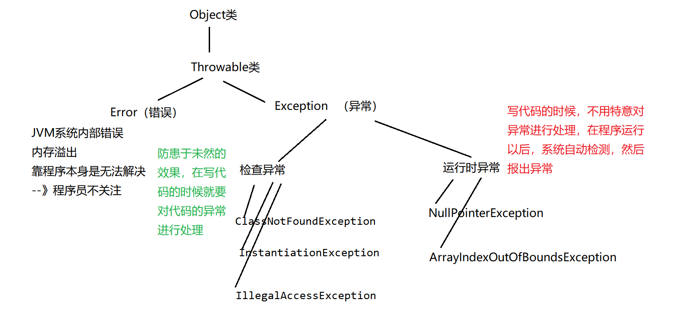

## 第八节 异常处理机制
异常：Exception：在程序的运行过程中，发生了不正常的现象，阻止了程序的运行，
我们称之为发生异常。
- 1.学习异常处理机制的原因：
  - 1.确保程序不会因错误终止。
  - 2.之前的程序在运行时也有问题和漏洞存在，通过选择结构来解决，随着业务流程复杂，漏洞
和问题变多，没法考虑到所有问题，一旦漏掉一个问题会导致程序终止。
  - 3.通过选择结构来解决会导致代码臃肿。
- 2.基于if-else处理异常缺点太多，所以java中专门出了一个异常处理机制：
  “异常三连”  try-catch-finally，还有throw（异常抛出）throws（异常向上抛出声明）
  - `1.捕获异常： try-catch`<br>
    原理：
    把可能出现异常的代码放入try代码块中，然后将异常封装为对象，被catch后面的()
  中的那个异常对象接收，如果异常类型相同就接收，接收以后：执行catch后面的{}里面
  的代码，然后try-catch后面的代码，该怎么执行就怎么执行。

    详细说一下：<br>
    - （1）try中没有异常，catch中代码不执行。<br>
    - （2）try中有异常，会从异常处终止并创建一个对应类型异常对象，然后使用catch进行捕获：<br>
  如果catch中异常类型和你出的异常类型匹配的话：走catch中的代码--》进行捕获<br>
  如果catch中异常类型和你出的异常类型不匹配的话：不走catch中的代码--》没有捕获成功，
  程序相当于遇到异常了，中断了，后续代码不执行。<br>
    - (3)`catch可以写多个`，他会依次向下寻找对应的异常类型，如果配对成功就执行相应
    catch后的语句。所以最上层应设置子类的异常类型，向下扩大范围写父类异常类型。
  
    注意：
    （1）try中如果出现异常，然后用catch捕获未成功的话，那么try中后续的代码是不会执行的。
    （2）如果catch捕获异常成功，那么try-catch后面的代码该执行还是执行没有影响。
```java
package com.msb.test01;
import java.util.InputMismatchException;
import java.util.Scanner;
/**
 * @Auther: msb-zhaoss
 */
public class Test4 {
    public static void main(String[] args) {
        Integer
        //实现一个功能：键盘录入两个数，求商：
        try{
            Scanner sc = new Scanner(System.in);
            System.out.println("请录入第一个数：");
            int num1 = sc.nextInt();
            System.out.println("请录入第二个数：");
            int num2 = sc.nextInt();
            System.out.println("商："+num1/num2);
        }catch(ArithmeticException ex){
            System.out.println("对不起，除数不可以为0");
        }catch(InputMismatchException ex){
            System.out.println("对不起，你录入的数据不是int类型的数据");
        }catch(Exception ex){
            System.out.println("对不起，你的程序出现异常");
        }finally {
            System.out.println("----谢谢你使用计算器111");
        }
    }
}
```
- 2.finally<br>
怎么样才可以将 try-catch后面的代码  必须执行？
只要将必须执行的代码放入`finally`中，那么这个代码无论如何一定执行。不管有没有捕获异常<br>
return和finally执行顺序？
`先执行finally最后执行return`,在执行return前先跳转执行finally后再执行return<br>
什么代码会放在finally中呢？
`关闭数据库资源，关闭IO流资源，关闭socket资源。`<br>
有一句话代码很厉害，它可以让finally中代码不执行!
`System.exit(0)`;//终止当前的虚拟机执行。
```java
package com.msb.test01;
import java.util.Scanner;
/**
 * @Auther: msb-zhaoss
 */
public class Test3 {
    public static void main(String[] args) {
        //实现一个功能：键盘录入两个数，求商：
        try{
            Scanner sc = new Scanner(System.in);
            System.out.println("请录入第一个数：");
            int num1 = sc.nextInt();
            System.out.println("请录入第二个数：");
            int num2 = sc.nextInt();
            System.out.println("商："+num1/num2);
            System.exit(0);//终止当前的虚拟机执行
            return;
        }catch(ArithmeticException ex){
            //throw ex;
        }finally {
            System.out.println("----谢谢你使用计算器111");
        }
    }
}
```
- 3.`throw和throws的区别：`
  - （1）位置不同：
  throw：方法内部
  throws: 方法的签名处，方法的声明处
  - （2）内容不同：<br>
throw+异常对象（检查异常，运行时异常）
throws+异常的类型（可以多个类型，用”，”拼接）
  - （3）作用不同：<br>
throw：异常出现的源头，`制造`异常。<br>
throws:在方法的`声明`处，告诉方法的调用者，这个方法中可能会出现我声明的这些异常。然后调用者对这个异常进行处理：
要么自己处理要么再继续向外抛出异常
```java
package test;
/**
 * 包含部分方法中抛出异常的情况解释说明
 * throw 和 throws
 * */
public class AbnormalTest {
    /*相同属性*/
    private String name;
    private int age;
    private String sex;
    private double weight;
    private double high;
    /*空构造器*/
    public AbnormalTest(){
    }
    /*构造器重载*/
    public AbnormalTest(String name, int age, String sex, double weight, double high)  {
        this.name = name;
        this.age = age;
        if(sex.equals("男")||sex.equals("女")){
            this.sex = sex;
        }else{
          /*运行时异常：包括RuntimeException及其所有子类。不要求程序必须对
          它们作出处理，比如InputMismatchException、ArithmeticException、
          NullPointerException等。即使没有使用try-catch或throws
          进行处理，仍旧可以进行编译和运行。如果运行时发生异常，会输出异常
          的堆栈信息并中止程序执行。*/
            throw new RuntimeException("性别不对！");
        }
        this.weight = weight;
        this.high = high;
    }
    /*三参构造器*/
    /* throw是在方法内部使用，进行异常的抛出
     * throws是在方法的声明处使用，将方法内可能出现的异常向上层抛出
     * 交给上层解决，尽管未出现异常，声明处也可加throws
     * */
    public AbnormalTest(String name, int age, String sex) throws Exception {
        this.name = name;
        this.age = age;
        if(sex.equals("男")||sex.equals("女")){
            this.sex = sex;
        }else{
            try {
                throw new Exception();
            } catch (Exception e) {
                e.printStackTrace();
            }
            /*检查异常需要被主动捕获才能处理，如果没有进行当场进行捕获，需要向上抛出。否则会编译错误，无法通过编译
            检查异常会使用throws向上抛出（就是谁调用这个方法就抛出给谁），需要被捕获后才能处理，一般使用try{}catch{}如上
             *如果没遇到try{}catch{}，会一直向上层抛出，每一层都要加throws
             * java中的main函数抛出的异常由JVM（java虚拟机）处理。
             * 在java程序中如果异常都向外抛，直到try{}catch处捕获；如果到了主方法（main方法）仍没有捕获，
             * 异常就由java虚拟机（java运行环境）处理
             * */
            throw new Exception();
        }
    }
}
```
```java
package test;
import java.io.IOException;
/*【方法重写的时候，如果父类没有抛出任何异常，那么子类只可以抛出运行时异常，不可以抛出检查（编译时）异常。】
  【如果父类的方法抛出了一个异常，那么子类在方法重写的时候不能抛出比被重写方法申明更加宽泛的检查（编译时）异常。】
  【子类重写方法的时候可以随时抛出运行时异常，包括空指针异常，数组越界异常等。】*/
 class A {
    public void method() throws IOException {
        System.out.println("A");
    }
}
class B extends A {
    @Override
//    这里抛出可以与父类抛出的异常同级或更低，但不能级别更高
    public void method() /*throws IOException (√)*//*throws Exception （×）*/{
        System.out.println("B");
    }
}
 class Test_ {
    public static void main(String[] args) {
        A a = new A();
        A b = new B();
        B c = new B();
/*第二行这里的创建的是class B的对象，但向上转型成了父类calss A的类型，所以对象b的表面类型
是父类class A，但实际类型是子类class B，在编译的时候，IDEA会认为b就是父类classA的对
象，那么调用的自然就是 A.method，而class A的方法进行了throws异常向上抛出（即使A的方
法内没有用throw抛出异常，但使用throws声明了可能出现异常，并向上抛出，上层方法就需要进行捕获
，否则就得继续向上抛出）*/
        try {
            b.method();
        } catch (Exception e) {
            e.printStackTrace();
        }
/*对象c表面类型和实际类型都是class B，class B并没有向上抛出异常（*/
        c.method();
    }
}
```
- 4.异常的分类<br>
异常分类结构图



- 5.自定义异常
有时我们为了提醒一些没有错误的做法时，我们需要手动抛出错误，但没有相对应的异常类型可以抛出
所以我们只能自定义异常，自定义的异常是可以继承的。<br>
  如果继承的是运行时异常，那么在使用的时候无需额外处理<br>
  如果继承的是检查异常，那么使用的时候需要try-catch捕获或者throws向上抛
```java
package test;
public class CreatAbnormal extends RuntimeException{
    public CreatAbnormal() {
    }
    public CreatAbnormal(String message) {
        super(message);
    }
}
```


