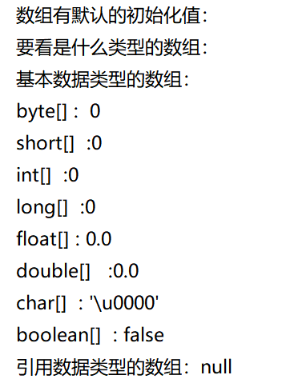

## 第六节 数组

### 1.为什么需要数组？
- 没有数组时我们需要`【创建大量的变量】`来存储数据信息；有数组之后，只需要创建`【一个数组】`
就可以存储多个数据信息。=========节省内存空间
- 大量数据使用数组，操作方便。
### 2.什么是数组？
- 数组是引用数据类型。是一种容器。
  数组的定义：
  数组是相同类型数据的有序集合。数组描述的是相同类型的若干个数据，按照一定的先后次序排列组合而成。
- 其中，每一个数据称作一个元素，每个元素可以通过一个索引（下标）来访问它们。
  数组的四个基本特点：
  1. 长度是确定的。数组一旦被创建，它的大小就是不可以改变的。
  2. 其元素的类型必须是相同类型，不允许出现混合类型。
  3. 数组类型可以是任何数据类型，包括基本类型和引用类型。
  4. 数组有索引的：索引从0开始，到 数组.length-1 结束
  5. 数组变量属于引用类型，数组也是对象。
  
  PS:数组变量属于引用类型，数组也是对象，数组中的每个元素相当于该对象的成员变量。
- 数组本身就是对象，Java中对象是在堆中的，因此数组无论保存原始类型还是其他对象类型，数组对象本身是在堆中存储的。
- 扩展：数组和变量基本数据类型的区别？
  - “多子女家庭”和“独生子女家庭”
### 3.怎么用数组？
- 数组（四步骤）：
  - 1.声明数组：数组类型[] 数组名；数组类型 数组名[];int[] ages
  - 2.分配空间：数组名 = new 数组类型[空间长度]；ages = new int[50]
    - 1+2合并：声明数组[] 数组名 = new 数组类型[空间长度]；【空间长度
一旦设定就不能再改变了】 int[] ages = new int[50]
  - 3.赋值数组元素： 
    - 1.静态赋值：
      1. 单个元素赋值：数组名[下标] = 值；age[0] = 60;
      2. 所有元素赋值：1+2+3步骤合并：
         1. 【方式一】int[] ages = {30,22,13,65,74};
         2. 【方式二】int[] ages = new int[]{30,22,13,65,74};
    - 2.动态赋值：
      数组定义与为数组元素分配空间并赋值的操作分开进行。
    ```html
    int[] arr ;
    arr = new int[3]
    arr[0] = 12;
    arr[1] = 23;
    arr[2] = 45;
    ```
    - 3.默认赋值：

       数组是引用类型，它的元素相当于类的实例变量，因此数组一经分配空间，其中的每个元素也被按照实例变量同样的方式被隐式初始化。
     int[] arr = new int[3];   ---> 数组有默认的初始化值

     
    - 4.操作数组：数组名[下标]【数组的每一个操作都离不开循环的帮助】
  - 基本数据类型（三步骤）：
    - 1.声明变量：变量类型 变量名；int age
    - 2.赋值变量：变量名 = 值； age = 20；
      - 1+2合并；变量类型 变量名 = 值；int age = 20
    - 3.使用变量：
### 4.总结数组
- 1.数组的长度是固定的，一旦设置不可更改
- 2.数组必须存储同一类型元素，任何变量类型都可以
- 3.数组下标索引的取值范围[0,空间长度（数组名.length）-1]
- 4.根据下标，随机访问元素的效率最高
### 5.数组内存分析
内存空间分为4块：
- 代码区（虚拟机里的类加载器会将物理位置下的字节码文件
里的代码段加载到内存的代码区里）
- 常量池：“字面常量”，“符号常量”，“静态变量”【常量池里不允许出现冗余/重复数据】
- 栈：基本数据类型的局部变量（方法里声明的变量就是局部变量）；引用数据类型的地址【栈里分很多方法区，一个方法区执行完
对应栈帧立即删除】引用数据类型会在堆里开辟空间存储数据，然后在栈里存储一个地址用以
调用。
- 堆：引用数据类型。引用数据类型在创建时在堆中开辟空间，不在使用时交给垃圾回收
机制回收。
### 6.使用数组
1. 存取数组：
```java
package com.jiruan;
import java.util.Scanner;
public class Demo01 {
    public static void main(String[] args) {
        /*控制台接受五个成绩，接收完再将五个成绩输出*/
        int[] scores = new  int[5];
        Scanner input = new Scanner(System.in);
        for (int i = 0; i <scores.length ; i++) {
            System.out.println("输入第"+(i+1)+"个成绩");
            scores[i] = input.nextInt();
        }
        int i = 0;
        for (int score:scores) {
            i++;
            System.out.print("第"+i+"个成绩为："+score);
        }
        System.out.println();
        for (int j = 0; j <scores.length ; j++) {
            System.out.print("第"+(j+1)+"个成绩为："+scores[j]);
        }
    }
}
```
2. 最值问题
```java
package com.jiruan;
import java.util.Scanner;
public class Demo01 {
    public static void main(String[] args) {
        getMax();
    }
        /*数组求最值*/
        public static void getMax() {
            int[] nums = {12, 34, 78, 46, 81, 125, 99, 45};
            int max = nums[0];
            for (int i = 1; i < nums.length; i++) {
            /*if (nums[i]>max){
                max = nums[i];
            }*/
                /*三元运算*/
                max = nums[i] > max ? nums[i] : max;
            }
            System.out.println("num数组中最大值是：" + max);
        }
    }
```
3. 查询问题
```java
package com.jiruan;
import java.util.Scanner;
public class Demo01 {
public static void main(String[] args) {
findIndex();
}
/*查询问题：根据元素找下标*/
    public static void findIndex(){
        int[] nums = {12,34,78,46,81,125,99,45};
        System.out.println("请输入一个整数");
        Scanner input = new Scanner(System.in);
        int num = input.nextInt();
        boolean b = false;
        for (int i = 0; i <nums.length ; i++) {
            if(num == nums[i]){
                System.out.println("存在！下标是："+i);
                b = true;
                break;
            }
        }
        if (!b) {
            System.out.println("不存在！");
        }
    }
}
```
4. 添加问题（有空余内存）
```java
package com.jiruan;
import java.util.Scanner;
public class Demo01 {
    public static void main(String[] args) {
        addNum01();
    }

    /*添加问题: 有空余空间/没有空余空间*/
    public static void addNum01() {
        int[] nums = new int[5];
        nums[0] = 23;
        nums[1] = 89;
        nums[2] = 76;
        nums[3] = 50;
        /*接受控制台输入的一个数，同时接受插入下标位置*/
        Scanner input = new Scanner(System.in);
        System.out.println("输入你要插入的数：");
        int num = input.nextInt();
        System.out.println("输入你要插入的下标：");
        int index = input.nextInt();
        for (int i = nums.length - 1; i >= (index + 1); i--) {
            nums[i] = nums[i - 1];
        }
        nums[index] = num;
        System.out.println(Arrays.
                toString(nums));
    }
}
```
添加问题（无空余内存）
```java
package com.jiruan;
import java.util.Scanner;
public class Demo01 {
  public static void main(String[] args) {
    addNum02();
  }
/*无空余空间*/
public static void addNum02() {
        int[] nums = {12,23,68,74,34};
        int[] newNums = new int[nums.length+1];
        for (int i = 0; i <nums.length ; i++) {
            newNums[i] = nums[i];
        }
        /*接受控制台输入的一个数，同时接受插入下标位置*/
        Scanner input = new Scanner(System.in);
        System.out.println("输入你要插入的数：");
        int num = input.nextInt();
        System.out.println("输入你要插入的下标：");
        int index = input.nextInt();
        for (int i = newNums.length-1; i >=(index+1) ; i--) {
            newNums[i] = newNums[i-1];
        }
        newNums[index] = num;
        System.out.println(Arrays.toString(newNums));
    }
}
```
5. 删除问题
```java
package com.jiruan;
import java.util.Scanner;
public class Demo01 {
  public static void main(String[] args) {
    deleteNum();
  }
/*删除问题*/
    public static void deleteNum(){
        int[] nums = {16,85,64,81,36,79,61};
        System.out.println(Arrays.toString(nums));
        Scanner input = new Scanner(System.in);
        System.out.println("输入你要删除的数：");
        int num = input.nextInt();
        boolean b =false;
        int index = 1;
        for (int i = 0; i <nums.length ; i++) {
            if (num == nums[i]){
                b = true;
                index = i;
                break;
            }
        }
        if (!b){
            System.out.println("不存在");
        }else {
            System.out.println("存在,下标为："+index);
        }
        if (!b){
            System.out.println("无法删除");
        }else {
            for (int i = index; i < nums.length - 1; i++) {
                nums[i] = nums[i + 1];
            }
            nums[nums.length - 1] = 0;
            System.out.println(Arrays.toString(nums));
        }
    }
}
```
### 7.阐述main方法
- 1.Main 方法是特殊的方法，作为程序的入口
- 2.固定格式：public static void main(string[] args){}
- 3.main方法可以有重载方法，但重载方法被视为普通方法。程序主入口不会改变。
- 4.参数是一个字符串类型的数组，在程序运行时，可以临时动态的传递一个信息变量进入。

```html
System.out.println(args.length);------>0
```

从这个结果证明，参数是String[],实参是  `new String[0]`
默认情况下，虚拟机在调用main方法的时候就是传入了一个`长度为0的数组`
如需手动传入实参，要在CMD里使用java 文件名 aa bb cc
### 8.可变参数
- 指的是参数的数量不确定，可以变化
- 1.可变参数：作用提供了一个方法，参数的个数是可变的 ,解决了部分方法的重载问题
```html
  int...num
  double...num
  boolean...num
```
- 2.可变参数在JDK1.5之后加入的新特性
- 3.方法的内部对可变参数的处理跟数组是一样
- 4.可变参数和其他数据一起作为形参的时候，可变参数一定要放在最后
- 5.我们自己在写代码的时候，建议不要使用可变参数。
### 9.Arrays工具类
作用：更方便操作数组。
- 常用方法：
  - `toString:对数组进行遍历`查看的，返回的是一个字符串，这个字符串比较好看
System.out.println(Arrays.toString(arr));
  - `binarySearch:二分法查找：`找出指定数组中的指定元素对应的索引：
这个方法的使用前提：一定要查看的是一个有序的数组：【如果元素存在，返回下标
如果元素不存在，返回值为该元素如果存在的话，存在的位置+1取反】
System.out.println(Arrays.binarySearch(arr,4));
  - `sort：排序 -->升序`
Arrays.sort(arr，fromindes,endindex);
可以指定排序范围。
  - `copyOf:完成数组的复制：`
int[] newArr = Arrays.copyOf(arr,x);【x为新数组的长度】
  - `copyOfRange:区间复制：`
int[] newArr2 = Arrays.copyOfRange(arr2,1,4);
//[1,4)-->1,2,3位置
  - `equals:比较两个数组的值是否一样：`
int[] arr3 = {1,3,7,2,4,8};
int[] arr4 = {1,3,7,2,4,8};
System.out.println(Arrays.equals(arr3,arr4));//true
System.out.println(arr3==arr4);//false ==比较左右两侧的值是否相等
，比较的是左右的地址值，返回结果一定是false
    - 基本数据类型作为参数传递时，是把值复制一份传走到具体方法里，对复制的值进行修改时，
  不影响原来的值。
    - 引用数据类型作为参数传递时，是把内存地址复制一份传走，对传递的值修改时，会影响原来的值
  - `fill：数组的填充：`
int[] arr5 = {1,3,7,2,4,8};
Arrays.fill(arr5,10);
arr5---->{10,10,10,10,10}
### 10.二维数组
一维数组：元素是一个个普通变量，通过一个下标能锁定一个具体元素内容

二维数组：元素是一个个数组，通过两个下标才能锁定一个具体的元素内容
- 1.使用二维数组
```html
private static void test07() {
        //1.声明数组
        int[][] arr;
        //2.分配空间
        arr = new int[3][];
        //1+2
        int[][] arr1 = new int[3][];
        //3.赋值
        arr[0] = new int[]{1,2};
        arr[1] = new int[]{3,4,5,6};
        int[] nums = {1,2,30};
        arr[2] = nums;
        //1+2+3
        int[][] arr2 = {{1,2},{4,5,6},{4,5,6,7,8,9,9}};
        int[][] arr3 =new int[][] {{1,2},{4,5,6},{4,5,6,7,8,9,9}};
        //使用
        System.out.println(arr3[1][2]); //5
        for (int i = 0; i <arr3.length ; i++) {
            for (int j = 0; j <arr3[i].length ; j++) {
                System.out.print(arr3[i][j]+"\t");
            }
            System.out.println();
        }
```


