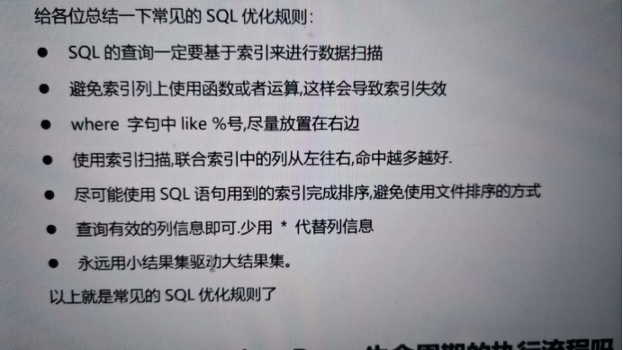

# 模拟面试记录整理
## 8/28
- 介绍下集合？
>我的回答： 
集合的回答很完整，几乎涵盖集合的主要部分。
 
>集合是一个大量存值的容器，是引用类型变量。常用的集合接口有collection，其下还有
list和set，然后是map接口，collection接口：无序，可重复的元素；list接口：有序
可重复的元素；set接口：无序，不可重复 ；Map接口：键值对存储：key（无序，唯一），
value（无序，可重复）；

- IO流序列化？
>我的回答： 
回答依然较为详细,回答transient关键字

>序列化操作是在使用对象IO流时为了将把内存中的Java对象转换成平台无关的二进制数据 ， 
从而允许把这种二进制数据持久地保存在磁盘上，或通过网络将这种二进制数据传输到另一个
网络节点的操作，一个类想要被序列化和反序列化，需要实现标记接口`Serializable`
为了防止修改类源码，导致序列化后的对象前后版本不一致，需要添加序列化ID，
transient修饰的属性 不可以被序列化。用来将敏感信息进行保密，因为根本没被写入所以读取时会显示初始值。
static关键字也不能被序列化，因为静态的东西属于类而不是对象。

## 8/30
- 对于数据库的了解？
>我的回答： 
卡壳了一次，非关系数据库了解有点少，数据库的整体阐述不太流畅

>数据库是按照数据结构来组织、存储和管理数据的仓库。整体分为关系型数据库和非关系型数据库
关系型数据库：Oracle、DB2、Microsoft SQL Server、Microsoft Access、MySQL
非关系数据库：NoSql、Cloudant、MongoDb、redis、HBase。

- 数据库的索引？
>我的回答： 
索引的底层阐述详细

>数据库索引是为了提高查询速度而对表字段附加的一种标识。
在数据库中，索引也允许数据库程序迅速地找到表中的数据，而不必扫描整个数据库。
mysql5版本后采用innoDB存储引擎，其索引的存储采用B+数的形式。

- 幻读？
>我的回答： 
详细

>幻读就是事务A 按照一定条件进行数据读取， 期间事务B 插入了相同搜索条件的新数据
，事务A再次按照原先条件进行读取时，发现了事务B 新插入的数据 称为幻读

- Mysql怎么解决事务并发问题？
>我的回答： 
非常详细

>采用事务隔离级别，事务的隔离级别用于决定如何控制并发用户读写数据的操作。
事务的隔离级别从低到高依次为READ UNCOMMITTED、READ COMMITTED、REPEATABLE READ以及SERIALIZABLE，
隔离级别越低，越能支持高并发的数据库操作。从上往下一次解决掉脏读、不可重复读和幻读问题，最后
SERIALIZABLE级别解决所有问题，但效率会降低。

- innoDB怎么解决事务并发问题？
>我的回答： 
不了解

>采用MVCC多版本并发控制，其中包含版本号，快照读，当前读的行锁，间隙锁和临键锁

- 数据库在更新表数据时是表锁还是行锁？
>我的回答： 
不熟悉

>行锁，在命中索引的条件下会对操作数据行进行上锁，没命中索引的情况下会进行全文扫描
对每一行上锁，相当于表锁。

- java创建对象的过程，什么是类？
>我的回答： 
非常详细

>通过使用类new一个对象出来，对象：对象是类的一个实例（对象不是找个女朋友），有状态和行为。例如，一条狗是一个对象，它的状态有：颜色、名字、品种；行为有：摇尾巴、叫、吃等。
类：类是一个模板，它描述一类对象的行为和状态。

- 内存泄露和内存溢出？
>我的回答： 
可以

>内存溢出就是你要求分配的内存超出了系统能给你的，系统不能满足需求，于是产生溢出。
是指程序在申请内存后，无法释放已申请的内存空间就造成了内存泄漏，一次内存泄漏似乎
不会有大的影响，但内存泄漏堆积后的后果就是内存溢出。

- 死锁发生的条件？
>我的回答： 
非常详细

>所谓死锁 是一组互相竞争资源的线程因互相等待导致“永久”阻塞的现象 。
> 第二个是发生死锁的原因，发生死锁的原因有四个，第一个是互斥条件，共享资源 
> X和Y只能被一个线程占用，第二个是指占有且等待，线程T1已经取得共享资源 
> X在等待共享资源Y的时候不释放共享资源X，第三个是不可抢占，其他线程不能强
> 行抢占线程T1占有的资源，第四个循环等待，线程T1等待线程T2占有的资源，
> 线程T2等待线程T1占有的资源。

## 09/01
- java的优点？
>我的回答： 
面向对象，指针，异常处理

>面对对象思想，取消了指针，有垃圾回收机制，异常处理机制，强制类型转换机制。

- 双向链表？
>我的回答： 
全

>双向链表，又称为双链表，是链表的一种，它的每个数据结点中都有两个指针，
> 分别指向直接后继和直接前驱。所以，从双向链表中的任意一个结点开始，
> 都可以很方便地访问它的前驱结点和后继结点。

- 事务并发错误？
>我的回答： 
引到脏读，脏读描述的好

>脏读：一个事务会读取到另一个事务未提交的数据。(读取到未提交数据)
例子：事务A修改了数据但还未提交，事务B读取到了事务A修改的数据。然后事务A因为某些错误回滚了，这个时候事务B读取到的数据就是脏的，这就是脏读。
 不可重复读：在同一事务内，事务两次读取到的数据是不一样的。(原数据中同一条数据被修改或被删除)
例子：事务A读取了一条数据之后，事务B修改了这条数据并提交了事务，然后事务A再次读取这条数据，就会发现两次结果不一致。这就是不可重复读。
  幻读：事务中的同一个查询在不同的时间产生不同的行集，这个就是幻读问题。(数据总条数新增)
例子：事务A使用一定的条件查询，然后事务B增加了符合条件的记录，当事务A再次查询的时候，发现两次查询的结果集不一样，好像产生了幻觉。这就是幻读。
不可重复读和幻读，都是读取到其他事务已经提交的数据。而脏读是读取到其他事务还未提交的数据
- 负载均衡？
>我的回答： 
介绍的不错，除权重策略之外的策略不知道

>负载均衡就是一种计算机网络技术，用来在多个计算机（计算机集群）、网络连接、
> CPU、磁碟驱动器或其他资源中分配负载，以达到最佳化资源使用、最大化吞吐率、
> 最小化响应时间、同时避免过载的目的。
>  轮询(Round Robin) 
请求到达后，将客户端发送到负载均衡器的请求依次轮流地转发给服务集群的某个节点。
优点：实现简单，每个集群节点平均分担所有的请求。
缺点：当集群中服务器硬件配置不同、性能差别大时，无法区别对待。引出下面的算法。
 随机(Random) 
随机选取集群中的某个节点来处理该请求，由概率论的知识可知，随着请求量的变大，随机算法会逐渐演变为轮询算法，即集群各个节点会处理差不多数量的请求。
优点：简单使用，不需要额外的配置和算法。
缺点：随机数的特点是在数据量大到一定量时才能保证均衡，所以如果请求量有限的话，可能会达不到均衡负载的要求。
 加权 
加权算法主要是根据集群的节点对应机器的性能的差异，给每个节点设置一个权重值，其中性能好的机器节点设置一个较大的权重值，而性能差的机器节点则设置一个较小的权重值。权重大的节点能够被更多的选中。它是和随机、轮训一起使用的。
优点：可以根据机器的具体情况，分配不同的负载，达到能者多劳。
缺点：需要额外管理加权系数。
 最小连接数 
主要是根据集群的每个节点的当前连接数来决定将请求转发给哪个节点，即每次都将请求转发给当前存在最少并发连接的节点。
优点：可以根据集群节点的负载情况来进行请求的动态分发，即机器性能好，处理请求快，积压请求少的节点分配更多的请求。避免某个节点因为处理超过自身所能承受的请求量而导致宕机或者响应过慢。
 hash 
将对请求的IP地址或者URL计算一个哈希值，然后与集群节点的数量进行取模来决定将请求分发给哪个集群节点。它不是真正意义上的负载均衡，在某些意义上也是一个单点服务。
优点：实现简单
缺点：如果某个节点挂了，会使得一部分流量不可用。
 流量削峰

-  二叉树？
>我的回答： 
说了定义和缺点，画不出最小二叉树

>一棵二叉树是结点的一个有限集合，该集合为空，或者是由一个根节点加上两棵称为左子树和右子树的二叉树组成。
（1）每个结点最多有两棵子树，即二叉树不存在度大于2的结点。
（2）二叉树的子树有左右之分，其子树的次序不能颠倒。
最小二叉树又称哈夫曼树

- 索引的底层结构？
>我的回答： 
mysql，innodb，b+树，5版本以前是MyISAM引擎答哈希表

>索引可选的数据结构 :二叉树 红黑树 hash B-tree，二叉树在插入顺序序列数据时会
> 退化成链表，查询效率低，红黑树可以自平衡，但是因为还是二叉树，存储数据过多会使
>树的高度很高，而且红黑树有自旋，都会影响查询的效率。 B树，多叉树，每一个节点都存储
> 数据，可以减少树的高度，B+树，B树的优化，，只有叶子节点存储数据，中间节点只存储
索引，叶子节点之间由双向指针链接，可看作双向链表。5版本后innoDB以B+树存储，5版本
> 前存储引擎为MyISAM，以B树存储。

- 双向队列？
>我的回答： 
答了队列，双向队列说的不多

>队列遵循的是先进先出 的原则。队列的尾部添加新的元素，并从顶部移除元素。最新的元素必须排在队列的末尾。
> 双端队列 是一种允许我们同时从前端和后端添加和删除元素的特殊队列，它是队列和栈的结合体。

- 多线程的锁？
>我的回答： 
还能锁一个对象，答的不错，但是，当前对象runable的例子反推出一个错误

>当多个线程同时操作同一个共享全局变量的时候，就容易出现线程安全问题，线程安全问题只会影响到线程对同一个共享的全局变量的写操作
> 为了解决线程安全的问题，使用了synchronized 进行加锁的操作，synchronized可
> 对类，对象，进行上锁，分同步方法和同步代码块，同步代码块就是对对象上锁。
> 修饰方法 
 静态方法（类方法） 
给静态方法添加 synchronized 关键字后，该类的被 synchronized 标识的静态方法一次只能被一个线程调用（获得锁），调用期间（占用锁）其它线程不允许调用被 synchronized 标识的静态方法（未获得锁），而没有添加 synchronized 关键字的静态方法（没有锁）可以被多个线程随时随意调用。
 非静态方法 
给非静态方法添加 synchronized 关键字后，该类的实例对象的被 synchronized 标识的非静态方法一次只能被一个线程调用（获得锁），调用期间（占用锁）其它线程不允许调用被 synchronized 标识的非静态方法（未获得锁），而没有添加 synchronized 关键字的非静态方法（没有锁）可以被多个线程随时随意调用。

## 9/4

- 对数据库的了解？
>我的回答： 
了解数据库的类型： 关系型和非关系型
关系型： 内部表通过链接形式 二维链接 保持数据的一致性
非关系型数据库： 用于存储大量数据，解决关系型数据库存储大量数据效率低的问题。
主流的关系型数据库； oracle mysql sql server
非关系型数据库 non-sql

>数据库是按照数据结构来组织、存储和管理数据的仓库。整体分为关系型数据库和非关系型数据库
关系型数据库：Oracle、DB2、Microsoft SQL Server、Microsoft Access、MySQL
非关系数据库：NoSql、Cloudant、MongoDb、redis、HBase。

- 在数据库中你知道什么时RR隔离级别吗？
>我的回答： 
repeatable-read 第三级别 可重复读  解决了其中两个问题  ： 脏读和不可重复读的问题
对于RR级别，用的什么引擎？

>repeatable-read，数据库默认级别，解决了脏读和不可重复读

- 5之后用的innodb如何解决幻读？
>我的回答： 
三种方法：
1.版本号  为事务添加版本号 为数据行添加版本号
2.快照读： 查询的数据是copy的数据。不会影响原表
3.间隙锁 ：在查询前后上锁。保持事务的原子性

>采用MVCC的快照读和当前读临键锁 
> 下面是MVCC机制的基本原理： 
对于每个事务，数据库系统为其分配一个唯一的时间戳，并且每个数据项都维护其自己的多个版本，每个版本都有其对应的时间戳。
当一个事务读取数据时，它只能读取时间戳早于其自身时间戳的数据版本，这样可以避免读取已被修改或正在被修改的数据。因为如果一个事务修改了某个数据项，那么该数据项的最新版本的时间戳将大于该事务的时间戳。
当一个事务需要修改数据时，它首先复制一份原始数据版本，并将该版本的时间戳设置为当前事务的时间戳。这样，当前事务就可以在该版本上执行修改操作，而其他事务仍然可以访问原始版本，从而实现并发控制。
当事务提交时，系统将其所有修改操作应用到数据库中，并将其时间戳更新为当前时间戳。这样，其他事务就可以读取到该事务所做的修改。
 临键锁（Next-Key Locks） 
Next-Key 可以理解为一种特殊的间隙锁，也可以理解为一种特殊的算法。通过临建锁可以解决幻读的问题。 每个数据行上的非唯一索引列上都会存在一把临键锁，当某个事务持有该数据行的临键锁时，会锁住一段左开右闭区间的数据。需要强调的一点是，InnoDB 中行级锁是基于索引实现的，临键锁只与非唯一索引列有关，在唯一索引列（包括主键列）上不存在临键锁。

- MVCC知道伐？？
>我的回答： 
知道

>MVCC（Multi-Version Concurrency Control）是一种常见的并发控制机制，常用于数据库管理系统中，其主要思想是为每个事务分配一个唯一的时间戳，并使用时间戳来区分事务的版本，以避免读取已被修改或正在被修改的数据。MVCC机制的主要原理是通过创建多个版本的数据，从而使并发事务不会互相干扰。
 下面是MVCC机制的基本原理： 
对于每个事务，数据库系统为其分配一个唯一的时间戳，并且每个数据项都维护其自己的多个版本，每个版本都有其对应的时间戳。
当一个事务读取数据时，它只能读取时间戳早于其自身时间戳的数据版本，这样可以避免读取已被修改或正在被修改的数据。因为如果一个事务修改了某个数据项，那么该数据项的最新版本的时间戳将大于该事务的时间戳。
当一个事务需要修改数据时，它首先复制一份原始数据版本，并将该版本的时间戳设置为当前事务的时间戳。这样，当前事务就可以在该版本上执行修改操作，而其他事务仍然可以访问原始版本，从而实现并发控制。
当事务提交时，系统将其所有修改操作应用到数据库中，并将其时间戳更新为当前时间戳。这样，其他事务就可以读取到该事务所做的修改。
总之，MVCC机制通过为每个事务分配唯一的时间戳，并创建多个版本的数据来实现并发控制。这种机制可以避免数据冲突和死锁等并发控制问题，从而提高数据库系统的性能和可靠性。

- 什么是聚集索引和非聚集索引？
>我的回答： 
主键是聚集  其他的是非聚集

>聚集索引就是存放的物理顺序和列中的顺序一样。一般设置主键索引就为聚集索引。
> 一般基于主键创建的索引就是聚集索引，创建主键时通常会默认为聚集索引，但也可以在
> 创建时不设置为聚集索引， 在 InnoDB 引擎中，每张表都会有一个特殊的索引“聚簇索引”，
> 一般情况下聚簇索引等于主键索引，但聚簇索引又不完全等于主键索引，因为一张表中没
> 有主键索引，那么聚簇索引会使用第一个唯一索引（此列必须为 not null），如果以
> 上情况都不满足，那么 InnoDB 会生成一个隐藏的聚簇索引。
> 除了聚集索引以外的索引都是非聚集索引，又称二级索引

- B+树了解吗 ？
>我的回答： 
了解  是对B树的优化。b树是在节点中存数据和指针。B+树在中间节点只存放索引，只在叶子节点存放数据。

>B+树是B-树的变体，也是一颗多路搜索树。一棵m阶的B+树主要有这些特点：
每个结点至多有m个子女;
非根节点关键值个数范围：⌈m/2⌉ - 1 <= k <= m-1
相邻叶子节点是通过指针连起来的，并且是关键字大小排序的。
>  B+树和B-树的主要区别如下： 
B-树内部节点是保存数据的;而B+树内部节点是不保存数据的，只作索引作用，它的叶子节点才保存数据。
B+树相邻的叶子节点之间是通过链表指针连起来的，B-树却不是。
查找过程中，B-树在找到具体的数值以后就结束，而B+树则需要通过索引找到叶子结点中的数据才结束
B-树中任何一个关键字出现且只出现在一个结点中，而B+树可以出现多次。

- B+树底层叶子节点的优化？
>我的回答： 
双向链表

>只有叶子节点存储数据，叶子节点之间形成一个双向链表，方便范围查询

- .B+树相比于红黑树的优点？？？？从树的高度来回答？
>我的回答： 
红黑树是二叉树。二叉树深度会更深。IO次数增多。B+树是多叉树，深度会减少效率高

>红黑树不仅需要自旋，而且二叉树存储数据比多叉树深度要深，增加磁盘IO次数，效率低。

- 希望你谈谈JVM。内存结构？
>我的回答： 
分为五大块 方法区 堆内存 虚拟机栈 本地方法栈 程序计数器
方法区和堆内存是线程共享的 其他的是线程私有的

>运行时数据区：方法区 堆内存 虚拟机栈 本地方法栈 程序计数器

- 回答堆内存 新生代？
>我的回答： 
新生代和老年代 ： 新生-eden 幸存者0 幸存者1
Eden存放刚创建的对象
MinorGC 存入幸存者0
进行下一次majorGC 从幸存者0移动到幸存者1
15次后转入老年代
Object header 4bit 最大为15位
老年满了后触发Full GC

>新生代主要用来存放新生的对象。一般占据堆空间的1/3。在新生代中，保存着大量的刚
> 刚创建的对象，但是大部分的对象都是朝生夕死，所以在新生代中会频繁的进行MinorGC
> ，进行垃圾回收。新生代又细分为三个区：Eden区、SurvivorFrom、ServivorTo区，
> 三个区的默认比例为：8：1：1。
 Eden区： 
Java新创建的对象绝大部分会分配在Eden区（如果对象太大，则直接分配到老
年代）。当Eden区内存不够的时候，就会触发MinorGC（新生代采用的是复制算法），对
新生代进行一次垃圾回收。
 SurvivorFrom区和To区： 
在GC开始的时候，对象只会存在于Eden区和名为From的Survivor区，To区是空的，
一次MinorGc过后，Eden区和SurvivorFrom区存活的对象会移动到SurvivorTo区中
，然后会清空Eden区和SurvivorFrom区，并对存活的对象的年龄+1，如果对象的年龄
达到15，则直接分配到老年代。MinorGC完成后，SurvivorFrom区和SurvivorTo区
的功能进行互换。下一次MinorGC时，会把SurvivorTo区和Eden区存活的对象放入SurvivorFrom区中，并计算对象存活的年龄。

- 解释HashSet的hashCode重复的问题？如何存储重复的键？
>我的回答： 
底层是 哈希表 链表和红黑树
存入对象时先用hashcode计算地址值，发生哈希冲突使用equals方法判断对象内容是否一样。如果则去除重复元素，如果不一样则散列 ： 开放寻址法和链式寻址法   
链表长度大于8 哈希表内容大于64将转为红黑树结构
还有栈寻址法和建立溢出缓冲区

## 9/8

- hashmap存储结构？？
>我的回答： 
底层是哈希表 链表 红黑树
原理是重写hashcode方法和equals方法判断对象是否重复
重复对象存储使用链式寻址发  一个bucket中树高度超过8并且数据数量超过64 
会变为红黑树。Hashmap扩容机制是新建一个hashmap，将原hashmap中内容依次
插入新的hashmap中。造成死循环。

- 解释一下死循环？
>我的回答： 
jdk1.7之前头插法扩容，导致元素顺序变为倒序。多线程并发状况下引发死循环问题

- 如何解决？
>我的回答： 
jdk1.8后将头插法改为，尾插法，使用线程安全的hashtable和ConcurrentHashMap

- 如何创建一个双向链表？
>我的回答： 
不清楚

>双链表顾名思义，就是链表由单向的链变成了双向链。 使用这种数据结构，我们可以不
再拘束于单链表的单向创建于遍历等操作，大大减少了在使用中存在的问题。在单链表中，
我们有一个数据域，还有一个指针域，数据域用来存储相关数据，而指针域则负责链表之
间的“联系”。 而在双向链表中，我们需要有两个指针域，一个负责向后连接，一个负责向
前连接。

- Concurrent下的线程方法都是线程安全的吗？
>我的回答： 
不清楚

>不是全都安全的，在迭代锁定时，通常需要将该锁定保留在集合中，否则，会有抛出 ConcurrentModificationException
的危险。此外，如果从多个线程频繁地访问集合，则常常不能很好地执行这些类。

- ConcurrentHashMap？
>我的回答： 
不清楚

>不能存储空值，会报空指针异常

- sql语句优化策略？
>我的回答： 
查询时不适用*
用索引查询
用小结果集驱动大结果集
不能在索引中使用函数

- 索引下推，索引回表，索引覆盖？
>我的回答： 
不清楚

>索引下推：
将服务层处理的判断过程转移到引擎层实现
在查询时，将筛选过程交给引擎层
索引回表：
查询时无法一次性查出所有结果，要回到原表中再次查询
索引覆盖：
使用索引查询时，尽量将查询的列和索引中的列对应。索引覆盖通过覆盖索引来实现。

- 什么是全文索引？
>我的回答： 
不清楚

>一般情况，对于模糊查询的情况最容易想到的就是 where  ... like %_... 这样。
> 确实，like 关键字在大都数情况下都能完成需求，但是在列的内容十分大的时候，
> like的性能就不能令人满意了，因为这个关键字并没有保证每次查询都能用上索引。
> 因此，全文索引就派上用场。除了性能上的提高，全文索引提供了更灵活的服务，比如： 
like 只是进行模式匹配，全文索引却提供了一些语法语义的查询功能，会将要查的字符串进行分词操作，这决定于MySQL的词库。
 全文索引可以自己设置词语的最小、最大长度，要忽略的词，这些都是可以设置的。
 用全文索引去某个列查一个字符串，会返回匹配度，可以理解为匹配的关键字个数，是个浮点数。
 总之就是，全文索引因为用上了索引，性能更高，有词库支撑可以进行分词提供了一些语义查询的功能，有词语停用表忽略某些词语，有词语最大最小值可以设置等更灵活。

- 索引的分类？
>我的回答： 
聚集索引 - 主键索引
1.普通索引
2.唯一索引
3.全文索引
4.组合索引

- 表没有设主键 有主键索引吗？
>我的回答： 
innoDB会自动生成隐形主键索引

>innoDB会自动生成索引，因为存储引擎存储数据就必须要主键索引才能存储，
> 【有问题时要以提问的形式提出，交谈要控制情绪，不能过去强硬】

