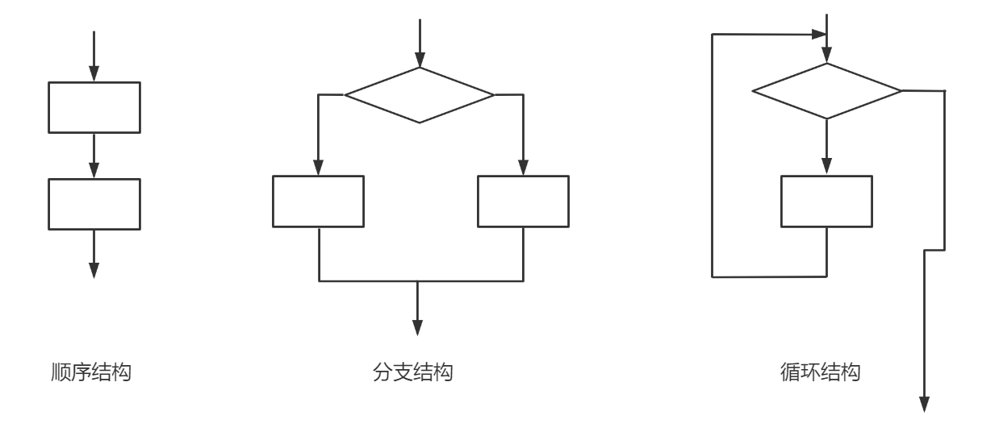
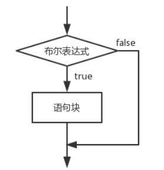
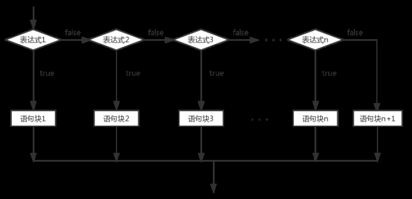
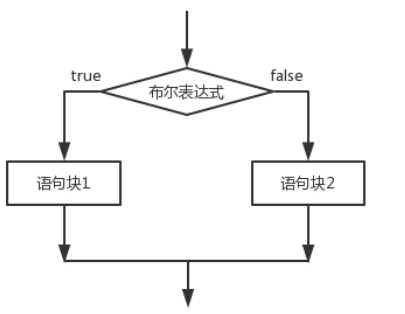
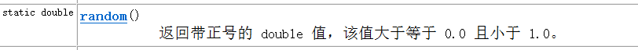
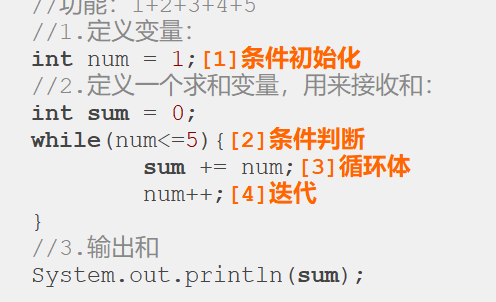
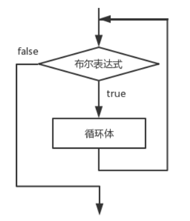
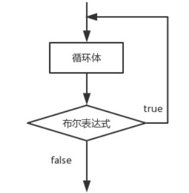
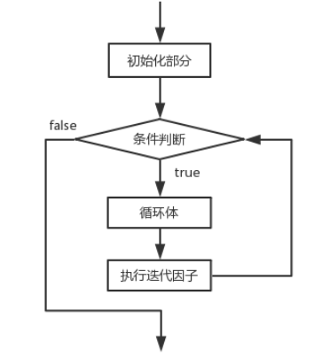
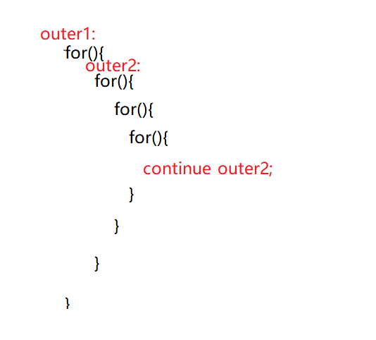

## 第四节 流程控制
流程控制语句分为：
- 顺序结构（从上到下，从左到右，逐行执行），
- 选择结构（根据表达式的判断结果，有选择性得选择某一部分代码执行），
- 循环结构（根据表达式的判断结果，判断某一部分代码是否进行多次重复进行）。
  
### 1.if选择结构

if后去除{}范围时，距离最近的下一个完整结构的代码默认为此循环的语块句。
- 单分支选择结构：
```html
if(布尔表达式){
语句块
}
```
if语句对布尔表达式进行一次判定，若判定为真，则执行{}中的语句块，否则跳过该语句块。


- 多分支选择结构：
```html
if(布尔表达式1) {
        语句块1;
} else if(布尔表达式2) {
        语句块2;
}……
else if(布尔表达式n){
        语句块n;
} else {
        语句块n+1;
}
```
1. 当布尔表达式1为真时，执行语句块1；否则，判断布尔表达式2，当布尔表达式2为真时，执行语句块2；否则，继续判断布尔表达式3······；
   如果1~n个布尔表达式均判定为假时，则执行语句块n+1，也就是else部分，即必定会执行一个语句块。
2. 如果最后一个判断语句也为else if，当全部表达式都不正确时，则 一个语块句都不执行。
3. 即使有多个条件都满足时，从上到的下的顺序，选择第一个真的表达式，执行对应的结构体后立即结束选择。
4. 一个多分支选择结构和多个单分支选择结构的区别？

多个单分支选择结构有可能一个都不执行，也可能都执行，说白了就是每个都是单个独立判断，判断结果互相不影响。


-  双分支选择结构：
```html
if(布尔表达式){
语句块1
}else{
      语句块2
}
```
当布尔表达式为真时，执行语句块1，否则，执行语句块2。也就是else部分。


- 嵌套分支选择结构：

  小朋友搬桌子：
  年龄大于7岁，可以搬桌子；
  如果年龄大于5岁，性别是男，可以搬桌子；
  否则不可以搬动桌子，提示：你还太小了
```html
 //1.录入小朋友的年龄：
Scanner sc = new Scanner(System.in);
System.out.println("请录入小朋友的年龄：");
int age = sc.nextInt();
//2.根据年龄判断：
if(age>=7){
System.out.println("yes");
}else if(age>=5){
//录入小朋友的性别；
System.out.println("请录入小朋友的性别：男：1  女 ：0");
int sex = sc.nextInt();
if(sex==1){//男生
System.out.println("yes");
}else{//女孩
System.out.println("no");
}
}else{//age<5
System.out.println("no");
}
```
- 典型题
  - 数a和数b转换
  - 接受一个四位整数，求各个位上的数字之和
  - 随机数：
    在java中依靠一个类：Math类帮助我们生成，这个类中有一个方法专门用来生成随机数：
    
```html
Math.random() -------> [0.0,1.0)
Math.random()*6 ----->[0.0,6.0)
(int)(Math.random()*6)  ----->[0,5]
(int)(1+Math.random()*6)----->[1,6]
```
- 输入一个整数，如果输入的数等于产生的随机数，显示”中奖“
```html
 System.out.print("输入一个整数：");
  int x = input.nextInt();
  double d = Math.random()*10;
  int i = (int)d;
  System.out.println(i);
  if (x == i){
  System.out.println("中奖了");
  }else {
  System.out.println("没中奖");
  }
```
1. 为什么Scanner使用时需要导入系统类，而Math使用时不需要导入系统类？

两者所处工具包不同，Math所在的Java.long包更加常用一些，会被jdk自动全部导入；
Scanner在java.util包下，不会被自动导入，所以使用时要进行手动导入。
2. 为什么Scanner使用时要创建对象才可以调用方法，而Math使用时不需要创建对象就可以使用方法

原因在于方法不同，一个是Math的random（），一个是Scanner的nextInt（），
random方法是静态方法，归类名拥有，可以用类名直接调用，nextInt是非静态方法，
必须通过对象名来调用。
### 2.switch选择结构
```html
switch (表达式) {
    case 值1:
         语句序列1;
         break;
    case 值2:
         语句序列2;
         break;
        … … …      … …
    default:默认语句;
}
```
- switch语句会根据表达式的值从相匹配的case标签处开始执行，一直执行到break语句处或者
  是switch语句的末尾。如果表达式的值与任一case值不匹配，则进入default语句
  （如果存在default语句的情况）。根据表达式值的不同可以执行许多不同的操作。
  switch语句中case标签在JDK1.5之前必须是整数（long类型除外）或者枚举，不能是字符串，
  在JDK1.7之后允许使用字符串(String)。大家要注意，当布尔表达式是等值判断的情况，
  可以使用if-else if-else多分支结构或者switch结构，如果布尔表达式区间判断的情况 ，
  则只能使用if-else if-else多分支结构。
- if选择结构和switch选择结构的区别：
  if更擅长处理区间问题，switch更擅长处理等值问题
- 注意事项
  - 【1】switch后面是一个()，()中表达式返回的结果是一个等值，这个等值的类型可以为：
    int,byte,short,char,String,枚举类型。
  - 【2】这个()中的等值会依次跟case后面的值进行比较，case后面的值必须是字面常量，不能重复，
    如果匹配成功，就执行:后面的代码
  - 【3】为了防止代码的“穿透”效果：在每个分支后面加上一个关键词break，遇到break这个分支就结束了
  - 【4】类似else的“兜底”“备胎”的分支：default分支：没有匹配成功的case时，执行default。
  - 【5】default分支可以写在任意的位置上，但是如果没有在最后一行，后面必须加上break关键字，
    如果在最后一行的话，break可以省略
  - 【6】相邻分支逻辑是一样的，那么就可以只保留最后一个分支，上面的都可以省去不写了
  - 【7】switch分支和if分支区别：
    - 表达式是等值判断的话--》if ，switch都可以
    - 如果表达式是区间判断的情况---》if最好
  - 【8】switch应用场合：就是等值判断，等值的情况比较少的情况下
  - 【9】break和default可以省略。
1. 输入月份，输出月份有多少天，今年为2023年：
```html
 Scanner input = new Scanner(System.in);
        System.out.println("请输入月份：");
        int mouth = new Scanner(System.in).nextInt();
        switch (mouth){
            case 2:
                if (2023%4 == 0 && 2023%100 != 0 || 2023%400 == 0){
                    System.out.println("29");
                }else {
                    System.out.println("28");
                }break;
            case 1:
            case 3:
            case 5:
            case 7:
            case 8:
            case 10:
            case 12:System.out.println(mouth+"月31天");break;
            case 4:
            case 6:
            case 9:
            case 11:
                System.out.println(mouth+"月30天");
                break;
            default:
                System.out.println("输入的数字不正确");
```
### 3.循环结构
- 1.循环结构：do...while；while；for；foreach
- 2.循环分类：
  - 1.根据循环次数分：确定次数循环、不确定次数循环
- 2.循环的组成
循环=循环条件（开始条件，终止条件，修改条件）+循环内容（重复执行的）【一般将循环的修改条件放到循环内容里】

循环四要素：


⑴初始语句:循环起始变量； ⑵条件表达式:用于判断循环结构的条件； ⑶循环体:重复执行代码块； 
⑷迭代因子: 改变循环条件的变量， 使循环趋向于结束的语句。
- 1.while循环
```html
while (布尔表达式) {
循环体;
}
```
在循环刚开始时，会计算一次“布尔表达式”的值，若条件为真，执行循环体。而对于后来每一次额外的循环，都会在开始前重新计算一次。
语句中应有使循环趋向于结束的语句，否则会出现无限循环–––"死"循环。

- 2.do...while循环
```html
do {
            循环体;
    } while(布尔表达式) ;
```
do-while循环结构会先执行循环体，然后再判断布尔表达式的值，若条件为真，执行循环体，当条件为假时结束循环。do-while循环的循环体至少执行一次。

- 3.for循环
```html
for (初始表达式; 布尔表达式; 迭代因子) {
          循环体;
}
```
for循环语句是支持迭代的一种通用结构，是最有效、最灵活的循环结构。for循环在第一次反复之前要进行初始化，即执行初始表达式；随后，对布尔表达式进行判定，若判定结果为true，则执行循环体，否则，终止循环；最后在每一次反复的时候，进行某种形式的“步进”，即执行迭代因子。

初始化部分设置循环变量的初值

条件判断部分为任意布尔表达式

迭代因子控制循环变量的增减

for循环在执行条件判定后，先执行的循环体部分，再执行步进。

- 100以内求和
```java
package com.jiruan;
public class test02 {
    public static void main(String[] args) {
        int sum = 0;
        for (int i = 1;i <= 100;i++){
            sum += i;
        }
    }
}
```
- 4.循环里的关键字
  - break：终止循环，执行循环后面的代码
    - 使用场合：可以在switch结构里，也可以在循环结构里。
  - continue：结束本次循环，进行下次循环
    - 只能在循环结构里
  - return:直接返回，终止方法
  - System.exit(x):终止当前运行的系统，x为正数时，系统正常结束，x为负数时
  系统异常结束。

  在任何循环语句的主体部分，均可用break控制循环的流程。break用于强行退出循环，不执行循环中剩余的语句。
continue 语句用在循环语句体中，用于终止某次循环过程，即跳过循环体中尚未执行的语句，接着进行下一次是否执行循环的判定。
return的作用,结束当前所在方法的执行.
- 5.二重循环
  - 内层循环，循环一遍，外层循环，循环一次
  - 二重循环中的关键字：
    - continue：默认结束最近包裹continue的循环结构，也可使用outer标签选择执行那一层循环
      
    - break:同上
    - return
    - System.exit
    - outer:标签

