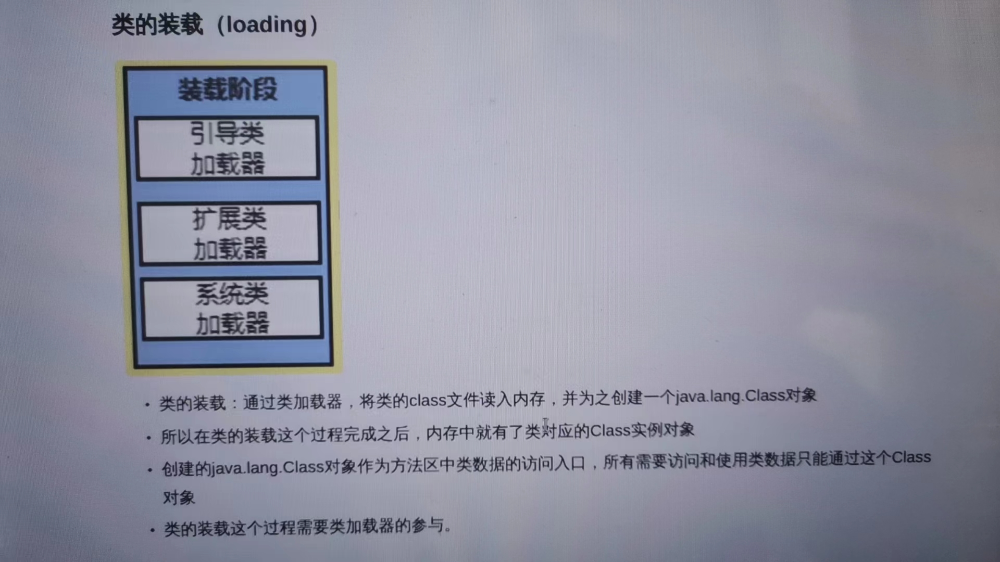
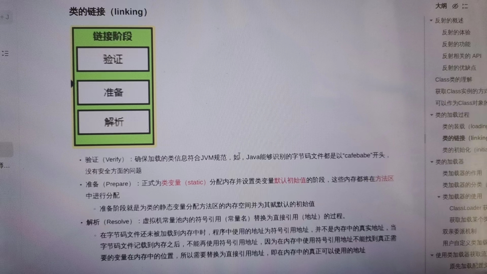
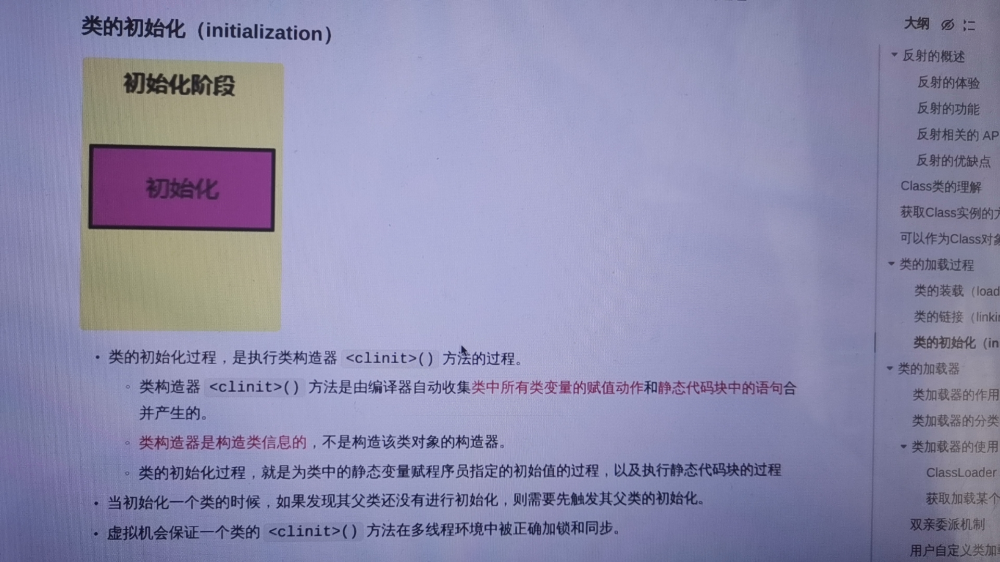
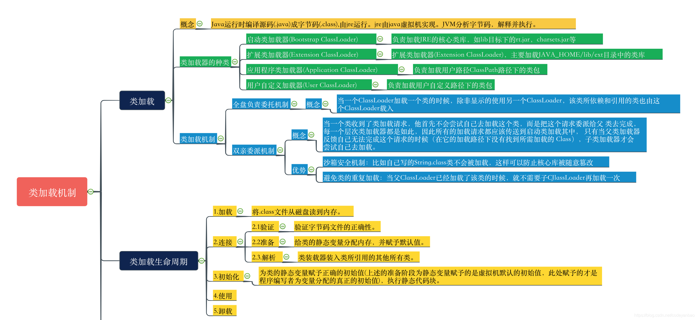

# JVM类的加载
## 一、类的加载过程
### 1.加载Loading
这个加载指的是类加载过程中的一个环节，在加载阶段Java虚拟机需要完成三件事：

- 通过一个类的全限定名获取定义此类的二进制字节流；
- 将这个字节流所代表的静态存储结构转化为方法区的运行时数据结构；
- 在内存中生成一个代表这个类的java.lang.Class对象，作为方法区这个类的各种数据的访问入口。

### 2.链接Linking

连接中又可分为：验证、准备、解析三个阶段。

- 1.验证Verify：
主要是验证class文件的字节流是否符合当前虚拟机的要求（如开头是否是CAFEBABE），用于保证被加载类的正确性。
主要包括四种验证：文件格式验证、元数据验证、字节码验证、符号引用验证。此处不做过多解释。

- 2.准备Prepare：
用于给类变量（static修饰的）分配内存，并且给类变量设置默认初始值（这里是默认值，如：static int i = 1，这里给i赋的默认值是0，不是1）。

>注：这里不包含final static修饰的静态常量。因为final在编译的时候就会分配，准备阶段就会显示初始化。也不会为实例变量分配初始化，类变量会分配在方法区中，而实例变量是会随着对象一起分配到Java堆中。

- 3.解析Resolve：
该阶段是将常量池的符号引用转换为直接引用的内存地址的过程。解析主要针对类或接口、字段、类方法、方法类型等。

### 3.初始化Initialzation

该阶段是类中所有静态变量进行指定的初始值赋值的过程，还包括静态代码块的执行。

## 二.三种类的加载器

### 1）Bootstrap 启动类加载器

它是最顶级的类加载器，它的底层不是一个类，而是有c++一段代码生成的。

用来加载类文件不是我们自己书写的，而是负责Java核心类库的,比如System,String等。

### 2）ExtClassLoader 扩展类加载器

主要负责加载jre/lib/ext目录下的一些扩展的jar。

### 3）AppClassLoader 系统/应用类加载器

是用来加载我们自己书写的类的.class文件的，比如 Person 、Student等

是用来加载ClassPath 指定的所有jar或目录，ClassPath表示存放类路径的。
我们如果不配置ClassPath，那么就表示当前文件夹。

在idea环境下的ClassPath是out目录。在out目录存放的都是我们书写好的class文件，
也就是说 AppClassLoader 类加载器是用来加载我们书写的out目录下的class文件。

类加载机制总结图：

