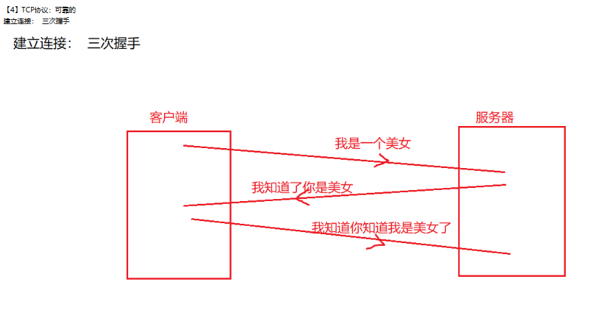

## 十三节 网络编程
### 1.引入
- 1.网络编程：
  把分布在不同地理区域的计算机与专门的外部设备用通信线路互连成一个规模大、功能强的网络系统，从而使众多的计算机可以方便地互相传递信息、共享硬件、软件、数据信息等资源。
  设备之间在网络中进行数据的传输，发送/接收数据。

- 2.通信两个重要的要素：IP+PORT 


- 3.设备之间进行传输的时候，必须遵照一定的规则 ---》通信协议：





- InetAddress   ---》 封装了IP
```java
public class Test01 {
    //这是一个main方法，是程序的入口：
    public static void main(String[] args) throws UnknownHostException {
        //封装IP：
        //InetAddress ia = new InetAddress();不能直接创建对象，因为InetAddress()被default修饰了。
        InetAddress ia = InetAddress.getByName("192.168.199.217");
        System.out.println(ia);
        InetAddress ia2 = InetAddress.getByName("localhost");//localhost指代的是本机的ip地址
        System.out.println(ia2);
        InetAddress ia3 = InetAddress.getByName("127.0.0.1");//127.0.0.1指代的是本机的ip地址
        System.out.println(ia3);
        InetAddress ia4 = InetAddress.getByName("LAPTOP-CRIVSRRU");//封装计算机名
        System.out.println(ia4);
        InetAddress ia5 = InetAddress.getByName("www.mashibing.com");//封装域名
        System.out.println(ia5);
        System.out.println(ia5.getHostName());//获取域名
        System.out.println(ia5.getHostAddress());//获取ip地址
    }
}
```
- InetSocketAddress  ---》封装了IP，端口号
```java
public class Test02 {
    //这是一个main方法，是程序的入口：
    public static void main(String[] args) {
        InetSocketAddress isa = new InetSocketAddress("192.168.199.217",8080);
        System.out.println(isa);
        System.out.println(isa.getHostName());
        System.out.println(isa.getPort());
        InetAddress ia = isa.getAddress();
        System.out.println(ia.getHostName());
        System.out.println(ia.getHostAddress());
    }
}
```
### 2.套接字

### 3.双向通信
#### 服务器设置
```java
package Test01;
/**
 * 服务器通信设置
 * */
import java.io.*;
import java.net.ServerSocket;
import java.net.Socket;
import java.util.Scanner;

public class Server {
    public static void main(String[] args) throws IOException {
        Scanner input = new Scanner(System.in);
        ServerSocket ss = new ServerSocket(8080);
        /*接受信息*/
        Socket s = ss.accept();
        /*创建输入字节流和数据流*/
        InputStream is = s.getInputStream();
        DataInputStream dis = new DataInputStream(is);
        /*创建输出字节流和数据流*/
        OutputStream os = s.getOutputStream();
        DataOutputStream dos = new DataOutputStream(os);
        /*循环进行接受信息和发送信息*/
        while (true) {
            /*接收客户端发送回的信息*/
            String str = dis.readUTF();
            /*判断接受的信息如果是exit就退出，如果不是就打印*/
            if (str.equals("exit"))break;
            System.out.println("客户端发来的信息："+str);

            /*进行控制台的信息接受和发送*/
            System.out.println("发送信息：");
            String ms  = input.next();
            dos.writeUTF(ms);
            /*判断发送过去的信息是否是exit来关闭程序*/
            if (ms.equals("exit"))break;
        }
        /*关闭流*/
        dos.close();
        dis.close();
        s.close();
        ss.close();
    }
}
```
#### 客户端设置
```java
package Test01;
import java.io.*;
import java.net.Socket;
import java.util.Scanner;

/**
 * 客户端通信设置
 * */
public class Client {
    public static void main(String[] args) throws IOException {
        Scanner input = new Scanner(System.in);
        //1.创建套接字：指定服务器的ip和端口号：
        Socket s = new Socket("192.168.1.184",6666);
        /*创建输出字节流和数据流*/
        OutputStream os = s.getOutputStream();
        DataOutputStream dos = new DataOutputStream(os);
        /*创建输入字节流和数据流*/
        InputStream is = s.getInputStream();
        DataInputStream dis = new DataInputStream(is);
        /*循环进行发送信息和接受信息*/
        while (true) {
            /*进行控制台的信息接受和发送*/
            System.out.println("发送信息：");
            String ms = input.next();
            dos.writeUTF(ms);
            /*判断发送过去的信息是否是exit来关闭程序*/
            if (ms.equals("exit"))break;

            /*接收服务器发送回的信息*/
            String str = dis.readUTF();
            /*判断接受的信息如果是exit就退出，如果不是就打印*/
            if (str.equals("exit"))break;
            System.out.println("服务器发来的信息：" + str);
        }
        /*关闭流*/
        dis.close();
        dos.close();
        s.close();
    }
}
```


