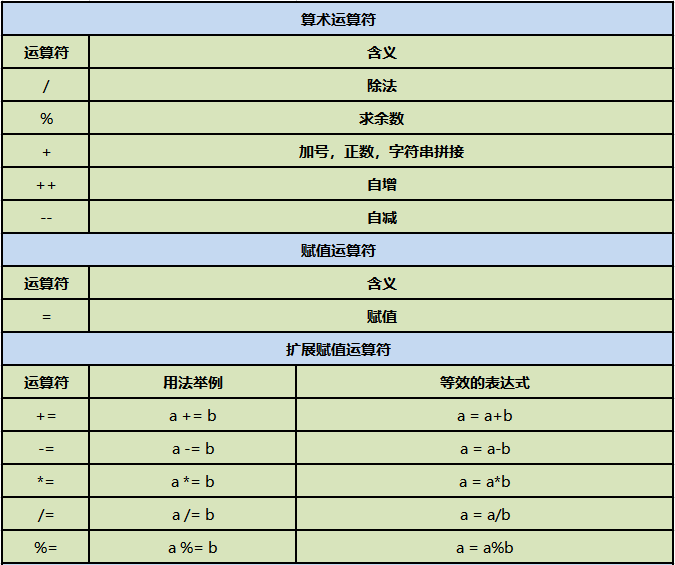
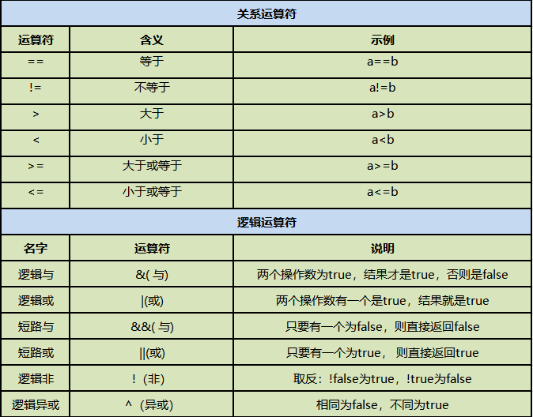
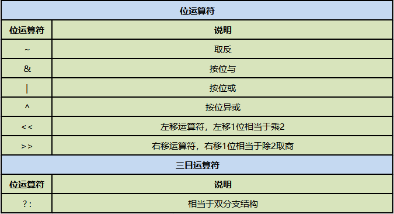
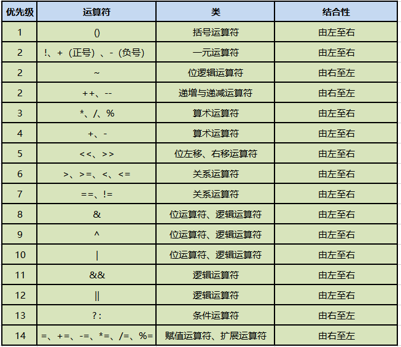

## 第三节
### 1.运算符



- 1.`算术运算符：`+；-；*；/；%（余）；++（自增）；--（自减）
    - %：用来求余数的。例：`int a = 7%5；---2`
    - ++;--: a++的运算结果相当于a = a + 1。无论这个变量是否参与到运算中去，只要用++运算符，这个变量本身就加1操作
      只是说如果表达式还包含其他功能的时候如果++在后：先进行其他功能，再自身加1 如果++在前：先自身加1，再进行其他功能

【简单来说，如果有其他需要调用a++/++a的地方，例：
```html
int a = 1; 
int b = a++(++a);
System.out.print(b);
```
a++的情况就是先将a的值（1）赋值给b再进行运算a++，++a的情况就是
先运算++a，再将a的值（2）赋值给b】
- 2.`赋值运算符：`=
- 3.`扩展赋值运算符：`+=；-=；*=；/=；(a+=b就是a=a+b)
    - a+=b 和 a=a+b 区别：
        - （1）a+=b  可读性稍差；编译效率高；底层自动进行类型转换
        - （2）a=a+b 可读性好；编译效率低；手动进行类型转换
- 4.`关系运算符：` >; <; !=; <=; >=; ==
    - 用==比较基本数据类型时，比较的时存储的内容；用来比较引用类型时，比较的是内存地址。
      要想比较引用类型的内容得用equals方法来进行比较。
- 5.`逻辑运算符：`&；|；！；&&；||
    - 条件1 & 条件2：前后两条件同时为真，结果才为真（前后两个条件都要判断）
    - 条件1 | 条件2：前后两条件一个为真，结果就为真（同上）
    - ！（条件表达式）
    - &&；||：短路与和短路或
        - &&：第一个条件为假，则直接判断为假。
        - ||：第一个条件为真，则直接判断为真。

进行逻辑判断时一定要使用&&；||，数据会更安全。
- 6.`条件运算符：`a？b:c(三元运算符)

  其中a是一个布尔类型的表达式，返回结果要么是true要么false，通过a的结果决定最终表达式的结果:
  如果a的结果是true，那么表达式最终结果为b ；如果a的结果是false，那么表达式最终结果为c【:两侧的值必须是同一类型的】
- 7.`位运算符：`&，|，^，~ ， >>(右移)，<<(左移)，>>>；
    - a << x:二进制数字向左移x位，在右边补x位的0
    - a >> x:二进制数字向右移x位，如果符号位为＋（0）在左边补x位的0，如果符号位为-（1）在左边补x位的1，
    - &:两组二进制数相同位置上都为1，结果为1，不同，则为0
    - |:两组二进制数相同位置上有一个为1，结果就为1，

  如何区分逻辑运算符和位运算符：

  逻辑运算符：左右连接的是布尔类型的操作数
  位运算符：左右连接的是具体的数值
- 8.`字符串运算符：`+（连接作用）
    - 字符串具有同化性：字符串通过+将其他类型同化成字符串类型，进行拼接输出。
- 9.运算符优先级
  
  不需要去刻意的记优先级关系
  赋值<三目<逻辑<关系<算术<单目
  理解运算符的结合性
