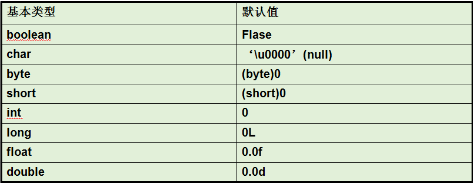
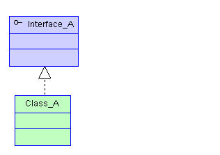

## 第七节 面向对象
### 1.面向过程和面向对象的区别？
- `面向过程：`当事件比较简单的时候，利用面向过程，注重的是事件的具体的步骤/过程，
注重的是过程中的具体的行为，以函数为最小单位，考虑怎么解决问题。

- `面向对象：`注重找“参与者”,将功能封装进对象，强调具备了功能的对象，
以类/对象为最小单位，考虑谁有能力来解决问题。

【面向过程 ---> 面向对象 , 其实就是由执行者 ---> 指挥者的 一个过渡；<br>
二者相辅相成,并不是对立的。解决复杂问题,通过面向对象方式便于我们从宏观上把握事物之
间复杂的关系、方便我们分析整个系统;具体到微观操作,仍然使用面向过程方式来处理】
### 2.面向对象的三个阶段；
- 【1】`面向对象分析OOA  --  Object Oriented Analysis`<br>
  - 1.从当前系统/题目中找出所有参与的对象，
  - 2.分析这些对象共有的静态特征和动态特征

动词--》动态特性--》方法<br>
名词--》静态特性--》属性

- 【2】`面向对象设计OOD  --  Object Oriented Design`<br>
  - 1.将所有参与的对象提取成一类，确定类名。
  - 2.确定保留那些静态特征和动态特征，然后为静态特征和动态特征命名。

- 【3】`面向对象编程OOP  --  Object Oriented Programming`

### 3.类和对象
面向对象编程关注的是类和对象
- 什么是类？------具有`相同属性`和`共同行为`的`一组对象`的集合
【`共同行为`的`几组对象`的集合叫`接口`】
- 什么叫对象？-----真实存在的万事万物。
### 4.创建类，创建对象
- 1.找参与者提取类，设置类名
- 2.找出参与者相同的属性和共同的行为。为属性和行为命名
  - 属性为啥要在方法外声明变量：
  `相同属性`，要在方法外声明：根本原因是为了扩大作用域范围！
  之前属性变量都是局部变量（方法里声明的变量就是局部变量），作用域只在大括号内
  现在的属性不仅需要在方法内使用，还要在其他类中可以使用，那就需要在方法外声明
  变成成员变量/全局变量
  - 方法为什么不用static：
    - 1.Static修饰的方法叫静态方法也叫类方法，静态方法归类
    所拥有，可以通过类名调用。
    - 2.Static修饰的方法不管是否使用，都是提前在内存里加载出来，等待调用
    一旦静态方法过多，反而会影响程序启动速度，降低效率。
### 5.成员变量和局部变量的区别？
- 区别1：代码中位置不同<br>
成员变量：类中方法外定义的变量<br>
局部变量：方法中定义的变量  代码块中定义的变量
- 区别2：代码的作用范围<br>
成员变量：本类下任何地方，其他类通过创建相应对象调用<br>
局部变量：当前一个方法（当前代码块），从声明开始，当方法结束
- 区别3：是否有默认值<br>
成员变量：有<br>
局部变量：没有



引用数据类型： null
- 区别4：是否要初始化<br>
成员变量：不需要，不建议初始化，后续使用的时候再赋值即可<br>
局部变量：一定需要，不然直接使用的时候报错
- 区别5：内存中位置不同<br>
成员变量：堆内存<br>
局部变量：栈内存   
- 区别6：生命周期不同<br>
成员变量：当前对象从创建到销毁<br>
局部变量：当前方法从开始执行到执行完毕
- 同名问题：
成员变量和局部变量可以同名。局部变量优先级更高（就近原则）
### 6.构造器==》构造方法
- 1.什么是构造方法？<br>
  创建对象时的new关键字实际上是在调用一个方法，这个方法叫构造方法（构造器）。
  调用构造器的时候，如果你的类中没有写构造器，那么系统会`默认`给你分配一个构造器，只是我们看不到罢了。
  可以自己显式地将构造器编写出来：【创建了构造器后（任意一种重载构造器），那么系统
  就不会默认分配一个空构造器】<br>
  构造器的格式：<br>
  `[修饰符] 构造器的名字(){
  }`<br>
  构造器和方法的区别：
  1. 没有方法的返回值类型
  2. 方法体内部不能有return语句
  3. 构造器的名字很特殊，必须跟类名一样
- 2.构造器的作用：<br>
  用new.构造器()创建对象，使用构造方法将对象实例化，并且属性有默认的初始化的值。
  new负责的是在堆中开辟空间，创建地址。<br>
  调用构造器的目的还有给属性进行初始赋值操作的。（初始化）
  【一般不会在空构造器中添加初始化操作】
- 3.构造器的重载：<br>
在空构造器的基础上添加形参，再进行属性变量赋值。
  - 1.一般保证空构造器的存在，空构造器中一般不会进行属性的赋值操作
  - 2.一般我们会重载构造器，在重载的构造器中进行属性赋值操作
  - 3.在重载构造器以后，假如空构造器忘写了，系统也不会给你分配默认的空构造器了，那么你要调用的话就会出错了。
  - 当形参名字和属性名字重名的时候，会出现`就近原则`：
  在要表示对象的属性前加上`this.`来修饰 ，因为`this代表的就是你创建的那个对象`

`为什么一定要有空构造器（无参构造）？`

因为在子类调用父类构造方法创建新对象时又没有准备实参时，调用父类的构造器时不加入实参会
默认调用空构造器，如果父类没有空构造器的话会报错。
### 7.this关键字
- 1.this指的是正在创建的对象(使用构造器时)或调用方法的对象(调用方法时)
总之指的就是当前对象。
- 2.this关键字 用法：
  - （1）this可以修饰属性：<br>
  总结：当属性名字和形参发生重名的时候，或者属性名字和局部变量重名的时候，
  都会发生就近原则，所以如果我要是直接使用变量名字的话就指的是离的近的那个
  形参或者局部变量，这时候如果我想要表示属性的话，在前面要加上：this.修饰。
  如果不发生重名问题的话，实际上你要是访问属性也可以省略this.
  - （2）this修饰方法：<br>
    总结：在同一个类中，方法可以互相调用，this.可以省略不写。
  - （3）this可以修饰构造器：
    总结：同一个类中的构造器可以相互用this调用，注意：`this修饰构造器必须放在第一行`
    调用时只用this()，()内加调用的构造器的形参名就可以了。
    ```
        //空构造器
    public Person(){
    }
    //有参构造器
    public Person(int age,String name,double height){
    //调用双参构造器
        this(age,name);
        this.height = height;
    }
    public Person(int age,String name){
    //调用单参构造器
        this(age);
        this.name = name;
    }
    public Person(int age){
        this.age = age;
    }
    ```
### 8.static 关键字
- 1.static 代表类所拥有的。static可以修饰：属性，方法，代码块，内部类。
- 2.作用：1.访问方便：类名.资源，2.在内存中提前加载资源，3.静态资源在对象之间
数据共享。
- 3.static修饰属性总结：
  （1）在类加载的时候一起加载入方法区中的静态域中

  （2）先于对象存在

  （3）访问方式： 对象名.属性名  ，类名.属性名（推荐）<br>

  属性：
  静态属性 （类变量）
  非静态属性（实例变量）
- 4.static修饰方法；
```java
package com.msb5;
/**
 * @Auther: msb-zhaoss
 */
public class Demo {
    int id;
    static int sid;
    public void a(){
        System.out.println(id);
        System.out.println(sid);
        System.out.println("------a");
    }
    //1.static和public都是修饰符，并列的没有先后顺序，先写谁后写谁都行
    static public void b(){
        System.out.println(this.id);//4.在静态方法中不能使用this关键字
        //a();//3.在静态方法中不能访问非静态的方法
        //System.out.println(id);//2.在静态方法中不能访问非静态的属性
        System.out.println(sid);
        System.out.println("------b");
    }
    //这是一个main方法，是程序的入口：
    public static void main(String[] args) {
        //5.非静态的方法只能用对象名.方法名去调用
        Demo d = new Demo();
        d.a();
        //6.静态的方法可以用   对象名.方法名去调用  也可以 用  类名.方法名 （推荐）
        Demo.b();
        d.b();
    }
}
```
- 1.在静态方法中不能使用this关键字,
- 2.在静态方法中不能访问非静态的方法
- 3.在静态方法中不能访问非静态的属性
【如果静态方法里想要使用非静态的东西，就需要先创建对象，用对象来调用。】


- 先加载静态变量还是静态方法？<br>
1. 先进行类加载，<br>
2. 然后加载静态变量，<br>
3. 其次是加载静态方法【加载不等于调用，静态方法的 调用要在使用时才会执行，但在
那之前静态方法是存在在代码区里的】，<br>
4. 然后是创建对象 时执行构造方法【但对象的地址是在执行构造方法之前就创建了的】，<br>
5. 再就是执行被调用的普通方法。

### 9.代码块---代码块分类：普通块，构造块，静态块，同步块（多线程）

类的组成：属性，方法，构造器，代码块，内部类

为什么需要代码块：划分作用域

- 普通代码块（方法中）
限制局部变量的作用域，将普通代码块内的局部变量作用域限制在代码块内。
- 构造代码块（类中）
在执行构造器之前执行
- 静态代码块（类中）
在进行类加载时，在静态变量加载之后执行
- 同步代码块

总结：
（1）代码块执行顺序：
最先执行静态块，只在类加载的时候执行一次，所以一般以后实战写项目：创建工厂，数据库的初始化信息都放入静态块。
一般用于执行一些全局性的初始化操作。

再执行构造块（不常用），
再执行构造器，
再执行方法中的普通块。

### 10.封装
面向对象编程：三大特性：封装，继承，多态，【plus 接口】

- 1.什么是封装？


作用：提高代码的安全性<br>
- 2.进行封装

  以属性为案例：
  进行封装：<br>
  （1）将属性私有化，被private修饰--》加入权限修饰符 一旦加入了权限修饰符，
   其他人就不可以随意的获取这个属性<br>
  （2）提供public修饰的方法让别人来访问/使用<br>
  （3）即使外界可以通过方法来访问属性了，但是也不能随意访问，因为咱们在方法中可以加入 限制条件。

实际开发中，方法一般会写成 setter，getter方法：
可以利用IDEA快捷键生成：alt+insert -->getter and setter:
```
 //getter方法
 public String getName() {
        return name;
    }
//setter方法，setter方法中一般会加入限制条件 
    public void setName(String name) {
        this.name = name;
    }
```
### 11.包
- 1.包的作用：
为了解决重名问题（实际上包对应的就是盘符上的目录）<br>
解决权限问题---有一种权限修饰符（默认），访问权限范围为同包下
【阿里规定：程序中的类，必须都要在一个包里】
- 创建包


- 2.包名定义：<br>
（1）名字全部小写【一般是小写字母，很少出现数字和$】<br>
（2）上下级中间用.隔开<br>
（3）一般都是公司域名倒着写[再向下细分模块名] ：  com.jd   com.msb<br>
（4）加上模块名字：
com.jd.login    com.jd.register<br>
（5）不能使用系统中的关键字：nul,con,com1---com9.....<br>
（6）包声明的位置一般都在非注释性代码的第一行：
- 3.导包问题


  总结：<br>
  （1）使用不同包下的类要需要导包： import **.*.*;  例如：import java.util.Date;<br>
  （2）在导包以后，还想用其他包下同名的类，就必须要手动自己写所在的包。<br>
  （3）同一个包下的类想使用不需要导包，可以直接使用。<br>
  （4）在java.lang包下的类，可以直接使用无需导包：<br>
   (5)import java.util.*，可以将包下的所有类全部导入，但不能导入包内的包，
    所以包一定要是平级存在，不能包含。
- 4.IDEA中导包快捷键：alt+enter  
  可以自己设置自动导包
- 5.在Java中的导包没有包含和被包含的关系：
  设置目录平级的格式（不是包含和被包含的显示）：


- 6.静态导入：
```java
package com.msb11;
//静态导入：
import static java.lang.Math.*;
//导入：java.lang下的Math类中的所有静态的内容
/**
 * @Auther: msb-zhaoss
 */
public class Test {
    //这是一个main方法，是程序的入口：
    public static void main(String[] args) {
        System.out.println(random());
        System.out.println(PI);
        System.out.println(round(5.6));
    }
    //在静态导入后，同一个类中有相同的方法的时候，会优先走自己定义的方法。
    public static int round(double a){
        return 1000;
    }
}
```

### 12.继承
#### 1.学习继承的原因：
随着项目的发展，功能越来越多，流程越来越复杂，类也越来越多，不同类中有大量
相同的属性和方法，为了减少相同代码的编写，使用继承可以实现相同代码不再写第二遍
#### 2.实现继承的步骤：
  - 1.将多个类中的相同属性和共同行为提取出来，放到一个单独的类里，称之为父类。
  - 2.将各自特有的代码留在本类下，做子类。
  - 3.使用继承关键字extends 将父类与子类关联。
#### 3.继承的好处：提高代码的复用性<br>
  父类定义的内容，子类可以直接拿过来用就可以了，不用代码上反复重复定义了.<br>
  需要注意的点： 父类private修饰的内容，子类实际上也继承，只是因为封装的特
  性阻碍了直接调用，但是提供了间接调用的方式(公开方法)，可以间接调用。
父类的构造器无法继承，但可以调用，这也必须在子类有构造器的前提下在构造器内调用
#### 4.总结：
  - （1）继承关系 ：
父类/基类/超类
子类/派生类
子类继承父类一定在合理的范围进行继承的    子类 extends  父类
  - （2）继承的好处：
    - 1.提高了代码的复用性，父类定义的内容，子类可以直接拿过来用就可以了，不用代码上反复重复定义了
    - 2.便于代码的扩展
    - 3.为了以后多态的使用。是多态的前提。
  - （3）父类private修饰的内容，子类也继承过来了。
  - （4）一个父类可以有多个子类。
  - （5）一个子类只能有一个直接父类。 但是可以间接的继承自其它类。
#### 5.权限修饰符


- 【1】private：权限：在当前类中可以访问
- 【2】default:缺省修饰符：权限：到同一个包下的其他类都可以访问
- 【3】protected：权限：最大到不同包下的子类
- 【4】public：在整个项目中都可以访问
按等级分:public>protected>default>private

总结：
  属性，方法：修饰符：`四种：private，缺省，protected，public`<br>
  类：修饰符：`两种：缺省，public`

以后写代码 一般属性：用private修饰 ，方法：用public修饰

#### 6.继承关系下构造方法执行顺序：
   - 1.子类在调用构造器时，如果没有手动调用父类的构造方法，会默认再调用父类的
空构造器，如果手动调用了父类的构造方法，程序就不再调父类的空构造器了，此调用
也具有传递性，直到传递到Object类（此和super关键字有关）
【这也可以解释为什么一个类必须要写空构造器】
   - 2.一个子类有两种继承方式
     - 1.extends 父类----》显式继承：继承父类
     - 2.隐式继承：表明继承Object类
#### 7.继承的特性
  - 1.传递性：Student --》继承自  Person  ---》继承自Object
    Object类是所有类的根基父类。 所有的类都直接或者间接的继承自Object。
  - 2.单根性：一个类只能有一个父类
#### 8.super关键字
【1】super:指的是：  父类的<br>
【2】super可以修饰属性，可以修饰方法；
- 1.调用属性和方法
在子类的方法中，可以通过  super.属性  super.方法 的方式，显示的去调用父类提供的属性，方法。<br>
在通常情况下，super.可以省略不写：<br>
还可以用this.来调用继承过来的资源.
- 2.调用构造器
  
 其实我们平时写的构造器的第一行都有：super()  -->作用：调用父类的空构造器，只是我们一般都省略不写
 （所有构造器的第一行默认情况下都有super(),但是一旦你的构造器中显示的使用super 调用了父类构造器，
 那么这个super()就不会给你默认分配了。如果构造器中没有显示的调用父类构造器的话， 那么第一行都有super()
 ,可以省略不写）【super调用必须在第一行】

在构造器中，super调用父类构造器和this调用子类构造器只能存在一个，两者不能共存：
因为super修饰构造器要放在第一行，this修饰构造器也要放在第一行：

#### 9.方法的重写
发生在子类和父类中，当子类对父类提供的方法不满意的时候，要对父类的方法进行重写。<br>
【2】重写有严格的格式要求：
子类的方法名字和父类必须一致，参数列表（个数，类型，顺序）也要和父类一致。

- 【5】重载和重写的区别：<br>
  重载：在同一个类中，当方法名相同，形参列表不同的时候  多个方法构成了重载。<br>
  重写：在不同的类中，子类对父类提供的方法不满意的时候，要对父类的方法进行重写。


#### 10.Object类
- getClass();-------获得当前类的Class对象。
- hashCode();-------Hash码，对应当前对象在内存中的地址。
- equals();---------比较两个对象的内存地址是否相等。
equals作用：这个方法提供了对对象的内容是否相等 的一个比较方式，对象的内容指的就是属性。
父类Object提供的equals就是在比较==地址，没有实际的意义，我们一般不会直接使用父类提供的方法，
而是在子类中对这个方法进行重写。【可以参考[重写equals方法.md](../技术文档/重写equals方法.md)】

一般重写equals就要重写hashCode方法


- toString();-------将当前内存中的存储对象转成字符串格式。【类的全局限定名@哈希码（16进制）】


toString的作用就是对对象进行“自我介绍”，一般子类对父类提供的toString都不满意，都要进行重写。
### 13.多态(动态绑定)
- 1.不同的子类，在做同一行为的时候，有不同的表现形态，为多态。【需具备继承与重写】<br>
`多态跟属性无关，多态指的是方法的多态，而不是属性的多态。`
【程序运行时，会根据传入进来的真正的实例子类对象，动态调用，重写的方法，而不是编
译时的父类方法。】
【多态的范围：继承，实现，重写，向上转型】
- 2.为什么需要多态？<br>
多态的好处：
为了提高代码的扩展性和可维护性，符合面向对象的设计原则：开闭原则。
开闭原则：指的就是扩展是开放的，修改是关闭的。<br>
注意：多态可以提高扩展性，但是扩展性没有达到最好，以后我们会学习 反射
- 3.多态的两种表现形式
  - 1.父类做参数
  - 2.父类做返回值类型

不仅可以使用父类做方法的形参，还可以使用父类做方法的返回值类型，真实返回的对象可以是该类的任意一个子类对象。
简单工厂模式的实现，它是解决大量对象创建问题的一个解决方案。将创建和使用分开，工厂负责创建，使用者直接调用即可。简单工厂模式的基本要求是
1. 定义一个static方法，通过类名直接调用
2. 返回值类型是父类类型，返回的可以是其任意子类类型
3. 传入一个字符串类型的参数，工厂根据参数创建对应的子类产品

- 4.引用数据类型之间的转型
  - 1.`向上转型：`将父类引用指向子类（或指将子类实例对象赋给父类的对象），是为了
调用父类对象的已被重写的方法时，根据实际传进来的实际子类对象而采用相应的子类重写的
方法。【1.无法调用子类特有的方法2.向上转换是自动进行，无需强制】

  - 2.`向下转型`：`将父类对象转成子类对象的过程`，子类继承了父类的内容，
但子类可以额外拓展其他属性变量和方法的，这些父类是无法调用的，所以需要进行向下
转型，将父类强制转为子类，`是为了获取子类内的特殊内容`。【向下转换须强制转换,并且要保证父类
对象内的实例为子类的对象，否则无法进行向下转换】
```
public class Demo {
    //这是一个main方法，是程序的入口：
    public static void main(String[] args) {
        Pig p = new Pig();
        Animal an = p;//转型：向上转型
        an.shout();
        //加入转型的代码：
        //将Animal转为Pig类型：
        Pig pig = (Pig)an ;//转型：向下转型
        pig.eat();
        pig.age = 10;
        pig.weight = 60.8;
    }
}
```
在上面的代码中Pig是Animal的子类，其中eat方法和weight属性都是Pig子类特有的
内容，须进行向下转型an，才能进行调用。

 - 3.instanceof


判断前者对象是否是后者这个类 的实例对象,如果是则返回true，这样可以`避免发生
类型转换异常`，判断为true后则进行向下转型。

子类 instanceof 父类 == true<br>
父类 instanceof 子类 == false

### 14.抽象类和抽象方法
- 1.抽象类
程序中不需要该类创建对象，就把该类设为抽象类。【例如不需要引用的父类】
使用`abstract`修饰词修饰类就能构成抽象类。【abstract只能修饰类和方法，无法修饰属性】
  - 抽象类作用：
  在抽象类中定义抽象方法，目的是为了为子类提供一个通用的模板，子类可以在模板
  的基础上进行开发，先重写父类的抽象方法，然后可以扩展子类自己的内容。抽象类
  设计避免了子类设计的随意性，通过抽象类，子类的设计变得更加严格，进行某些程
  度上的限制。使子类更加的通用。
  - `【4】面试题`：
  
  （1）抽象类不能创建对象，那么抽象类中是否有构造器？<br>
抽象类中一定有构造器。构造器的作用  给子类初始化对象的时候要先super调用父类的构造器。

  （2）抽象类是否可以被final修饰？<br>
不能被final修饰，因为抽象类设计的初衷就是给子类继承用的。要是被final修饰了这个抽象类了，就不存在继承了，就没有子类。


- 2.抽象方法
父类要求子类必须重写某个方法时，就可以将父类的方法写成抽象方法，如果子类没重写
或没重写完父类抽象的抽象方法，子类也将变成抽象类。<br>
`抽象类不一定具备抽象方法。`
`抽象方法不具备方法体{}。`

### 15.final关键字
- 1.修饰变量
```java
public class Test {
    //这是一个main方法，是程序的入口：
    public static void main(String[] args) {
        //第1种情况：
        //final修饰一个变量，变量的值不可以改变，这个变量也变成了一个字符常量，约定俗称的规定：名字大写
        final int A = 10;//final修饰基本数据类型
        //A = 20; 报错：不可以修改值
        //第2种情况：
        final Dog d = new Dog();//final修饰引用数据类型，那么地址值就不可以改变
        //d = new Dog(); -->地址值不可以更改
        //d对象的属性依然可以改变：
        d.age = 10;
        d.weight = 13.7;
        //第3种情况：
        final Dog d2 = new Dog();
        a(d2);
        //第4种情况：
        b(d2);
    }
    public static void a(Dog d){//可以使用
        d = new Dog();
    }
    public static void b(final Dog d){//d被final修饰 ，指向不可以改变
        //d = new Dog();
    }
}
```
final修饰变量会使变量变成常量，不能再更改。<br>
final修饰引用数据类型，那么地址值就不可以改变<br>
【一般常量名所有字母大写，并且声明的同时赋值】
- 2.修饰方法
- 
  final修饰方法，那么这个方法不可以被该类的子类重写：


- 3.修饰类

  final修饰类，代表没有子类，该类不可以被继承：一旦一个类被final修饰，那么
  里面的方法也没有必 要用final修饰了（final可以省略不写）


### 16.native关键字 本地的
native修饰的方法称为本地方法。与平台和操作系统关联性/依赖性很高，可以移植性低<br>
native获取文件，访问系统底层。【C语言擅长】<br>
C语言可重写native方法<br>

### 17.接口

- 1.接口声明格式：<br>
[访问修饰符]  interface 接口名   [extends  父接口1，父接口2…]  {<br>
常量定义；       
方法定义；
}
 
使用接口是为了解决java的单根性问题（子类只能有一个父类）。
```java
package com.msb.test04;
/**
 * 1.类是类，接口是接口，它们是同一层次的概念。
 * 2.接口中没有构造器
 * 3.接口如何声明：interface
 * 4.在JDK1.8之前，接口中只有两部分内容：
 * （1）常量：固定修饰符：public static final
 * （2）抽象方法：固定修饰符：public abstract
 * 注意：修饰符可以省略不写，IDE会帮你自动补全，但是初学者建议写上，防止遗忘。
 */
public interface TestInterface01 {
    //常量：
    /*public static final*/ int NUM = 10;
    //抽象方法：
    /*public abstract*/ void a();
    /*public abstract*/ void b(int num);
    /*public abstract*/ int c(String name);
}
interface TestInterface02{
    void e();
    void f();
}
/*
5.类和接口的关系是什么？ 实现关系  类实现接口：
6.一旦实现一个接口，那么实现类要重写接口中的全部的抽象方法：
7.如果没有全部重写抽象方法，那么这个类可以变成一个抽象类。
8.java只有单继承，java还有多实现
一个类继承其他类，只能直接继承一个父类
但是实现类实现接口的话，可以实现多个接口
9.写法：先继承 再实现：extends Person implements TestInterface01,TestInterface02
 */
class Student extends Person implements TestInterface01,TestInterface02 {
    @Override
    public void a() {
        System.out.println("---1");
    }
    @Override
    public void b(int num) {
        System.out.println("---2");
    }
    @Override
    public int c(String name) {
        return 100;
    }
    @Override
    public void e() {
        System.out.println("---3");
    }
    @Override
    public void f() {
        System.out.println("---4");
    }
}
class Test{
    //这是一个main方法，是程序的入口：
    public static void main(String[] args) {
        //10.接口不能创建对象：
        //TestInterface02 t = new TestInterface02();
        TestInterface02 t = new Student();//接口指向实现类 ---》多态
        //11.接口中常量如何访问：
        System.out.println(TestInterface01.NUM);
        System.out.println(Student.NUM);
        Student s = new Student();
        System.out.println(s.NUM);
        TestInterface01 t2 = new Student();
        System.out.println(t2.NUM);
    }
}
```
- 2.接口的特性
  - 1.接口中没有构造器
  - 2.接口用interface声明
  - 3.在JDK1.8之前，接口中只有两部分内容：
（1）常量：固定修饰符：public static final
（2）抽象方法：固定修饰符：public abstract
【修饰符可以省略不写，IDE会帮你自动补全，但是初学者建议写上，防止遗忘。】
  - 4.类和接口的关系是什么？ 实现关系  类实现接口：
  - 5.一旦实现一个接口，那么实现类要重写接口中的全部的抽象方法：
  - 6.如果没有全部重写抽象方法，那么这个类可以变成一个抽象类。
  - 7.java只有单继承，java还有多实现：
    一个类继承其他类，只能`直接继承一个父类`
    但是实现类实现接口的话，可以`实现多个接口`
  - 8.先继承 再实现：extends Person implements TestInterface01,TestInterface02
  - 9.接口不能创建对象：【可以通过匿名内部类实例化对象】

- 3.继承与实现<br>
  继承：子类对父类的继承<br>
  实现：实现类对接口的实现
- 4.接口的作用？<br>
  定义规则，只是跟抽象类不同地方在哪？它是接口不是类。
  接口定义好规则之后，实现类负责实现即可。
- 5.多态的应用场合：<br>
  - （1）父类当做方法的形参，传入具体的子类的对象
  - （2）父类当做方法的返回值，返回的是具体的子类的对象
  - （3）接口当做方法的形参，传入具体的实现类的对象
  - （4）接口当做方法的返回值，返回的是具体的实现类的对象
  

- 6.接口和抽象类的区别：

  相同点：<br>
  1.子类可以`继承`抽象父类,子类可以`实现`接口<br>
  2.接口和抽象父类都不可以创建对象<br>
  3.抽象父类和接口里都可以有抽象方法和非抽象方法。<br>
  4.抽象父类和接口都会要求子类/实现类 必须将抽象方法全部实现，否则子类/实现类会变成抽象类。<br>

  不同点：<br>
  1.子类只能继承`一个`抽象父类<br>
  子类可以实现很`多个`接口<br>
  2.抽象父类有构造方法,但是由于是抽象类导致不能创建对象。<br>
  接口没有构造方法，所以才导致不能创建对象。<br>
  3.抽象类中可以有变量，也可以有常量<br>
  接口中只能有常量 public static final。<br>
  4.类的关键字是 `class` ；接口的关键字是 `interface`

  
- 7.一个行为/方法，如何判断写在父类还是子类
如果该内容是一个共性的，父类的所有子类都具有，就写在父类里，否则写在子类里。


- 8.在JDK1.8之前，接口中只有两部分内容：<br>
  （1）常量：固定修饰符：public static final
  （2）抽象方法：固定修饰符：public abstract

在JDK1.8之后，新增非抽象方法：<br>
1. 被public default修饰的非抽象方法：
注意1：default修饰符必须要加上，否则出错
注意2：实现类中要是想重写接口中的非抽象方法，那么default修饰符必须不能加，否则出错。
```java
public interface TestInterface {
    //常量：
    public static final int NUM= 10;
    //抽象方法：
    public abstract void a();
    //public default修饰的非抽象方法：
    public default void b(){
        System.out.println("-------TestInterface---b()-----");
    }
}
class Test implements TestInterface{
    public void c(){
        //用一下接口中的b方法：
        b();//可以
        //super.b();不可以
        TestInterface.super.b();//可以
    }
    @Override
    public void a() {
        System.out.println("重写了a方法");
    }
    @Override
    public void b() {
    }
}
```

2. 静态方法：<br>
注意1：`static不可以省略不写`
注意2：`静态方法不能重写`
```java
public interface TestInterface2 {
    //常量：
    public static final int NUM = 10;
    //抽象方法：
    public abstract  void a();
    //public default非抽象方法；
    public default void b(){
        System.out.println("-----TestInterface2---b");
    }
    //静态方法：
    public static void c(){
        System.out.println("TestInterface2中的静态方法");
    }
}
class Demo implements TestInterface2{
    @Override
    public void a() {
        System.out.println("重写了a方法");
    }
//    此静态方法不是重写，是实现类的特有静态方法
    public static void c(){
        System.out.println("Demo中的静态方法");
    }
}
class A {
    //这是一个main方法，是程序的入口：
    public static void main(String[] args) {
        Demo d = new Demo();
        d.c();
        Demo.c();
        TestInterface2.c();
    }
}
```

疑问：为什么要在接口中加入非抽象方法？？？
如果接口中只能定义抽象方法的话，那么我要是修改接口中的内容，那么对实现类的影响太大了，所有实现类都会受到影响。
现在在接口中加入非抽象方法，对实现类没有影响，想调用就去调用即可。

### 18.内部类
为了解决继承的单根性。<br>
一个类在另一个类里声明创建，里层类叫内部类，外层叫外部类。

### 19.类和类之间的关系
- 一、继承关系      
  继承指的是一个类（称为子类、子接口）继承另外的一个类（称为父类、父接口）的功能，
并可以增加它自己的新功能的能力。在Java中继承关系通过关键字`extends`明确标识，
在设计时一般没有争议性。在UML类图设计中，继承用一条带空心三角箭头的实线表示，从
子类指向父类，或者子接口指向父接口。

- 二、实现关系      
  实现指的是一个class类实现interface接口（可以是多个）的功能，实现是类与接口
之间最常见的关系。在Java中此类关系通过关键字`implements`明确标识，在设计时一般
没有争议性。在UML类图设计中，实现用一条带空心三角箭头的虚线表示，从类指向实现的
接口。

- 三、依赖关系      
  简单的理解，依赖就是一个类A使用到了另一个类B，而这种使用关系是具有偶然性的、
临时性的、非常弱的，但是类B的变化会影响到类A。比如某人要过河，需要借用一条船，
此时人与船之间的关系就是依赖。表现在代码层面，让类B作为参数被类A在某个method方
法中使用。在UML类图设计中，依赖关系用由类A指向类B的带箭头虚线表示。

- 四、关联关系  
  关联体现的是两个类之间语义级别的一种强依赖关系，比如我和我的朋友，这种关系比
依赖更强、不存在依赖关系的偶然性、关系也不是临时性的，一般是长期性的，而且双方
的关系一般是平等的。关联可以是单向、双向的。表现在代码层面，为被关联类B以类的
属性形式出现在关联类A中，也可能是关联类A引用了一个类型为被关联类B的全局变量。
在UML类图设计中，关联关系用由关联类A指向被关联类B的带箭头实线表示，在关联的
两端可以标注关联双方的角色和多重性标记。

- 五、聚合关系      
  聚合是关联关系的一种特例，它体现的是整体与部分的关系，即has-a的关系。此时
整体与部分之间是可分离的，它们可以具有各自的生命周期，部分可以属于多个整体对象
，也可以为多个整体对象共享。比如计算机与CPU、公司与员工的关系等，比如一个航母
编队包括海空母舰、驱护舰艇、舰载飞机及核动力攻击潜艇等。表现在代码层面，和关联
关系是一致的，只能从语义级别来区分。在UML类图设计中，聚合关系以空心菱形加实线
箭头表示。

- 六、组合关系     
  组合也是关联关系的一种特例，它体现的是一种contains-a的关系，这种关系比聚合
更强，也称为强聚合。它同样体现整体与部分间的关系，但此时整体与部分是不可分的，
整体的生命周期结束也就意味着部分的生命周期结束，比如人和人的大脑。表现在代码层
面，和关联关系是一致的，只能从语义级别来区分。在UML类图设计中，组合关系以实心
菱形加实线箭头表示。

- 七、总结     
  对于继承、实现这两种关系没多少疑问，它们体现的是一种类和类、或者类与接口间
的纵向关系。其他的四种关系体现的是类和类、或者类与接口间的引用、横向关系，
是比较难区分的，有很多事物间的关系要想准确定位是很难的。前面也提到，这四种
关系都是语义级别的，所以从代码层面并不能完全区分各种关系，但总的来说，`后几种
关系所表现的强弱程度依次为：组合>聚合>关联>依赖。`


