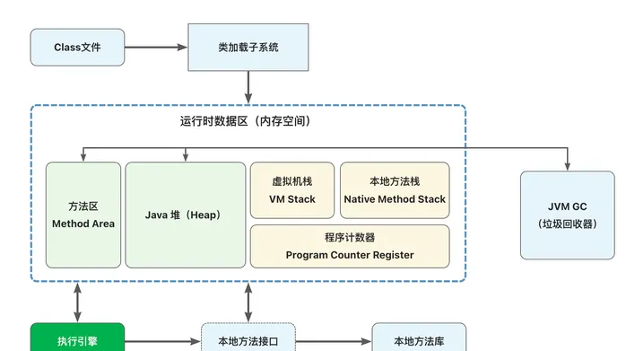
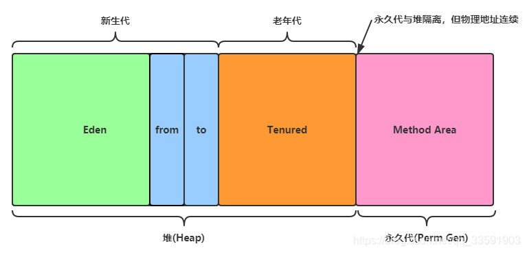

# JAVA虚拟机（JVM）
## 1.概念：
>JVM中文名是java虚拟机，是指通过软件模拟一个具有完整的硬件功能并且运行在完全隔离的环
境中的完整的计算机系统，JVM是一台被定制过的现实中不存在的计算机。java的跨平台原理也是
基于JVM实现的，java将源码先编译成与平台无关的字节码.class文件，这时JVM就充当一个翻
译官的职责，它识别.class文件后将其翻译成计算机能识别的机器码，各平台有各自的JVM虚拟机
这就是问什么java是一次编译到处运行。

>当前市面上使用范围最广的，是Sun/OracleJDK或者OpenJDK中默认的 HotSpot 虚拟机，
这个一款由官方开发和主推的虚拟机。
## 2.JVM的结构体系

### 1.类加载子系统（类加载器）
JVM默认提供了三个类加载器。
  - 1.`Bootstrap ClassLoader`：称之为启动类加载器，是最顶层的类加载器，负责加载
  JDK中的核心类库，如 rt.jar、resources.jar、charsets.jar等。 
  - 2.`Extension ClassLoader`：称之为扩展类加载器，负责加载Java的扩展类库
  - 3.`App ClassLoader`：称之为系统类加载器，负责加载应用程序classpath目录下
  所有jar和class文件。
>JVM运行时数据区分为5部分，方法区，堆，虚拟机栈，本地方法栈，程序计数器。其中方法区和
堆是线程共享的，虚拟机栈是线程独享的。

> 运行时数据区
### 2.方法区

方法区用于存储JVM加载完成的类型信息、常量、静态变量、即时编译器编译
后的代码缓存，方法区和 Java 堆区一样，都是线程共享的内存区域。在`JDK1.8`以前，使用`永久代`
的方式来实现方法区，JDK8以后，永久代的概念被废弃了，方法区改用和 JRockit、J9一样的
在本地内存中实现的`元空间（Meta Space）`来代替.

#### java7版本前的堆和永久代：

>从上图中可以看到，永久代与堆中的老年代是连续的，这里的连续指的是物理地址连续，
永久代本身并不在堆中。因此，老年代与永久代其中一个满了，都会触发Full GC。

在java8版本后元空间取而代之。
`元空间(Metaspace)`，不再与堆连续，而且在JDK7版本就已经将`字符串常量池和静态变量从永久
代移动到了堆`上。
并且元空间直接存在于本地内存中，也就是机器的内存。理论上机器内存有多大，元空间的就
可以就有多大。但可以通过以下的参数来设置元空间的大小：

- -XX:MetaspaceSize，初始空间大小，达到该值就会触发垃圾收集进行类型卸载，
同时GC会对该值进行调整：如果释放了大量的空间，就适当降低该值；如果释放了很少的空
间，那么在不超过MaxMetaspaceSize时，适当提高该值。
- -XX:MaxMetaspaceSize，最大空间，默认是没有限制的。

除了上面两个指定大小的选项以外，还有两个与 GC 相关的属性：

- -XX:MinMetaspaceFreeRatio，在GC之后，最小的Metaspace剩余空间容量的百分比，
减少为分配空间所导致的垃圾收集
- -XX:MaxMetaspaceFreeRatio，在GC之后，最大的Metaspace剩余空间容量的百分比，
减少为释放空间所导致的垃圾收集

>【在使用-XX:MaxMetaspaceSize显示指定元空间的大小为一个比较小的值，接着在循环中
动态加载过多的类，那么会报出"java.lang.OutOfMemoryError: Metaspace"异常。】

在Java8时，仍然使用PremSize或MaxPermSize设置永久代的大小时，会被编译器忽略并且警告。

>为什么方法区的实现方法中元空间会替代永久代？ 
因为永久代使用的是虚拟机内存，他有一个JVM固定好的上限值不可改变，而且当使用永久代
实现方法区时，永久代的最大容量受制于 PermSize 和 MaxPermSize 参数设置的大
小，而这两个参数的大小又很难确定，因为在程序运行时需要加载多少类是很难估算的，如 果这
两个参数设置的过小就会频繁的触发 Full GC 和导致 OOM（Out of Memory，内存溢出）。
所以为了避免OOC，采用了元空间实现方法区，因为元空间使用的是本地内存，内存量足够大
能大大降低OOC的问题。
### 3.堆

堆区负责存放对象实例，当Java创建一个类的实例对象或者数组时，都会在堆中为新的对象分配内存。
并且JDK7版本后字符串常量池和静态变量也存储到了堆中。堆中的内存回收是交给GC（垃圾回收机制）来处理的。

在方法区里的那张图我们可以看到堆中的空间分成了两大区域，新生代和老年代。一般新生代是总内存
的1/3,老年代是2/3.

### 4.虚拟机栈

在栈中只保存基本数据类型和对象的引用，栈是先进先出的，栈内创建的基本类型数据在超出其作用
域后，会被自动释放掉。每个线程被创建时，会同时创建一个对应的栈，每个栈都有分为许多栈帧。
每个栈帧对应着每个方法的调用。

### 5.本地方法栈

本地方法栈执行的是本地（Native）方法服务，存储的也是本地方法的局部变量表，本地方法
的操作数栈等信息。本地方法栈是在 程序调用 或 JVM调用 本地方法接口（Native）时候启用。
本地方法都不是使用Java语言编写的，它们可能由C或其他语言编写，本地方法也不由JVM去运行
，所以本地方法的运行不受JVM管理。

### 6.程序计数器

在JVM的概念模型里，字节码解释器工作时就是通过改变这个计数器的值来选取下一条需要执行
的字节码指令。分支、循环、跳转、异常处理、线程恢复等基础功能都需要依赖这个计数器来完
成。JVM的多线程是通过线程轮流切换并分配处理器执行时间的方式来实现的，为了各条线程之
间的切换后计数器能恢复到正确的执行位置，所以每条线程都会有一个独立的程序计数器。
程序计数器仅占很小的一块内存空间。
当线程正在执行一个Java方法，程序计数器记录的是正在执行的JVM字节码指令的地址。如果正
在执行的是一个Natvie（本地方法），那么这个计数器的值则为空（Underfined）。

### 7.常量池
常量池是分3种类型的：
- 1、Class文件内容里的常量池 
Java代码在经过编译器后，会生成一个Class文件，这个常量池就是Class文件里的一大段
内容（通常是最大的一段内容），它主要存放着 字面量、符号引用 等信息，在JVM把Class
文件加载完成后，Class 常量池里的数据会存放到运行时常量池中。
- 2、运行时常量池（Runtime Constant Pool） 
运行时常量池是方法区（Method Area）的一部分，运行时常量池中存储的，是基本类型
的数据和对象的引用，注意是对象的引用而不是对象实例本身哦。
Java虚拟机在加载Class文件时，Class文件内容里常量池的数据会放入运行时常量池。
每一个加载好的Class对象里都会有一个运行时常量池。
- 3、各个包装类型里实现的常量池，例如String类里面的字符串常量池（String Pool） 
字符串由一个char[]构成，当我们的Java程序里频繁出现相同字面量的代码时，重复的
创建和销毁对象是一件很浪费资源的事情，所以Java实现了一个字符串常量池。
JDK7之后，字符串常量池从方法区迁移到了堆区，它的底层实现可以理解为是一个HashTable。
Java虚拟机中只会存在一份字符串常量池。字符串常量池里，存放的数据可以是引用也可以是
对象实例本身。

