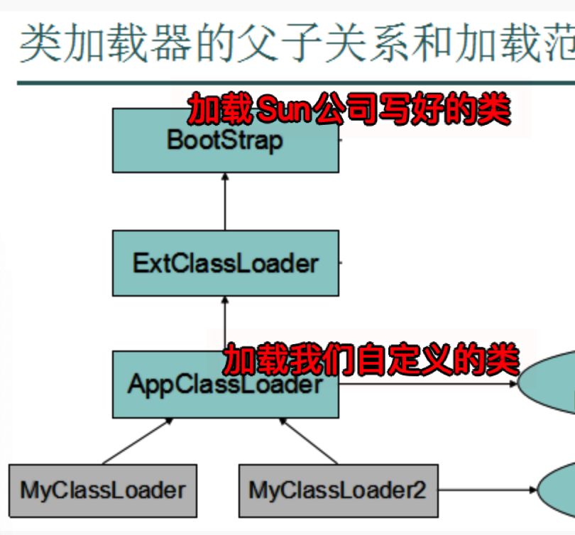
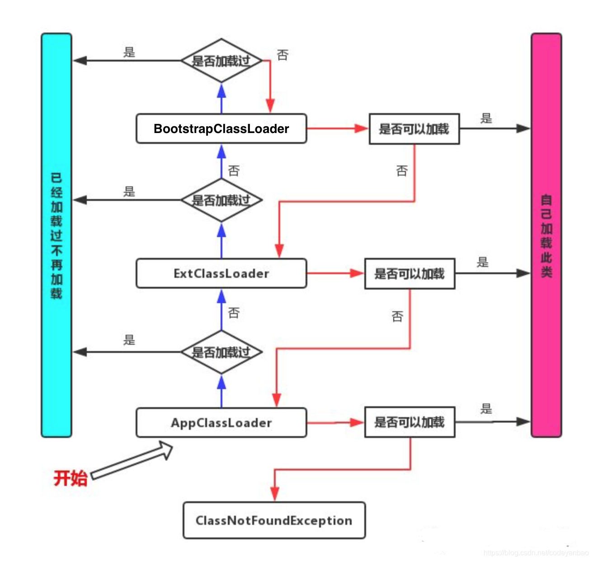
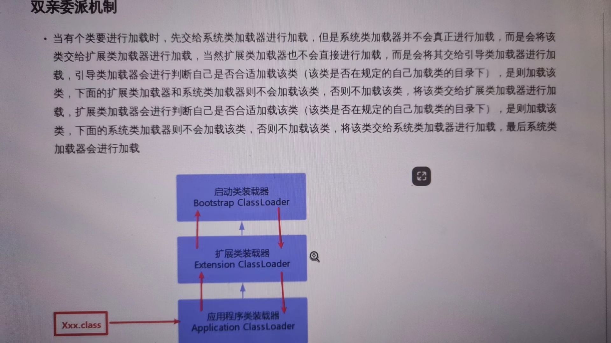

# 双亲委派机制

## 类加载器

Java是运行在Java的虚拟机(JVM)中的，但是它是如何运行在JVM中了呢？我们在IDE中编写的Java源代码被编译器编译成.class的字节码文件。然后由我们得ClassLoader负责将这些class文件给加载到JVM中去执行。  
JVM中提供了三层的ClassLoader：

- 启动类加载器Bootstrap classLoader:主要负责加载核心的类库(java.lang.*等)，构造ExtClassLoader和APPClassLoader。

- 扩展类加载器ExtClassLoader：主要负责加载jre/lib/ext目录下的一些扩展的jar。

- 应用程序类加载器AppClassLoader：主要负责加载应用程序的主函数类

## 双亲委派机制大致流程

当一个Hello.class这样的文件要被加载时。不考虑我们自定义类加载器，首先会在
AppClassLoader中检查是否加载过，如果有那就无需再加载了。如果没有，那么会拿到父加
载器，然后调用父加载器的loadClass方法。父类中同理也会先检查自己是否已经加载过，如
果没有再往上。注意这个类似递归的过程，直到到达Bootstrap classLoader之前，都是
在检查是否加载过，并不会选择自己去加载。直到BootstrapClassLoader，已经没有父加
载器了，这时候开始考虑自己是否能加载了，如果自己无法加载，会下沉到子加载器去加载，一
直到最底层，如果没有任何加载器能加载，就会抛出ClassNotFoundException。

