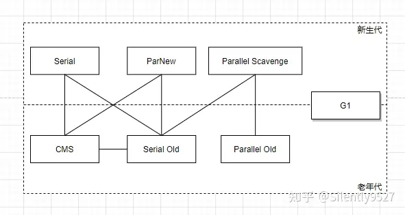
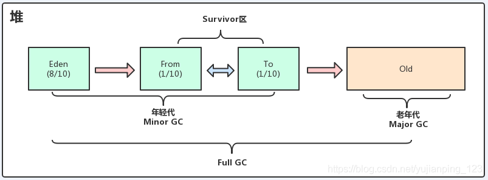
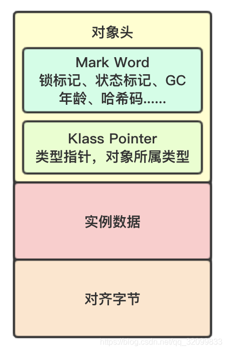
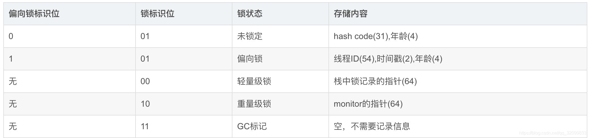

# 垃圾回收机制

## Java有四种类型的垃圾回收器：

- 串行垃圾回收器（Serial Garbage Collector）
- 并行垃圾回收器（Parallel Garbage Collector）
- 并发标记扫描垃圾回收器（CMS Garbage Collector）
- G1垃圾回收器（G1 Garbage Collector）

## GC 垃圾收集（Gabage Collection）
垃圾回收机制就是为了自动负责回收堆中不需要的对象的机制，他是一个守护线程是主程序
之外的一个多线程。

## 堆

### 堆内存分为新生代和老年代

- `新生代，`新生代就是用于存储新生对象的区域，而这个区域又分为3个区域，分别是`Eden区`
  `Survivor From区`和`Survivor To区`，它们有各自的默认内存地址百分比，刚创建的对象
  会被分配到Eden区(如果该对象占用内存非常大，则直接分配到老年代区), 当Eden区内存不
  够的时候就会触发MinorGC（`Survivor区满不会引发MinorGC，而是直接将对象移动到老年代中`）

- `MinorGC：`当Eden区内存满了之后会触发MinorGC，回收完对象后会将存活的对象复制到
Survivor From区，随后清空Eden区内存，然后等待下一次MinorGC，再次MinorGC时
会检测Eden区和Survivor From区进行回收后，将所有存活的对象复制到Survivor To区，
之后再次清空两个区的内存，这之后，有一个角色转换过程，就是会将Survivor To区和
Survivor From区的角色互换，也就是空的那个现在是Survivor To区了，而存储对象
的区在转换后依然被当作Survivor From区，再就是循环MinorGC的过程。

【总之就是要保证Survivor To区在MinorGC后永远是空的，而且这种复制算法的好处就是
能避免内存碎片的残余， 并且在新生代中的对象每存活过一次MinorGC，其年龄就会+1，
当年龄大于15时，就会被移入到老年代中。】

>为什么移入老年代的临界点要设置为15岁呢？ 
其一是避免创建出来的对象频繁被移入老年代中，导致老年代内存溢出，所以要设置一个存活
期限限制新生代对象向老年代移动的过程，还有一点是，年龄这个数据是存储在对象的头信息
中的，它拿出了4bit的空间来存储这个年龄，4bit最大为1111，也就是十进制的15，这也是
为什么年龄设置为什么默认是15岁。

- `老年代`，新生代中说过，新生代对象满15岁会进入老年代中，或者该对象的内存过大
  Eden区一次性装不下时也会进入到老年代中，当老年代的内存也不够用时就会触发Major GC

- `Major GC`：Major GC使用的算法是：标记清除（回收）算法或者标记压缩算法。

`标记清除（采用可达性算法）`：
1. 首先会从`GC root`进行遍历，把可达对象（存过的对象）打标记
2. 再从GC root二次遍历，将没有被打上标记的对象清除掉。

优点：老年代对象一般是比较稳定的，相比复制算法，不需要复制大量对象。之所以将所有对象扫描2次，看似比较消耗时间，其实不然，是节省了时间。举个栗子，数组 1,2,3,4,5,6。删除2,3,4，如果每次删除一个数字，那么5,6要移动3次，如果删除1次，那么5,6只需移动1次。

缺点：这种方式需要中断其他线程（STW），相比复制算法，可能产生内存碎片。

`标记压缩`：和标记清除算法基本相同，不同的就是，在清除完成之后，会把存活的对象向
内存的一边进行压缩，这样就可以解决内存碎片问题。

>还有一个Full GC的堆回收机制,采用的是G1收集器, 是清理整个堆空间—包括年轻代和老年代。 
其触发条件包括1. 调用System.gc， 
2.老年代空间不足，包括：
新创建的对象都会被分配到Eden区，如果该对象占用内存非常大，则直接分配到老年代区，
此时老年代空间不足. 
做minor gc操作前，发现要移动的空间（Eden区、From区向To区复制时，
To区的内存空间不足）比老年代剩余空间要大，则触发full gc，而不是minor gc 
等等