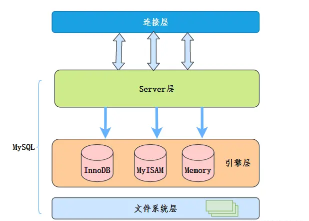
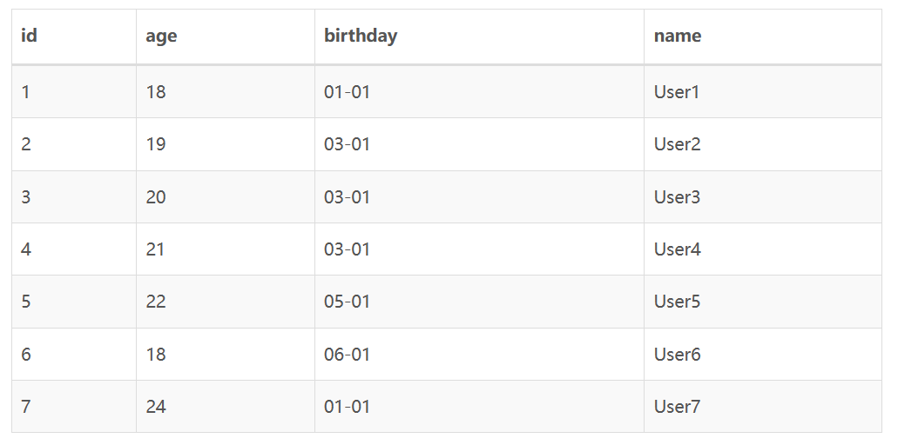
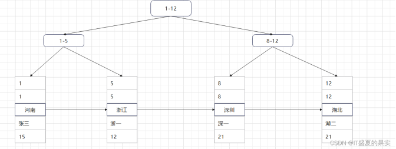
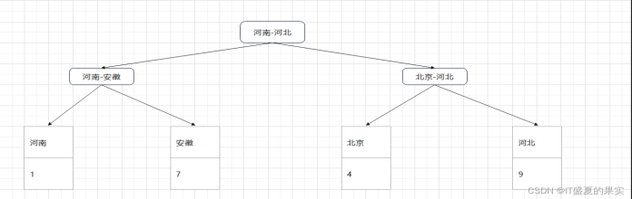

# 索引下推、索引回表、索引覆盖
## 一、索引下推

`索引下推（Index condition pushdown）`简称ICP，是一种优化数据库查询的技术，它利用了数据库
索引的特性，在一定条件下，在索引层面就过滤掉不需要的数据，从而减少查询时需要访问的数
据块，提高查询效率。

在普通的查询中，数据库需要先从表中读取所有的数据记录，然后再根据查询条件过滤不需要的
记录，最后返回查询结果。而在索引下推中，数据库会在索引树的节点上进行条件过滤，只将满
足条件的数据块返回，而不是读取整个数据记录。这样可以避免从磁盘读取不必要的数据，降低
IO开销，提升查询速度。

索引下推的主要优点是减少了回表操作，即减少了访问磁盘的次数和需要传输的数据量，从而提
高了查询效率和响应速度。具体来说，如果查询条件涉及到的字段都可以通过索引直接获取，而
不需要回表操作，那么查询速度将大大提高。

需要注意的是，索引下推并不是适用于所有类型的查询，它涉及到查询中所使用的索引类型和查
询条件的限制。通常，只有涉及到等值查询或范围查询的情况下，才能使用索引下推技术实现优
化。同时，索引下推也会产生额外的开销，需要消耗更多的CPU资源，因此需要在实际应用中进
行评估和优化。

MySQL的大概框架为：

索引下推的下推其实就是指将部分上层（服务层）负责的事情，交给了下层（引擎层）去处理。

假设有这样一个用户表：

>创建一个联合索引(age, birthday)，并查询出年龄>20，且生日为03-01的用户： 
select * from user where age>20 and birthday="03-01"

为在没有索引下推的情况下，执行步骤如下：

- 存储引擎根据索引查找出age>20的用户id，分别是：4,5,7
- 存储引擎到表格中取出id in (4,5,7)的3条记录，返回给服务层
- 服务层过滤掉不符合birthday="03-01"条件的记录，最后返回查询结果为id=4的1行记录。

如果开启了索引下推优化，执行步骤如下：

- 存储引擎根据索引查找出age>20的用户id，并使用索引中的birthday字段过滤掉不符合birthday="03-01"条件的记录，最后得到id=4；
- 存储引擎到表格中取出id=4的1条记录，返回给服务层；
- 服务层过滤掉不符合birthday="03-01"条件的记录，最后返回查询结果为id=4的1行记录。
- 启用索引下推后，把where条件由MySQL服务层放到了存储引擎层去执行，带来的好处就是存储引擎根据id到表格中读取数据的次数变少了。在上面这个例子中，没有索引下推时需要多回表查询2次。并且回表查询很可能是离散IO，在某些情况下，对数据库性能会有较大提升。

## 二、索引回表

先通过普通索引的值定位聚簇索引值，再通过聚簇索引的值定位行记录数据，需要扫描两
次索引B+树，它的性能较扫一遍索引树更低。

当我们执行如下sql：select * from table where id = 5时，会发生回表吗？

答案是：不会。因为id作为索引时，索引id的这个B+树已经包含了所有的数据，不需要再去查询什么其他的东西了。

当我们执行如下sql：select * from table where address= 安徽时，会发生回表吗？

答案是：会。因为address作为查询条件时。address的这个B+树里面只能查到address，id这两个字段，
但我们需要查询的是所有字段，所以它还会根据拿到的id值再次去id的那颗B+树中再查一遍，将所有的值查
询出来。增加了IO操作，所以发生回表时，是一个耗时的操作。

## 三、索引覆盖

只需要在一棵索引树上就能获取SQL所需的所有列数据，无需回表，速度更快。通常需要将查询
的列都包含在组合索引中。

如果一个索引包含（或者说覆盖）所有需要查询的字段的值，我们就称之为“覆盖索引”。

