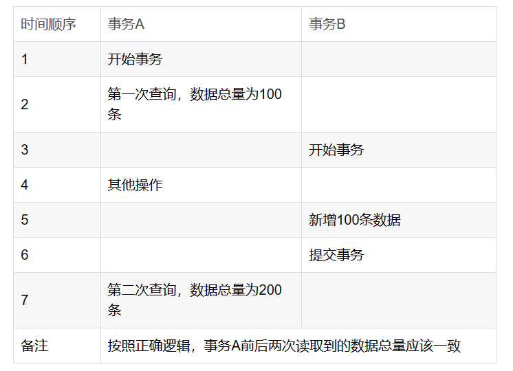

## 脏读，不可重复读，幻读
```
1.脏读是指多事务并发的时候，一个事务读取到了另一个事务尚未提交的数据，并进行了使用
这种情况未脏读。
例如：
A事务读取B事务尚未提交的数据，此时如果B事务发生错误并执行回滚操作，那么A事务
读取到的数据就是脏数据。然后A事务在此脏数据的基础上进行了数据库更新，就会导致A事务
的实际操作数据库结果与期望结果不符合，这种并发问题就是脏读。
```

```
2.不可重复读是指并发过程中一个事务前后多次读取数据，数据内容不一致。
例如：
事务A第一次读取数据，此时读取了小明的年龄为20岁，事务B执行更改操作，将
小明的年龄更改为30岁，此时事务A第二次读取到小明的年龄时，发现其年龄是30岁，和之
前的数据不一样了，也就是数据不重复了，系统不可以读取到重复的数据，成为不可重复读。
```

```
3.幻读是指并发过程中一个事务多次读取数据发现前后数据总量不一样。
例如：事务A第一次读取的数据总量为100条，这时事务B进行了数据添加，新增100条数据
然后提交了事务，事务A再次读取数据时读取到了200条数据，前后数据总量不一致了，就像
突然多出现了100条数据，像幻觉一样，这种并发问题称为幻读。
```
