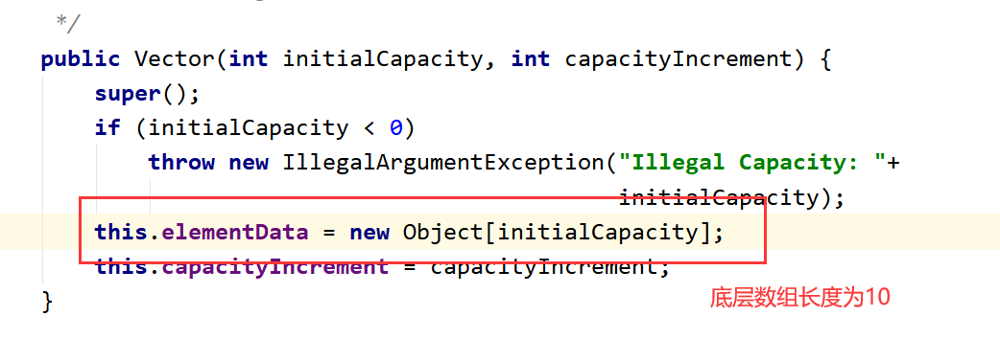
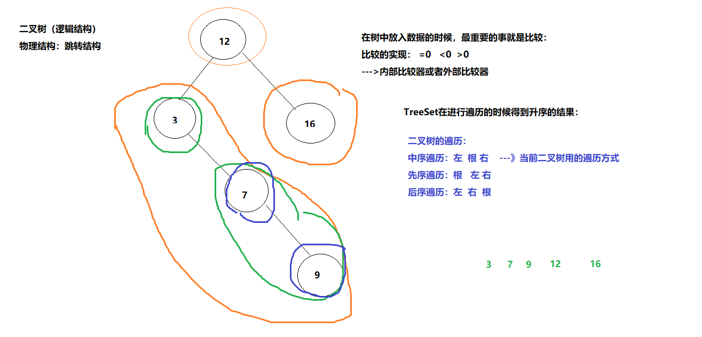

## 第十节 集合
### 1.为什么学习集合？
集合是一个大量存值的容器，是引用类型变量。<br>
数组的随机访问和循环遍历的效率是最高的。
数组的缺点：<br>
（1）数组一旦指定了长度，那么长度就被确定了，不可以更改。<br>
（2）删除，增加元素  效率低。<br>
（3）数组中实际元素的数量是没有办法获取的，没有提供对应的方法或者属性来获取,操作是面向过程的<br>
（4）数组存储：有序（存入下标有序），可重复 ，对于无序的，不可重复的数组不能满足要求。<br>

### 2. 集合结构图

- collection接口：无序，可重复的元素；
  - list接口：有序可重复的元素；
  - set接口：无序，不可重复
- Map接口：键值对存储：key（无序，唯一），value（无序，可重复）；


### 3.collection接口
```java
package com.msb.test01;
import java.util.ArrayList;
import java.util.Arrays;
import java.util.Collection;
import java.util.List;
/**
 * @author : msb-zhaoss
 */
public class Test01 {
    //这是main方法，程序的入口
    public static void main(String[] args) {
        /*
        Collection接口的常用方法：
        增加：add(E e) addAll(Collection<? extends E> c)
        删除：clear() remove(Object o)
        修改：
        查看：iterator() size()
        判断：contains(Object o)  equals(Object o) isEmpty()
         */
        //创建对象：接口不能创建对象，利用实现类创建对象：
        Collection col = new ArrayList();
        //调用方法：
        //集合有一个特点：只能存放引用数据类型的数据，不能是基本数据类型
        //基本数据类型自动装箱，对应包装类。int--->Integer
        col.add(18);
        col.add(12);
        col.add(11);
        col.add(17);
        System.out.println(col/*.toString()*/);
        List list = Arrays.asList(new Integer[]{11, 15, 3, 7, 1});
        col.addAll(list);//将另一个集合添加入col中
        System.out.println(col);
        //size查看有多少元素
        System.out.println("集合中元素的数量为："+col.size());//4
        // 清空集合
        //col.clear();
        System.out.println(col);
        System.out.println("集合是否为空："+col.isEmpty());
        boolean isRemove = col.remove(15);
        //remove(Object obj):删除集合中的obj元素。若删除成功返回true，否则返回false。
        System.out.println(col);
        System.out.println("集合中数据是否被删除："+isRemove);
        Collection col2 = new ArrayList();
        col2.add(18);
        col2.add(12);
        col2.add(11);
        col2.add(17);
        Collection col3 = new ArrayList();
        col3.add(18);
        col3.add(12);
        col3.add(11);
        col3.add(17);
        System.out.println(col2.equals(col3));
        System.out.println(col2==col3);//地址一定不相等  false
        System.out.println("是否包含元素："+col3.contains(117));
        
        Collection<String> collection = new ArrayList<>();
        collection.add("我");
        collection.add("是");
        collection.add("一");
        collection.add("个");
        collection.add("人");
        System.out.println(collection);//[我, 是, 一, 个, 人]
        collection.remove("人");
        Collection<String> collection1 = new ArrayList<>();
        collection1.addAll(collection);
        collection1.add("哈哈");
        collection1.removeAll(collection);
        System.out.println(collection1);//[哈哈]
        Collection<String> collection3 = new ArrayList<>();
        collection3.addAll(collection);
        collection3.add("你");
        collection3.add("好");
        //迭代器是一个接口，每个集合有自己特有的迭代器，需要不同集合自己创建
        Iterator iterator = collection3.iterator();
        while (iterator.hasNext()){
          System.out.print(iterator.next()+"-");//我-是-一-个-你-好-
        }
    }
}
```
### 4.list接口
```java
package com.msb.test01;
import com.sun.org.apache.xerces.internal.dom.PSVIAttrNSImpl;
import java.util.ArrayList;
import java.util.Iterator;
import java.util.List;
/**
 * @author : msb-zhaoss
 */
public class Test03 {
    //这是main方法，程序的入口
    public static void main(String[] args) {
        /*
        List接口中常用方法：
        增加：add(int index, E element)
        删除：remove(int index)  remove(Object o)
        修改：set(int index, E element)
        查看：get(int index)
        判断：
         */
        List list = new ArrayList();
        list.add(13);
        list.add(17);
        list.add(6);
        list.add(-1);
        list.add(2);
        list.add("abc");
        System.out.println(list);//[13, 17, 6, -1, 2, abc]
        //使用下标添加元素
        list.add(3,66);
        System.out.println(list);//[13, 17, 6, 66, -1, 2, abc]
        //使用下标修改元素
        list.set(3,77);
        System.out.println(list);//[13, 17, 6, 77, -1, 2, abc]
        list.remove(2);//在集合中存入的是Integer类型数据的时候，调用remove方法调用的是：remove(int index)
        System.out.println(list);//[13, 17, 77, -1, 2, abc]
        list.remove("abc");
        System.out.println(list);
        //获取
        Object o = list.get(0);
        System.out.println(o);    //13
        //List集合 遍历：
        //方式1：普通for循环：
        System.out.println("---------------------");
        for(int i = 0;i<list.size();i++){
            System.out.println(list.get(i));
        }
        //方式2：增强for循环：
        System.out.println("---------------------");
        for(Object obj:list){
            System.out.println(obj);
        }
        //方式3：迭代器：
        System.out.println("---------------------");
        Iterator it = list.iterator();
        while(it.hasNext()){
            System.out.println(it.next());
        }
    }
}
```
### 5.Arraylist
ArrayList底层存储是数组。---紧密结构/顺序结构（随机访问和循环便利方便）
- 1.重要属性
  - 1.存储使用object[]数组

  - 2.无参构造时默认长度为10

  - 3.记录元素数

- 2.特有方法
```
 /*ArrayList 实现类 特有方法
  indexOf --根据元素找下标
  subList---获得指定范围的元素[第一个参数，第二个参数)
  clone---克隆元素
  */
  ArrayList list=new ArrayList();//10
  list.add("1234");
  list.add("qwe");
  list.add(543);
  System.out.println("查找qwe所在的下标位置："+list.indexOf("qwe"));
  list.set(1,"ooo");
  System.out.println(list.subList(0,1));//获得指定范围的元素[第一个参数，第二个参数)
  System.out.println(list.clone());
```
- 3.扩容流程
  - 1.调用add方法：
  
  - 2.当数组中的10个位置都满了的时候就开始进行数组的扩容，扩容长度为 原数组的1.5倍：
  
  
  
### 6.Vector
- 【1】底层Object数组，int类型属性表示数组中有效长度：

- 【2】Vector v=new Vector();调用构造器：

- 【3】add方法：


- 2.Vector和ArrayList的区别和联系<br>
Vector和ArrayList的区别和联系<br>
实现原理相同，功能相同，都是长度可变的数组结构，很多情况下可以互用<br>
两者的主要区别如下<br>
  - 1)Vector是早期JDK实现类，ArrayList是替代Vector的新实现类<br>
  - 2)Vector线程安全，ArrayList重速度轻安全，线程非安全<br>
  - 3)长度需增长时，Vector默认增长一倍，ArrayList增长50%<br>
### 7.Linklist
3.ArrayList和LinkedList的区别和联系<br>
两者都实现了List接口，都具有List中元素有序、不唯一的特点。<br>
ArrayList实现了长度可变的数组，在内存中分配连续空间。遍历元素和随机访问元素的效率比较高；<br>


LinkedList采用链表存储方式。插入、删除元素时效率比较高


- 1.常用方法
```java
package com.msb.test04;
import java.util.Iterator;
import java.util.LinkedList;
/**
 * @author : msb-zhaoss
 */
public class Test {
    //这是main方法，程序的入口
    public static void main(String[] args) {
        /*
        LinkedList常用方法：
        增加 addFirst(E e) addLast(E e)
             offer(E e) offerFirst(E e) offerLast(E e)
        删除 poll()
            pollFirst() pollLast()  ---》JDK1.6以后新出的方法，提高了代码的健壮性
            removeFirst() removeLast()
            pop()--删除第一个元素并返回
        修改
        查看 element()
             getFirst()  getLast()
             indexOf(Object o)   lastIndexOf(Object o)
             peek()
             peekFirst() peekLast()
        判断
         */
        //创建一个LinkedList集合对象：
        LinkedList<String> list = new LinkedList<>();
        list.add("aaaaa");
        list.add("bbbbb");
        list.add("ccccc");
        list.add("ddddd");
        list.add("eeeee");
        list.add("bbbbb");
        list.add("fffff");
        list.addFirst("jj");
        list.addLast("hh");
        list.offer("kk");//添加元素在尾端
        list.offerFirst("pp");
        list.offerLast("rr");
        System.out.println(list);//LinkedList可以添加重复数据
        System.out.println(list.poll());//删除头上的元素并且将元素输出
        System.out.println(list.pollFirst());
        System.out.println(list.pollLast());
        System.out.println(list.removeFirst());
        System.out.println(list.removeLast());
        System.out.println(list);//LinkedList可以添加重复数据
        /*list.clear();//清空集合
        System.out.println(list);*/
        /*System.out.println(list.pollFirst());*/
        /*System.out.println(list.removeFirst());报错：Exception in thread "main" java.util.NoSuchElementException*/
       
       
        //集合的遍历：
        System.out.println("---------------------");
        //普通for循环：
        for(int i = 0;i<list.size();i++){
            System.out.println(list.get(i));
        }
        System.out.println("---------------------");
        //增强for：
        for(String s:list){
            System.out.println(s);
        }
        System.out.println("---------------------");
        //迭代器：
        /*Iterator<String> it = list.iterator();
        while(it.hasNext()){
            System.out.println(it.next());
        }*/
        //下面这种方式好，节省内存
        for(Iterator<String> it = list.iterator();it.hasNext();){
            System.out.println(it.next());
        }
    }
}
```
- 2.底层原理图

- 3.源码
```java
public class LinkedList<E>{//E是一个泛型，具体的类型要在实例化的时候才会最终确定
        transient int size = 0;//集合中元素的数量
        //Node的内部类
        private static class Node<E> {
        E item;//当前元素
        Node<E> next;//指向下一个元素地址
        Node<E> prev;//上一个元素地址
        Node(Node<E> prev, E element, Node<E> next) {
            this.item = element;
            this.next = next;
            this.prev = prev;
        }
    }
        transient Node<E> first;//链表的首节点
        transient Node<E> last;//链表的尾节点
        //空构造器：
        public LinkedList() {
    }
        //添加元素操作：
        public boolean add(E e) {
        linkLast(e);
        return true;
    }
        void linkLast(E e) {//添加的元素e
        final Node<E> l = last;//将链表中的last节点给l 如果是第一个元素的话 l为null
                //将元素封装为一个Node具体的对象：
        final Node<E> newNode = new Node<>(l, e, null);
                //将链表的last节点指向新的创建的对象：
        last = newNode;
                
        if (l == null)//如果添加的是第一个节点
            first = newNode;//将链表的first节点指向为新节点
        else//如果添加的不是第一个节点 
            l.next = newNode;//将l的下一个指向为新的节点
        size++;//集合中元素数量加1操作
        modCount++;
    }
        //获取集合中元素数量
        public int size() {
        return size;
    }
        //通过索引得到元素：
        public E get(int index) {
        checkElementIndex(index);//健壮性考虑
        return node(index).item;
    }
        
    Node<E> node(int index) {
        //如果index在链表的前半段，那么从前往后找
        if (index < (size >> 1)) {
            Node<E> x = first;
            for (int i = 0; i < index; i++)
                x = x.next;
            return x;
        } else {//如果index在链表的后半段，那么从后往前找
            Node<E> x = last;
            for (int i = size - 1; i > index; i--)
                x = x.prev;
            return x;
        }
    }
}
```

### 8.Set接口
Set接口:存储无序唯一的元素。
#### 1.HashSet
```java
package com.msb.test07;
import java.util.HashSet;
/**
 * @author : msb-zhaoss
 */
public class TestInteger {
    //这是main方法，程序的入口
    public static void main(String[] args) {
        //创建一个HashSet集合：
        HashSet<Integer> hs = new HashSet<>();
        System.out.println(hs.add(19));//true
        hs.add(5);
        hs.add(20);
        System.out.println(hs.add(19));//false 这个19没有放入到集合中
        hs.add(41);
        hs.add(0);
        System.out.println(hs.size());//唯一，无序
        System.out.println(hs);
    }
}
```
- 1.HashSet原理图：


首先获得两个对象的Hash码，比较是否相同，不同就是两个对象。<br>
如果Hash码相同就再用equals方法进行比较，如果不同，就说明两个对象不同。<br>
如果equals比较相同，就不进行存储。<br>

#### 2.TreeSet
特点：唯一，无序（没有按照输入顺序进行输出）， 有序（按照升序进行遍历）<br>
TreeSet底层的二叉树的遍历是按照升序的结果出现的，这个升序是靠中序遍历得到的：

- 1.TreeSet唯一存储原理：<br>
借助比较器Comparable(内部比较器接口)，实现利用二叉树存储数据，有三种情况【0，>0，<0】
如果结果为0，就判断两对象相同，不进行存储，如果>0就存储在二叉树右支，如果<0就存储在二叉树左支。
【一般比较器是要存入的对象和二叉树内的已有对象一一比较，依次确定分哪支】
`内部比较器：`Comparable内部比较器接口
```java
package com.msb.test10;
/**
 * @author : msb-zhaoss
 */
public class Student implements Comparable<Student> {
    private int age;
    private String name;
    public int getAge() {
        return age;
    }
    public void setAge(int age) {
        this.age = age;
    }
    public String getName() {
        return name;
    }
    public void setName(String name) {
        this.name = name;
    }
    public Student(int age, String name) {
        this.age = age;
        this.name = name;
    }
    @Override
    public String toString() {
        return "Student{" +
                "age=" + age +
                ", name='" + name + '\'' +
                '}';
    }
    //比较器重写
    @Override
    public int compareTo(Student o) {
        return this.getAge()-o.getAge();
    }
}
```
`外部比较器:`Comparator外部比较器接口
```java
package com.msb.test10;
import java.util.Comparator;
/**
 * @author : msb-zhaoss
 */
public class Student  {
    private int age;
    private String name;
    public int getAge() {
        return age;
    }
    public void setAge(int age) {
        this.age = age;
    }
    public String getName() {
        return name;
    }
    public void setName(String name) {
        this.name = name;
    }
    public Student(int age, String name) {
        this.age = age;
        this.name = name;
    }
    @Override
    public String toString() {
        return "Student{" +
                "age=" + age +
                ", name='" + name + '\'' +
                '}';
    }
}
//创建外部比较器
class BiJiao01 implements Comparator<Student> {
  @Override
  public int compare(Student o1, Student o2) {
    //比较年龄：
    return o1.getAge()-o2.getAge();
  }
}
class BiJiao02 implements Comparator<Student> {
  @Override
  public int compare(Student o1, Student o2) {
    //比较姓名：
    return o1.getName().compareTo(o2.getName());
  }
}
class BiJiao03 implements Comparator<Student> {
  @Override
  public int compare(Student o1, Student o2) {
    //在年龄相同的情况下 比较身高  年龄不同比较年龄
    if((o1.getAge()-o2.getAge())==0){
      return ((Double)(o1.getHeight())).compareTo((Double)(o2.getHeight()));
    }else{//年龄不一样
      return o1.getAge()-o2.getAge();
    }
  }
}
```
### 9.Map接口


Map接口：K-v存储-----k（无序，唯一）---v（无序，不唯一）
当一个元素所占空间特别大，查询所需要的时间很长，效率低，这时就需要有唯一一个值(key)代表元素对象。
- 1.HashMap
通过HashCode和equals方法保证唯一。
常用方法
```java
package com.msb.test11;
import java.util.Collection;
import java.util.HashMap;
import java.util.Map;
import java.util.Set;
/**
 * @author : msb-zhaoss
 */
public class Test01 {
    //这是main方法，程序的入口
    public static void main(String[] args) {
        /*
        增加：put(K key, V value)
        删除：clear() remove(Object key)
        修改：replace（key , value）
        查看：entrySet() get(Object key) keySet() size() values()
        判断：containsKey(Object key) containsValue(Object value)
            equals(Object o) isEmpty()
         */
        //创建一个Map集合：无序，唯一
        Map<String,Integer> map = new HashMap<>();
        System.out.println(map.put("lili", 10101010));
        map.put("nana",12345234);
        map.put("feifei",34563465);
        System.out.println(map.put("lili", 34565677));
        map.put("mingming",12323);
        /*map.clear();清空*/
        /*map.remove("feifei");移除*/
        System.out.println(map.size());
        System.out.println(map);
        System.out.println(map.containsKey("lili"));
        System.out.println(map.containsValue(12323));
        Map<String,Integer> map2 = new HashMap<>();
        System.out.println(map2.put("lili", 10101010));
        map2.put("nana",12345234);
        map2.put("feifei",34563465);
        System.out.println(map2.put("lili", 34565677));
        map2.put("mingming2",12323);
        System.out.println(map==map2);
        System.out.println(map.equals(map2));//equals进行了重写，比较的是集合中的值是否一致
        System.out.println("判断是否为空："+map.isEmpty());
        System.out.println(map.get("nana"));//获取对应key的value
        System.out.println("-----------------------------------");
        
        //四种遍历
        //keySet()对集合中的key进行遍历查看：
        Set<String> set = map.keySet();
        for(String s:set){
            System.out.println(s);
        }
        System.out.println("-----------------------------------");
        //values()对集合中的value进行遍历查看：
        Collection<Integer> values = map.values();
        for(Integer i:values){
            System.out.println(i);
        }
        System.out.println("-----------------------------------");
        //get(Object key) keySet()
        //通过get获取value值
        Set<String> set2 = map.keySet();
        for(String s:set2){
            System.out.println(map.get(s));
        }
        System.out.println("-----------------------------------");
        //entrySet()
        Set<Map.Entry<String, Integer>> entries = map.entrySet();
        for(Map.Entry<String, Integer> e:entries){
            System.out.println(e.getKey()+"----"+e.getValue());
        }
    }
}
```
- 2.TreeMap
通过重写比较器保证唯一。

### 10.collections工具类
Arrays---数组工具类
Collections-----集合工具类
```java
package com.msb.test12;
import java.util.ArrayList;
import java.util.Collections;
/**
 * @author : msb-zhaoss
 */
public class Test01 {
    //这是main方法，程序的入口
    public static void main(String[] args) {
        //Collections不支持创建对象，因为构造器私有化了
        /*Collections cols = new Collections();*/
        //里面的属性和方法都是被static修饰，我们可以直接用类名.去调用即可：
        //常用方法：
        //addAll：
        ArrayList<String> list = new ArrayList<>();
        list.add("cc");
        list.add("bb");
        list.add("aa");
        Collections.addAll(list,"ee","dd","ff");
        Collections.addAll(list,new String[]{"gg","oo","pp"});
        System.out.println(list);
        //binarySearch必须在有序的集合中查找：--》排序：
        //内部比较器
        Collections.sort(list);//sort提供的是升序排列,
        
        //外部比较器
        Collections.sort(list, new Comparator<Student>() {
          @Override
          public int compare(Student o1, Student o2) {
            return o1.getScore()-o2.getScore();
          }
        });
        System.out.println(list);
        //binarySearch
        System.out.println(Collections.binarySearch(list, "cc"));
        //copy:替换方法
        ArrayList<String> list2 = new ArrayList<>();
        Collections.addAll(list2,"tt","ss");
        Collections.copy(list,list2);//将list2的内容替换到list上去
        System.out.println(list);
        System.out.println(list2);
        //fill 填充
        Collections.fill(list2,"yyy");
        System.out.println(list2);
    }
}
```


